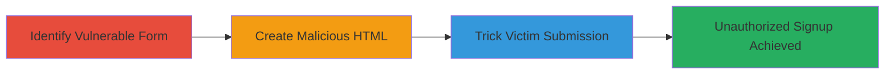

---
tags:
  - csrf
  - web
  - exploitation
  - account-creation
type: attack_chain
tools: []
tactics:
  - '[[Initial Access]]'
verified: false
platforms:
  - Web
submitted: true
complexity: medium
created_at: '2023-10-01T00:00:00Z'
procedures:
  - '[[procedures/Identify-Vulnerable-CSRF-Endpoint-in-Beta-Signup-Form]]'
  - '[[procedures/Create-Malicious-HTML-Form-for-CSRF-Exploitation]]'
  - '[[procedures/Trick-Victim-into-Submitting-Forged-CSRF-Request]]'
step_count: 3
techniques:
  - '[[Exploit Public-Facing Application]]'
updated_at: '2025-12-14T17:27:03.394Z'
description: >-
  A multi-stage attack exploiting a CSRF vulnerability in the Crashlytics beta
  signup form to forge unauthorized signups on behalf of authenticated users.
skill_level: intermediate
impact_level: high
id: 4cf102a0-2eb0-424d-ae55-2ed4a7aaaa18
validated: true
mitre_tactics:
  - '[[Initial Access]]'
mitre_techniques:
  - '[[Exploit Public-Facing Application]]'
---
# CSRF Exploitation in Crashlytics Beta Signup Form for Unauthorized Account Creation

Multi-stage attack chain demonstrating a complete CSRF workflow against the Crashlytics beta signup form, allowing attackers to forge signups with arbitrary user data on behalf of tricked authenticated victims.

## Chain Metrics Dashboard

| Metric | Value |
|--------|-------|
| Chain Status | Unverified |
| Total Steps | 3 |
| Execution Time | ~5 minutes |
| Skill Level | Intermediate |
| Complexity | Medium |
| Impact Level | High |

## Attack Flow Visualization



## Prerequisites & Requirements

### Required Tools

- None (relies on basic web development tools like a text editor and web server)

### Target Environment

- Web platform
- Crashlytics service running at http://try.crashlytics.com/list/
- No specific ports required beyond standard HTTP (80)

### Initial Access Requirements

- Attacker must host a malicious page (e.g., on their own server)
- Victim must be authenticated to the target site and visit the attacker's page
- No prior credentials needed for attacker

## Detailed Attack Procedures

### Step 1: Identify Vulnerable Endpoint
procedure: [[procedures/Identify-Vulnerable-CSRF-Endpoint-in-Beta-Signup-Form]]

**Objective**: Locate and analyze the beta signup form to confirm the absence of CSRF protections.

**Instructions**: Inspect the form at http://try.crashlytics.com/list/ using browser developer tools to verify it accepts POST requests with 'name' and 'email' parameters without any CSRF token fields or headers.

**Expected Output**: Confirmation that the form lacks anti-CSRF measures, such as tokens in hidden inputs or SameSite cookie attributes.

**Success Indicators**:
- Form identified with POST method to /list/
- No CSRF token present in HTML source

### Step 2: Create Malicious Form
procedure: [[procedures/Create-Malicious-HTML-Form-for-CSRF-Exploitation]]

**Objective**: Build a proof-of-concept HTML page that forges a POST request to the vulnerable endpoint with attacker-controlled data.

**Instructions**: Use a text editor to construct an HTML file with an invisible or disguised form that auto-submits to the target URL. Host it on an attacker-controlled server.

Example HTML structure:

```html
<!DOCTYPE html>
<html>
<body>
  <form id="csrf-form" action="http://try.crashlytics.com/list/" method="POST" style="display:none;">
    <input type="text" name="name" value="Victim Name">
    <input type="email" name="email" value="fake@example.com">
  </form>
  <script>
    document.getElementById('csrf-form').submit();
  </script>
</body>
</html>
```

Upload and serve this file via a simple web server like Python's http.server.

**Expected Output**: Malicious page ready for hosting, which upon load submits the forged request.

**Success Indicators**:
- HTML form validates by testing locally
- Page loads and auto-submits without errors

### Step 3: Demonstrate Exploitation
procedure: [[procedures/Trick-Victim-into-Submitting-Forged-CSRF-Request]]

**Objective**: Lure an authenticated victim to the malicious page to trigger the CSRF attack, resulting in unauthorized beta signup.

**Instructions**: Distribute the malicious URL via phishing email, social engineering, or malicious link. Ensure the victim is logged into Crashlytics before visiting.

Monitor the target endpoint or victim feedback to confirm the signup occurs with the injected data.

**Expected Output**: Successful POST request to http://try.crashlytics.com/list/ with fake name/email, creating an unauthorized beta account.

**Success Indicators**:
- Victim's browser sends the forged request
- Signup confirmed via email notification or backend logs

## Attack Chain Summary

### Key Achievements

1. Identified CSRF vulnerability in public-facing web form
2. Crafted and hosted a functional exploit payload
3. Simulated victim interaction leading to unauthorized action

## Technique & Tactic Coverage

### MITRE ATT&CK Techniques

- [[Exploit Public-Facing Application]]

### MITRE ATT&CK Tactics

- [[Initial Access]]

---
*Last updated: 2023-10-01T00:00:00Z*
