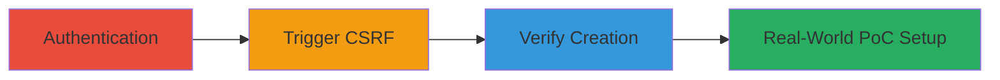

---
tags:
  - csrf
  - elastic
  - appsearch
  - web-vulnerability
type: attack_chain
tools:
  - '[[tools/Semgrep]]'
tactics:
  - '[[Initial Access]]'
verified: false
platforms:
  - Web
  - Cloud
submitted: true
complexity: medium
created_at: '2023-10-01T00:00:00Z'
procedures:
  - '[[procedures/Exploit-CSRF-in-AppSearch-Curations-Creation]]'
step_count: 4
techniques:
  - '[[Exploit Public-Facing Application]]'
updated_at: '2025-12-14T17:27:50.286Z'
description: >-
  A multi-step attack chain exploiting a CSRF vulnerability in Elastic
  AppSearch's curations creation feature to inject unauthorized content via
  unprotected GET requests.
skill_level: intermediate
impact_level: medium
id: bcc0f600-9a1d-406d-bc7d-f0de16c7d110
validated: true
mitre_tactics:
  - '[[Initial Access]]'
mitre_techniques:
  - '[[Exploit Public-Facing Application]]'
---
# CSRF Exploitation in Elastic AppSearch for Unauthorized Curation Creation

Multi-stage attack chain demonstrating a complete attack workflow exploiting CSRF in Elastic AppSearch to create unauthorized curations, potentially spamming or injecting offensive content into the search engine.

## Chain Metrics Dashboard

| Metric | Value |
|--------|-------|
| Chain Status | Unverified |
| Total Steps | 4 |
| Execution Time | ~5 minutes |
| Skill Level | Intermediate |
| Complexity | Medium |
| Impact Level | Medium |

## Attack Flow Visualization

## Prerequisites & Requirements

### Required Tools

- [[tools/Semgrep]]

### Target Environment

- Web platform with Elastic Enterprise Search and AppSearch enabled
- Port 9243 open
- Services: Elasticsearch
- Tech stack: Elastic Enterprise Search, AppSearch, Elasticsearch

### Initial Access Requirements

- Valid credentials for an authenticated user (e.g., username 'h1repro' and password '&Xb|MzZeB@<')
- Network access to the target instance (e.g., https://h1repro.kb.eu-west-1.aws.found.io:9243)
- Browser for manual exploitation or hosting capabilities for PoC

## Detailed Attack Procedures

### Step 1: Authenticate to AppSearch
procedure: [[procedures/Exploit-CSRF-in-AppSearch-Curations-Creation]]

**Objective**: Gain authenticated access to the curations management interface to set up the environment for CSRF exploitation.

**Instructions**: Open a web browser and navigate to the curations management page at `https://h1repro.kb.eu-west-1.aws.found.io:9243/app/enterprise_search/app_search/engines/national-parks-demo/curations`. Select the 'Login with Elasticsearch' option and enter the credentials: username `h1repro` and password `&Xb|MzZeB@<`. This establishes a valid session cookie necessary for the CSRF attack to succeed.

**Expected Output**: Successful login, displaying the curations management dashboard.

**Success Indicators**:
- User is logged in and can view existing curations
- Session is active in the browser

### Step 2: Trigger CSRF via Malicious URL
procedure: [[procedures/Exploit-CSRF-in-AppSearch-Curations-Creation]]

**Objective**: Exploit the unprotected GET endpoint to create a curation with arbitrary content without user consent.

**Instructions**: While the authenticated session from Step 1 is active, open a new browser tab and visit the vulnerable endpoint: `https://h1repro.kb.eu-west-1.aws.found.io:9243/internal/app_search/engines/national-parks-demo/curations/find_or_create?query=QUERY_YOU_WANT_TO_CREATE_HERE`. Replace `QUERY_YOU_WANT_TO_CREATE_HERE` with the desired curation query, such as `Malicious Curation Content`. This GET request forges the creation action using the existing session.

**Expected Output**: The server processes the request and creates the curation silently.

**Success Indicators**:
- No error on the page load
- Curation is created on the backend

### Step 3: Verify Curation Creation
procedure: [[procedures/Exploit-CSRF-in-AppSearch-Curations-Creation]]

**Objective**: Confirm the unauthorized curation has been added to the system.

**Instructions**: Return to the curations management page from Step 1 and refresh the browser (press F5 or Ctrl+R). The new curation with the injected query should now appear in the list.

**Expected Output**: The refreshed page shows the newly created curation in the interface.

**Success Indicators**:
- Injected curation visible in the list
- Query content matches the parameter used in Step 2

### Step 4: Simulate Real-World CSRF PoC
procedure: [[procedures/Exploit-CSRF-in-AppSearch-Curations-Creation]]

**Objective**: Demonstrate a practical attack by hosting a malicious page that auto-triggers the CSRF.

**Instructions**: Create an HTML file with a form targeting the vulnerable endpoint, e.g., `<form action="https://h1repro.kb.eu-west-1.aws.found.io:9243/internal/app_search/engines/national-parks-demo/curations/find_or_create" method="GET"><input type="hidden" name="query" value="Malicious Query"><input type="submit" value="Click Me"></form>`. For automation, add JavaScript to auto-submit on load: ``. Host this file on a web server (e.g., using Python's `http.server`) and trick the victim into visiting it while authenticated.

**Expected Output**: Automatic form submission creates the curation without further interaction.

**Success Indicators**:
- Form submits successfully
- Curation appears after refresh (as in Step 3)

## Attack Chain Summary

### Key Achievements

1. Authenticated access to Elastic AppSearch curations interface
2. Unauthorized creation of curations via CSRF-protected GET requests
3. Verification of injected content in the search engine
4. Realistic PoC for drive-by attacks on authenticated users

## Technique & Tactic Coverage

### MITRE ATT&CK Techniques

- [[Exploit Public-Facing Application]]

### MITRE ATT&CK Tactics

- [[Initial Access]]

---
*Last updated: 2023-10-01T00:00:00Z*
