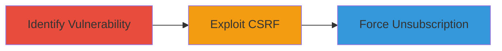

---
tags:
  - csrf
  - web
  - expressionengine
  - unsubscribe
type: attack_chain
tools: []
tactics:
  - '[[Initial Access]]'
verified: false
platforms:
  - Web
submitted: true
complexity: medium
created_at: '2023-10-01T00:00:00Z'
procedures:
  - '[[procedures/Identify-CSRF-in-Unsubscribe-Endpoints]]'
  - '[[procedures/Exploit-CSRF-to-Force-Unsubscription]]'
step_count: 2
techniques:
  - '[[Exploit Public-Facing Application]]'
updated_at: '2025-12-14T17:27:42.963Z'
description: >-
  A multi-stage attack chain exploiting CSRF in ExpressionEngine's comment and
  channel unsubscribe features via unprotected GET requests, allowing forced
  unsubscription of authenticated users.
skill_level: intermediate
impact_level: low
id: eb29d87d-edc5-4720-9f8c-f96b17b99d87
validated: true
mitre_tactics:
  - '[[Initial Access]]'
mitre_techniques:
  - '[[Exploit Public-Facing Application]]'
---
# CSRF Exploitation in ExpressionEngine Unsubscribe Functionality

Multi-stage attack chain demonstrating a complete attack workflow exploiting Cross-Site Request Forgery (CSRF) in ExpressionEngine's comment and channel unsubscribe endpoints.

## Chain Metrics Dashboard

| Metric | Value |
|--------|-------|
| Chain Status | Unverified |
| Total Steps | 2 |
| Execution Time | ~5 minutes |
| Skill Level | Intermediate |
| Complexity | Medium |
| Impact Level | Low |

## Attack Flow Visualization



## Prerequisites & Requirements

### Required Tools

- None (relies on browser and basic web development tools for PoC crafting)

### Target Environment

- ExpressionEngine CMS running on PHP web server
- Authenticated user session required for exploitation
- No specific ports; standard HTTP/HTTPS (80/443)

### Initial Access Requirements

- Attacker needs to trick victim into visiting a malicious link while authenticated
- No prior credentials; social engineering for link click

## Detailed Attack Procedures

### Step 1: Identify CSRF Vulnerability
procedure: [[procedures/Identify-CSRF-in-Unsubscribe-Endpoints]]

**Objective**: Analyze the unsubscribe endpoints to confirm lack of CSRF protection, identifying exploitable GET requests.

**Instructions**: Inspect the ExpressionEngine site's comment and channel unsubscribe functionality. Use browser developer tools to monitor network requests during unsubscribe actions. Verify that requests are sent via GET without CSRF tokens.

For example, navigate to a comment or channel subscription page and attempt to unsubscribe, observing the request URL like `/member/unsubscribe?entry_id=123`.

**Expected Output**: Confirmation of GET-based unsubscribe without token validation.

**Success Indicators**:
- Requests lack CSRF tokens in headers or parameters
- Action completes without additional authentication

### Step 2: Exploit CSRF to Force Unsubscription
procedure: [[procedures/Exploit-CSRF-to-Force-Unsubscription]]

**Objective**: Craft and deliver a malicious payload to trick an authenticated user into performing the unsubscribe action unknowingly.

**Instructions**: Create a simple HTML page hosting an auto-submitting form or img tag that triggers the GET request to the vulnerable endpoint. Host this on an attacker-controlled server and send the link to the victim via phishing or social engineering.

Example PoC HTML:

```html
<!DOCTYPE html>
<html>
<body>
    
    <p>Click here for your prize: <a href="https://attacker.com/malicious">Prize</a></p>
</body>
</html>
```

When the victim visits while authenticated, the img src triggers the unsubscribe.

**Expected Output**: Victim's browser sends the GET request, unsubscribing them from notifications.

**Success Indicators**:
- Victim confirms loss of subscription notifications
- Server logs show the GET request from victim's IP

## Attack Chain Summary

### Key Achievements

1. Identified unprotected GET endpoints for unsubscribe actions
2. Crafted CSRF PoC to bypass protections
3. Demonstrated disruption of user engagement without data loss

## Technique & Tactic Coverage

### MITRE ATT&CK Techniques

- [[Exploit Public-Facing Application]]

### MITRE ATT&CK Tactics

- [[Initial Access]]

---

*Last updated: 2023-10-01T00:00:00Z*
