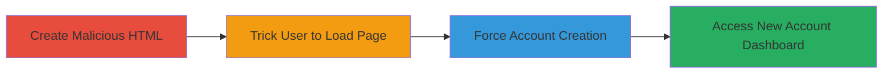

# CSRF Exploitation in Factlink Sign-Up to Force Unauthorized Account Creation

Multi-stage attack chain demonstrating a complete CSRF workflow against the Factlink platform.

## Chain Metrics Dashboard

| Metric | Value |
|--------|-------|
| Chain Status | Unverified |
| Total Steps | 3 |
| Execution Time | ~5 minutes |
| Skill Level | Intermediate |
| Complexity | Medium |
| Impact Level | High |

## Attack Flow Visualization

## Prerequisites & Requirements

### Required Tools

- None (uses basic HTML and browser)

### Target Environment

- Web platform (Ruby on Rails application)
- Authenticated user session on https://staging.factlink.com
- No specific ports or services beyond standard HTTPS (443)

### Initial Access Requirements

- Attacker must have a way to deliver the malicious HTML (e.g., email, phishing link)
- Victim must be authenticated to Factlink
- Network access to the Factlink staging endpoint

## Detailed Attack Procedures

### Step 1: Create Malicious HTML
procedure: [[procedures/Craft-CSRF-HTML-Form-for-Factlink-Sign-Up]]

**Objective**: Build an HTML page that auto-submits a forged sign-up request to bypass CSRF protections.

**Instructions**: Develop the HTML form with hidden fields mimicking the legitimate sign-up, including the authenticity token if obtainable, targeting the POST endpoint.

**Expected Output**: A local HTML file ready for delivery.

**Success Indicators**:
- HTML file created and validates against the target form structure
- Form auto-submits when loaded in a browser

### Step 2: Trick Victim into Loading the HTML Page
procedure: [[procedures/Deliver-Malicious-HTML-via-User-Interaction]]

**Objective**: Socially engineer the victim to open the malicious page while authenticated to Factlink.

**Instructions**: Host or send the HTML file via email, link, or file share, ensuring the victim clicks it or visits the URL in their browser with an active Factlink session.

**Expected Output**: Victim's browser loads and submits the form invisibly.

**Success Indicators**:
- Victim interacts with the delivery mechanism
- No visible errors on page load

### Step 3: Observe the Forced Account Creation
procedure: [[procedures/Observe-and-Verify-Unauthorized-Account-Creation]]

**Objective**: Confirm the new account is created and accessible via the dashboard.

**Instructions**: Monitor the endpoint response or check Factlink for the new user account with the specified credentials.

**Expected Output**: Redirect to the home dashboard with new account details.

**Success Indicators**:
- New account exists in the system
- Attacker can log in with predefined credentials

## Attack Chain Summary

### Key Achievements

1. Bypassed CSRF protections in the sign-up process
2. Forced creation of unauthorized accounts without user knowledge
3. Gained access to new accounts for potential further exploitation

## Technique & Tactic Coverage

### MITRE ATT&CK Techniques

- [[Exploit Public-Facing Application]] Exploit Public-Facing Application
- [[Drive-by Compromise]] Drive-by Compromise

### MITRE ATT&CK Tactics

- [[Initial Access]] Initial Access

---
*Last updated: 2023-10-01T00:00:00Z*
