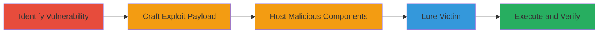

# CSRF Exploitation in Federalist API via Flash SWF and PHP Redirector

Multi-stage attack chain demonstrating a CSRF vulnerability in the Federalist API's POST endpoints, exploited by forging Content-Type headers using Adobe Flash SWF files and a PHP proxy to perform unauthorized actions like triggering site builds on behalf of authenticated users.

## Chain Metrics Dashboard

| Metric | Value |
|--------|-------|
| Chain Status | Unverified |
| Total Steps | 5 |
| Execution Time | ~10 minutes |
| Skill Level | Intermediate |
| Complexity | Medium |
| Impact Level | Medium |

## Attack Flow Visualization

## Prerequisites & Requirements

### Required Tools

- [[tools/Flash-SWF-File]]
- [[tools/PHP-Redirector]]
- [[tools/crossdomain-xml]]
- [[tools/swf-json-csrf]]

### Target Environment

- Web platform with Federalist API (e.g., https://federalist.fr.cloud.gov)
- POST endpoints like /v0/build/ and /v0/sites/
- No specific ports required beyond standard HTTPS (443)

### Initial Access Requirements

- Attacker controls a web server to host SWF, PHP, and crossdomain.xml
- Victim must be authenticated to Federalist and have Flash enabled in browser
- Knowledge of target site IDs (e.g., site ID 1 or 35) for payload crafting
- No prior credentials needed for attacker

## Detailed Attack Procedures

### Step 1: Identify Lack of CSRF Protection
procedure: [[procedures/Identify-CSRF-Lack-of-Protection-in-API]]

**Objective**: Detect the absence of CSRF tokens on Federalist API POST endpoints and confirm vulnerability to Content-Type forgery.

**Instructions**: Inspect API documentation and endpoints to note lack of CSRF tokens. Attempt initial proof-of-concept POST requests to /v0/build/ with JSON payload, observing failure due to Content-Type checks but confirming no token requirement.

**Expected Output**: API accepts requests without tokens but rejects non-JSON Content-Type.

**Success Indicators**:
- No CSRF token observed in API responses or docs
- Initial POC fails only on Content-Type, not authentication

### Step 2: Craft SWF Flash File for JSON Request
procedure: [[procedures/Craft-SWF-Flash-File-for-JSON-Request]]

**Objective**: Create a Flash SWF file capable of sending a forged JSON POST request to bypass Content-Type validation.

**Instructions**: Use tools like the swf_json_csrf repository to generate an SWF file. Embed parameters such as jsonData (e.g., {"site":1,"branch":"master"}), php_url (attacker's PHP endpoint), and endpoint (e.g., https://federalist.fr.cloud.gov/v0/build/).

**Expected Output**: Compiled SWF file ready for embedding in HTML.

**Success Indicators**:
- SWF file loads without errors in Flash-enabled browser
- Parameters correctly passed to initiate request

### Step 3: Host SWF and PHP Redirector on Attacker Server
procedure: [[procedures/Host-SWF-and-PHP-Redirector-on-Attacker-Server]]

**Objective**: Set up the malicious webpage and proxy to facilitate the cross-origin request and header forgery.

**Instructions**: Deploy the SWF file embedded in an HTML page on attacker's server. Create a PHP script for 307 redirect that preserves the Content-Type: application/json header. Include crossdomain.xml to allow Flash cross-origin access if needed.

**Expected Output**: Accessible webpage at attacker URL (e.g., http://attacker.com/malicious.html) with SWF loaded.

**Success Indicators**:
- PHP endpoint returns 307 redirect on POST
- crossdomain.xml permits Flash requests
- Page loads SWF without Flash security errors

### Step 4: Lure Authenticated User to Malicious Page
procedure: [[procedures/Lure-Authenticated-User-to-Malicious-Page]]

**Objective**: Trick an authenticated Federalist user into visiting the attacker's page, triggering the CSRF action.

**Instructions**: Distribute the malicious URL via phishing, social engineering, or embedding in untrusted sites. Ensure victim has active Federalist session and Flash enabled. Upon page load, SWF sends POST via PHP proxy to Federalist API.

**Expected Output**: Victim's browser executes the Flash request, performing the POST (e.g., trigger build for site ID 1).

**Success Indicators**:
- Victim visits page while authenticated
- Flash executes without user interaction
- API action (e.g., build restart) occurs server-side

### Step 5: Verify Exploitation via API Action
procedure: [[procedures/Verify-Exploitation-via-API-Action]]

**Objective**: Confirm the unauthorized POST action was processed by the API.

**Instructions**: Monitor Federalist dashboard or API logs for the triggered action (e.g., new build initiated for targeted site). Note that response is not readable by attacker due to SOP/CORS, but server-side effects validate success.

**Expected Output**: Evidence of action like build logs or site modifications.

**Success Indicators**:
- Unauthorized build or site addition observed
- No direct response to attacker, but impact confirmed

## Attack Chain Summary

### Key Achievements

1. Bypassed CSRF protection and Content-Type checks using Flash and PHP proxy
2. Performed unauthorized POST actions on Federalist API without victim interaction beyond page visit
3. Demonstrated medium-impact disruption to user sites, limited by private repo access

## Technique & Tactic Coverage

### MITRE ATT&CK Techniques

- [[Drive-by Compromise]]
- [[Exploit Public-Facing Application]]

### MITRE ATT&CK Tactics

- [[Initial Access]]
- [[Execution]]

---

*Last updated: 2023-10-01T00:00:00Z*
