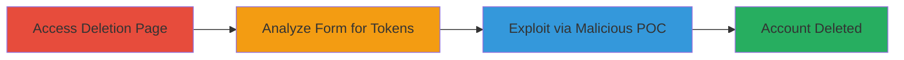

# CSRF Exploitation in Flickr Account Deletion Leading to Unauthorized Account Termination

Multi-stage attack chain demonstrating a complete attack workflow exploiting the lack of CSRF protection in Flickr's account deletion after switching authentication systems.

## Chain Metrics Dashboard

| Metric | Value |
|--------|-------|
| Chain Status | Unverified |
| Total Steps | 3 |
| Execution Time | ~5 minutes |
| Skill Level | Intermediate |
| Complexity | Medium |
| Impact Level | High |

## Attack Flow Visualization

## Prerequisites & Requirements

### Required Tools

- Web browser with developer tools

### Target Environment

- Web platform
- Flickr service at https://www.flickr.com
- Authenticated user session

### Initial Access Requirements

- Valid Flickr account credentials
- Ability to access the account deletion page
- No special network access beyond internet

## Detailed Attack Procedures

### Step 1: Test Account Deletion Feature
procedure: [[procedures/Test-Flickr-Account-Deletion-Feature]]

**Objective**: Access and observe the account deletion form to understand its behavior and submission process.

**Instructions**: Log in to Flickr using the new SmugMug login flow at https://identity.flickr.com/. Navigate to https://www.flickr.com/account/delete and inspect the HTML form using browser developer tools. Attempt a test submission to confirm the deletion process without actually deleting the account.

**Expected Output**: Form visible without CSRF token; submission prompts confirmation but lacks protection.

**Success Indicators**:
- Form accessed successfully
- No errors in form rendering

### Step 2: Identify Missing CSRF Token
procedure: [[procedures/Identify-Missing-CSRF-Token-in-Flickr-Login-Flow]]

**Objective**: Analyze the form for security tokens and compare against the legacy Yahoo system to confirm the vulnerability.

**Instructions**: Use browser developer tools to inspect the form elements at https://www.flickr.com/account/delete. Look for hidden input fields like CSRF tokens. Compare with historical knowledge of Yahoo authentication (https://login.yahoo.com), which implicitly protected via auth code. Note the absence in the new flow.

**Expected Output**: Confirmation that no CSRF token is present in the form POST request.

**Success Indicators**:
- Form source code shows missing token
- Network tab reveals unprotected POST to /account/delete

### Step 3: Create POC for Exploitation
procedure: [[procedures/Create-POC-for-Flickr-CSRF-Exploitation]]

**Objective**: Develop and demonstrate a malicious page that tricks an authenticated user into deleting their account.

**Instructions**: Create an HTML page with a form that auto-submits to https://www.flickr.com/account/delete using the victim's session. Host it on a third-party site and lure the user via email or link. Record a video showing the exploitation from an authenticated session.

**Expected Output**: Account deletion upon form submission from the malicious page.

**Success Indicators**:
- Malicious form submits successfully
- Victim's account is terminated

## Attack Chain Summary

### Key Achievements

1. Identified CSRF gap post-auth system migration
2. Demonstrated unauthorized account deletion via cross-site form submission
3. Highlighted impact of removing implicit protections without replacement

## Technique & Tactic Coverage

### MITRE ATT&CK Techniques

- [[Exploit Public-Facing Application]]

### MITRE ATT&CK Tactics

- [[Initial Access]]

---
*Last updated: 2023-10-01T00:00:00Z*
