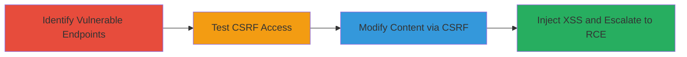

---
tags:
  - csrf
  - wordpress
  - xss
  - rce
  - web
type: attack_chain
tools: []
tactics:
  - '[[Initial Access]]'
  - '[[Execution]]'
  - '[[Collection]]'
commands:
  - '[[commands/Test-CSRF-with-frs-show-modal-Form]]'
  - '[[commands/Exploit-CSRF-with-frs-save-Form]]'
  - '[[commands/HTTP-POST-to-frs-show-modal]]'
  - '[[commands/Vulnerable-frs-save-PHP-Function]]'
verified: false
platforms:
  - Web
  - WordPress
submitted: true
complexity: medium
created_at: '2023-10-01T00:00:00Z'
procedures:
  - '[[procedures/Identify-Vulnerable-AJAX-Endpoints-in-WordPress-Plugin]]'
  - '[[procedures/Test-AJAX-Functions-for-CSRF-Vulnerability]]'
  - '[[procedures/Exploit-CSRF-to-Modify-Post-Content]]'
  - '[[procedures/Inject-JavaScript-for-Stored-XSS-and-Escalation]]'
step_count: 4
techniques:
  - '[[Exploit Public-Facing Application]]'
  - '[[Drive-by Compromise]]'
  - '[[JavaScript]]'
updated_at: '2025-12-14T17:27:15.564Z'
description: >-
  A multi-stage attack exploiting CSRF in the Fluid Responsive Slideshow plugin
  to modify WordPress content, inject stored XSS, and potentially achieve remote
  code execution via admin privileges.
skill_level: intermediate
impact_level: high
id: 5e2edbb4-d61a-417f-ab7f-4612fdddb4bd
validated: true
mitre_tactics:
  - '[[Initial Access]]'
  - '[[Execution]]'
  - '[[Collection]]'
mitre_techniques:
  - '[[Exploit Public-Facing Application]]'
  - '[[Drive-by Compromise]]'
  - '[[JavaScript]]'
---
# CSRF Exploitation in Fluid Responsive Slideshow WordPress Plugin Leading to Stored XSS and RCE

Multi-stage attack chain demonstrating exploitation of a CSRF vulnerability in the Fluid Responsive Slideshow plugin (v2.2.0) on a WordPress site, allowing arbitrary content modification, stored XSS injection, and potential escalation to server-side RCE.

## Chain Metrics Dashboard

| Metric | Value |
|--------|-------|
| Chain Status | Unverified |
| Total Steps | 4 |
| Execution Time | ~5 minutes |
| Skill Level | Intermediate |
| Complexity | Medium |
| Impact Level | High |

## Attack Flow Visualization



## Prerequisites & Requirements

### Required Tools

- Web browser for crafting and submitting forms
- Access to a controlled site to host malicious HTML

### Target Environment

- WordPress site with Fluid Responsive Slideshow plugin (v2.2.0)
- Admin user with logged-in session
- No specific ports; web access required

### Initial Access Requirements

- Attacker controls a site that the admin visits
- Target admin must be authenticated to WordPress
- Knowledge of target post/page IDs

## Detailed Attack Procedures

### Step 1: Identify Vulnerable AJAX Endpoints
procedure: [[procedures/Identify-Vulnerable-AJAX-Endpoints-in-WordPress-Plugin]]

**Objective**: Review the plugin source to identify AJAX handlers lacking CSRF protection.

**Instructions**: Access the plugin files and examine ajax.php for handlers like frs_save that process $_POST without nonces.

**Expected Output**: Confirmation of vulnerable functions using wp_update_post directly from unsanitized input.

**Success Indicators**:
- No wp_verify_nonce calls found
- Direct use of $_POST for post updates identified

### Step 2: Test Non-Destructive Access to AJAX Functions
procedure: [[procedures/Test-AJAX-Functions-for-CSRF-Vulnerability]]

**Objective**: Verify lack of CSRF protection by sending a test request to a non-modifying endpoint.

**Instructions**: Craft and submit a form using [[commands/Test-CSRF-with-frs-show-modal-Form]] to the admin-ajax.php endpoint with a bogus post_id.

```html
<form method=post action="https://eng.uber.com/wp-admin/admin-ajax.php?action=frs_show_modal">
<input type=text name="post_id" value="zzz">
<input type=submit>
</form>
```

Auto-submit with JavaScript if needed for stealth.

**Expected Output**: JSON response for logged-in users, confirming access without tokens.

**Success Indicators**:
- Valid JSON returned for authenticated sessions
- '0' response for unauthenticated, indicating no auth bypass but CSRF possible

### Step 3: Exploit CSRF to Modify Post/Page Content
procedure: [[procedures/Exploit-CSRF-to-Modify-Post-Content]]

**Objective**: Use CSRF to update a target post with malicious content.

**Instructions**: Create an auto-submitting form using [[commands/Exploit-CSRF-with-frs-save-Form]], targeting a known post_id with injected script in content.

```html
<form method=post action="https://eng.uber.com/wp-admin/admin-ajax.php?action=frs_save">
<input type=text name="post_id" value="(ANY POST/PAGE ID)">
<input type=text name="title" value="new title for the page">
<input type=text name="content" value="Any HTML content, e.g. <script>alert('hello');</script>">
<input type=submit>
</form>
```

Host on attacker site and lure admin to visit.

**Expected Output**: Post updated; script executes on page load.

**Success Indicators**:
- Target post content modified
- Alert or payload executes when viewing the post

### Step 4: Inject JavaScript for Stored XSS and Potential Escalation
procedure: [[procedures/Inject-JavaScript-for-Stored-XSS-and-Escalation]]

**Objective**: Leverage modified content for persistent XSS and escalate to RCE.

**Instructions**: After injection, use the XSS to access admin editors; target old/protected posts for stealth and redirect via JS. Exploit admin JS to edit plugins/themes for RCE, e.g., via wpengine-common.

**Expected Output**: JavaScript executes site-wide; admin privileges gained for further exploits.

**Success Indicators**:
- XSS payload affects all viewers
- Access to plugin editor or RCE vector achieved

## Attack Chain Summary

### Key Achievements

1. Identified CSRF in plugin AJAX without nonce validation
2. Demonstrated arbitrary post modification via cross-site forms
3. Injected stored XSS for broad impact
4. Outlined escalation path to server-side RCE

## Technique & Tactic Coverage

### MITRE ATT&CK Techniques

- [[Exploit Public-Facing Application]] Exploit Public-Facing Application
- [[Drive-by Compromise]] Drive-by Compromise
- [[JavaScript]] JavaScript

### MITRE ATT&CK Tactics

- [[Initial Access]] Initial Access
- [[Execution]] Execution
- [[Collection]] Collection

---

*Last updated: 2023-10-01T00:00:00Z*
