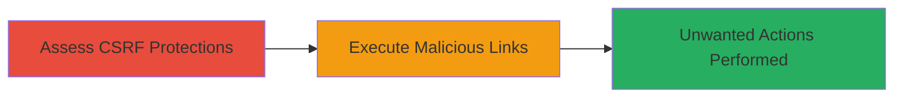

---
tags:
  - csrf
  - web
  - irc
  - javascript
type: attack_chain
tools: []
tactics:
  - '[[Initial Access]]'
verified: false
platforms:
  - Web
submitted: true
complexity: medium
procedures:
  - '[[procedures/Assess-CSRF-Protections-in-IRC-Link-Handling]]'
  - '[[procedures/Craft-and-Execute-Malicious-CSRF-Links-in-IRCCloud]]'
step_count: 2
techniques:
  - '[[Exploit Public-Facing Application]]'
description: >-
  A multi-step attack exploiting CSRF in IRCCloud's IRC link handling to force
  authenticated users into performing unwanted actions like joining arbitrary
  channels or spamming messages.
skill_level: intermediate
impact_level: medium
id: eea90a63-8149-46a3-b3e2-3a38d1782f63
created_at: '2025-12-14T17:27:22.927Z'
updated_at: '2025-12-14T17:27:22.927Z'
validated: true
mitre_tactics:
  - '[[Initial Access]]'
mitre_techniques:
  - '[[Exploit Public-Facing Application]]'
---
# CSRF Exploitation in IRCCloud to Force Unwanted Channel Joins and Spamming

Multi-stage attack chain demonstrating a complete attack workflow exploiting Cross-Site Request Forgery (CSRF) in IRCCloud's handling of IRC protocol links (irc://). This vulnerability allows an attacker to craft malicious links or pages that, when visited by a logged-in user, trigger state-changing actions such as joining arbitrary IRC channels or sending spam messages without the user's explicit consent. The attack relies on JavaScript execution in the browser, as non-JS methods like image tags fail to process the links. IRCCloud viewed this as intended usability behavior mimicking traditional IRC clients and did not implement fixes, classifying it as informative.

## Chain Metrics Dashboard

| Metric | Value |
|--------|-------|
| Chain Status | Unverified |
| Total Steps | 2 |
| Execution Time | ~5 minutes |
| Skill Level | Intermediate |
| Complexity | Medium |
| Impact Level | Medium |

## Attack Flow Visualization



## Prerequisites & Requirements

### Required Tools

- Web browser with developer tools (e.g., Chrome DevTools for testing JavaScript execution)
- Text editor for crafting HTML/JS payloads

### Target Environment

- IRCCloud web application (https://www.irccloud.com)
- Required services/ports: Web (HTTPS on port 443)
- Tech stack: JavaScript-enabled browser interacting with IRC services

### Initial Access Requirements

- Attacker needs to lure a logged-in IRCCloud user to visit a malicious link or page (e.g., via phishing or social engineering)
- No direct credentials required, but victim must be authenticated in IRCCloud
- Network access: Public internet; no privileged position needed

## Detailed Attack Procedures

### Step 1: Assess CSRF Protections
procedure: [[procedures/Assess-CSRF-Protections-in-IRC-Link-Handling]]

**Objective**: Identify the absence of CSRF protections in IRCCloud's handling of irc:// links, confirming that JavaScript can trigger state-changing actions like channel joins without tokens.

**Instructions**: Open the IRCCloud web application in a browser while logged in. Use developer tools to inspect how irc:// links are processed. Test by manually navigating to an irc:// link (e.g., irc://irc.example.com/channel) and observe if it executes without additional confirmation. Attempt non-JS methods like embedding the link in an  tag on a test page to verify they fail, confirming JavaScript dependency.

**Expected Output**: The link executes, joining the channel or performing the action seamlessly, with no CSRF token prompts.

**Success Indicators**:
- Action (e.g., channel join) completes without user interaction beyond visiting the page
- Browser console shows JavaScript handling the link without errors or blocks

### Step 2: Craft and Execute Malicious Links
procedure: [[procedures/Craft-and-Execute-Malicious-CSRF-Links-in-IRCCloud]]

**Objective**: Create and deliver a malicious page or link that uses JavaScript to forge the CSRF-vulnerable request, forcing the victim to join arbitrary channels or spam messages.

**Instructions**: Craft an HTML page with JavaScript to simulate the irc:// link execution. For example, use window.location or a custom handler to trigger the action. Host the page on an attacker-controlled server and send the link to the victim via email or chat. When the victim (logged into IRCCloud) visits, the JS executes the forged request.

Example payload in HTML:

```html
<!DOCTYPE html>
<html>
<body>
<script>
  // Simulate irc:// link to join malicious channel
  window.location = 'irc://irc.example.com/#malicious-channel';
  // Or for spamming: trigger multiple joins or message sends via JS
</script>
</body>
</html>
```

**Expected Output**: Victim's IRCCloud session performs the unwanted action (e.g., joins channel or sends spam) transparently.

**Success Indicators**:
- Victim reports unexpected channel join or spam activity in their IRC session
- Attacker observes no errors in the forged request execution

## Attack Chain Summary

### Key Achievements

1. Confirmed CSRF vulnerability in IRC link handling without protections
2. Successfully forced unwanted actions via JavaScript-crafted links
3. Demonstrated impact on user sessions without authentication bypass

## Technique & Tactic Coverage

### MITRE ATT&CK Techniques

- [[Exploit Public-Facing Application]]

### MITRE ATT&CK Tactics

- [[Initial Access]]

---
*Last updated: 2023-10-01*
