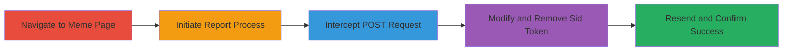

# CSRF Exploitation in Imgur Meme Abuse Reporting for Forged Content Flags

Multi-stage attack chain demonstrating a complete CSRF exploitation workflow in Imgur's abuse reporting system.

## Chain Metrics Dashboard

| Metric | Value |
|--------|-------|
| Chain Status | Unverified |
| Total Steps | 5 |
| Execution Time | ~5 minutes |
| Skill Level | Intermediate |
| Complexity | Medium |
| Impact Level | High |

## Attack Flow Visualization

## Prerequisites & Requirements

### Required Tools

- [[tools/Burp-Suite]]

### Target Environment

- Web platform (Imgur meme pages)
- Required services/ports: HTTP/HTTPS on port 80/443
- Network access requirements: Direct internet access to Imgur

### Initial Access Requirements

- Authenticated Imgur session (user must be logged in)
- Browser with proxy support for interception
- No prior access needed beyond standard web browsing

## Detailed Attack Procedures

### Step 1: Navigate to Target Meme Page
procedure: [[procedures/Navigate-to-Target-Meme-and-Initiate-Report]]

**Objective**: Access a specific meme page to set up the reporting process and observe the normal flow.

**Instructions**: Open a web browser and visit a target meme URL on Imgur, such as http://imgur.com/t/memes/ieTEJEd. Ensure you are authenticated as an Imgur user.

**Expected Output**: The meme page loads, displaying the image and post options.

**Success Indicators**:
- Meme page renders successfully
- User authentication is active (visible in account menu)

### Step 2: Initiate Abuse Report
procedure: [[procedures/Navigate-to-Target-Meme-and-Initiate-Report]]

**Objective**: Trigger the report abuse feature to generate the form submission request.

**Instructions**: Click on the post options menu (typically three dots or gear icon), select 'Report', and choose the 'Abusive/Offensive' category. Do not submit yet; prepare for interception.

**Expected Output**: Report form appears with category selection.

**Success Indicators**:
- Report dialog opens
- Category options are selectable

### Step 3: Intercept the Report Request
procedure: [[procedures/Intercept-Report-Submission-Request]]

**Objective**: Capture the POST request sent when submitting the report using an intercepting proxy.

**Instructions**: Configure your browser to route traffic through [[tools/Burp-Suite]] as a proxy. Click 'Report' to submit, and intercept the request in Burp Suite. The request will include a 'Sid' token in the POST body for CSRF validation.

**Expected Output**: Intercepted POST request visible in proxy tool, showing form data including 'Sid' token.

**Success Indicators**:
- Request is captured before reaching the server
- 'Sid' token is present in the request body

### Step 4: Modify Request to Remove Sid Token
procedure: [[procedures/Modify-Request-to-Bypass-Sid-Token]]

**Objective**: Alter the request to bypass CSRF protection by removing the validation token.

**Instructions**: In the proxy tool like Burp Suite, edit the POST body to delete the 'Sid' parameter and its value. Also strip any other form validation tokens if present, but retain essential fields like the meme ID and report category. Forward the modified request.

**Expected Output**: Modified request sent to server.

**Success Indicators**:
- Request forwards without errors
- No validation errors in proxy logs

### Step 5: Verify Successful Forged Report
procedure: [[procedures/Resend-Modified-Request-and-Verify-Success]]

**Objective**: Confirm the server processes the request without the token, proving the CSRF vulnerability.

**Instructions**: Observe the server's response after forwarding the modified request. Check for a 200 OK status and any confirmation of report submission.

**Expected Output**: Server returns 200 OK, indicating the abuse report was accepted and processed.

**Success Indicators**:
- 200 OK response code
- No error messages about missing tokens
- Report is logged on the server side (verifiable by checking meme status or user report history)

## Attack Chain Summary

### Key Achievements

1. Demonstrated lack of CSRF token validation in Imgur's abuse reporting endpoint.
2. Enabled forging of abuse reports on behalf of authenticated users via malicious pages.
3. Highlighted potential for mass false reporting leading to content removal.

## Technique & Tactic Coverage

### MITRE ATT&CK Techniques

- [[Exploit Public-Facing Application]]

### MITRE ATT&CK Tactics

- [[Initial Access]]

---
*Last updated: 2023-10-01T00:00:00Z*
