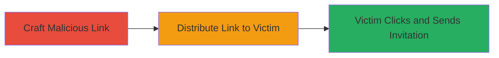

---
tags:
  - csrf
  - linkedin
  - web
  - social-engineering
type: attack_chain
tools: []
tactics:
  - '[[Initial Access]]'
  - '[[Execution]]'
verified: false
platforms:
  - Web
submitted: true
complexity: medium
created_at: '2023-10-01T00:00:00Z'
procedures:
  - '[[procedures/Craft-Malicious-CSRF-Link-for-LinkedIn-Invitations]]'
  - '[[procedures/Distribute-Malicious-Link-to-Victims]]'
step_count: 2
techniques:
  - '[[Exploit Public-Facing Application]]'
  - '[[User Execution]]'
updated_at: '2025-12-14T17:27:50.469Z'
description: >-
  A multi-stage attack leveraging a CSRF vulnerability in LinkedIn's invitation
  feature to force victims to send connection requests to the attacker via
  malicious links.
skill_level: intermediate
impact_level: high
id: 23873f62-eb77-4091-b517-30e02397d734
validated: true
mitre_tactics:
  - '[[Initial Access]]'
  - '[[Execution]]'
mitre_techniques:
  - '[[Exploit Public-Facing Application]]'
  - '[[User Execution]]'
---
# CSRF Exploitation in LinkedIn Connection Invitations for Forced Network Expansion

Multi-stage attack chain demonstrating a complete attack workflow exploiting a CSRF vulnerability in LinkedIn's connection invitation system.

## Chain Metrics Dashboard

| Metric | Value |
|--------|-------|
| Chain Status | Unverified |
| Total Steps | 2 |
| Execution Time | ~5 minutes |
| Skill Level | Intermediate |
| Complexity | Medium |
| Impact Level | High |

## Attack Flow Visualization

## Prerequisites & Requirements

### Required Tools

- None (manual link crafting and distribution)

### Target Environment

- LinkedIn web platform
- Authenticated victim account
- No specific ports or services beyond standard HTTPS

### Initial Access Requirements

- Attacker's LinkedIn account
- Victim's public profile URL name
- Ability to communicate with victim (e.g., email, messaging)

## Detailed Attack Procedures

### Step 1: Craft Malicious Link
procedure: [[procedures/Craft-Malicious-CSRF-Link-for-LinkedIn-Invitations]]

**Objective**: Create a forged URL that exploits the CSRF vulnerability to send a connection invitation from the victim's account to the attacker without confirmation.

**Instructions**: Analyze LinkedIn's invitation URL structure from 'People You May Know' emails, then modify it by replacing the target with the attacker's username and appending tracking parameters to mimic legitimate requests.

**Expected Output**: A clickable link like `https://www.linkedin.com/comm/mynetwork/send-invite/attacker-username?lipi=...&midSig=...` that triggers the invitation upon click.

**Success Indicators**:
- Link validates against LinkedIn's endpoint structure
- No immediate errors when tested in a browser (victim must be authenticated)

### Step 2: Distribute Link to Victim
procedure: [[procedures/Distribute-Malicious-Link-to-Victims]]

**Objective**: Deliver the malicious link to the target user, tricking them into clicking it while authenticated on LinkedIn.

**Instructions**: Share the crafted link via email, social media, or messaging, disguising it as a legitimate recommendation or resource. When the victim clicks it while logged into LinkedIn, the browser automatically submits the forged request.

**Expected Output**: Victim's account sends a connection request to the attacker, visible in the attacker's LinkedIn invitations.

**Success Indicators**:
- Connection request received from victim's account
- No user confirmation prompt appears during the process

## Attack Chain Summary

### Key Achievements

1. Bypassed LinkedIn's intended single-user invitation restrictions
2. Enabled spam and unwanted network growth without victim consent
3. Demonstrated CSRF impact on social networking features

## Technique & Tactic Coverage

### MITRE ATT&CK Techniques

- [[Exploit Public-Facing Application]]
- [[User Execution]]

### MITRE ATT&CK Tactics

- [[Initial Access]]
- [[Execution]]

---
*Last updated: 2023-10-01T00:00:00Z*
