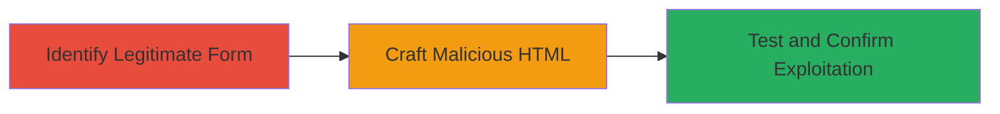

---
tags:
  - csrf
  - web-vulnerability
  - data-tampering
type: attack_chain
tools: []
tactics:
  - '[[Initial Access]]'
commands: []
platforms:
  - Web
complexity: medium
procedures:
  - '[[procedures/Exploit-CSRF-in-Localize-Phrase-Addition]]'
step_count: 3
techniques:
  - '[[Drive-by Compromise]]'
description: >-
  Attack chain exploiting CSRF vulnerability in the Localize web application's
  phrase addition feature, allowing unauthorized data modification via malicious
  forms.
skill_level: intermediate
impact_level: high
id: afd185dd-3125-430a-b206-230adb88ada8
created_at: '2025-12-14T17:27:35.874Z'
updated_at: '2025-12-14T17:27:35.874Z'
verified: false
validated: true
submitted: true
mitre_tactics:
  - '[[Initial Access]]'
mitre_techniques:
  - '[[Drive-by Compromise]]'
---
# CSRF Exploitation in Localize Phrase Addition Feature

Multi-stage attack chain demonstrating a complete CSRF workflow against the Localize web application, where inadequate CSRF token validation allows attackers to trick authenticated users into submitting malicious forms for unauthorized phrase additions.

## Chain Metrics Dashboard

| Metric | Value |
|--------|-------|
| Chain Status | Unverified |
| Total Steps | 3 |
| Execution Time | ~5 minutes |
| Skill Level | Intermediate |
| Complexity | Medium |
| Impact Level | High |

## Attack Flow Visualization

## Prerequisites & Requirements

### Required Tools

- Web browser for testing
- Text editor for crafting HTML

### Target Environment

- Web platform
- Localize application with phrase addition feature
- Authenticated user session

### Initial Access Requirements

- Social engineering capability (e.g., phishing link to malicious page)
- Knowledge of target project ID and language ID
- No special credentials beyond user authentication

## Detailed Attack Procedures

### Step 1: Identify Legitimate Form
procedure: [[procedures/Exploit-CSRF-in-Localize-Phrase-Addition]]

**Objective**: Analyze the legitimate phrase addition form to identify the CSRF token and submission endpoint.

**Instructions**: Inspect the add phrase form in the Localize application using browser developer tools. Note the POST endpoint (e.g., http://www.localize.io/add_phrase/59/languages/3) and form parameters such as add_phrase[type]=1, add_phrase[key]=asdasd, add_phrase[string]=456, and the CSRFToken field.

**Expected Output**: Documented form structure confirming the presence but non-enforcement of the CSRF token.

**Success Indicators**:
- Endpoint and parameters identified
- CSRF token field observed but not validated

### Step 2: Craft Malicious HTML
procedure: [[procedures/Exploit-CSRF-in-Localize-Phrase-Addition]]

**Objective**: Create a malicious HTML page with a hidden form that submits to the target endpoint without the CSRF token.

**Instructions**: Use a text editor to build an HTML file with a form set to action='http://www.localize.io/add_phrase/59/languages/3' method='POST'. Include hidden inputs for the required parameters (e.g., <input type="hidden" name="add_phrase[type]" value="1">, <input type="hidden" name="add_phrase[key]" value="asdasd">, <input type="hidden" name="add_phrase[string]" value="456">) and a submit button or auto-submit script. Host this page on a server or local file for delivery via phishing.

**Expected Output**: Malicious HTML page ready for user interaction.

**Success Indicators**:
- Form omits CSRF token
- Parameters match legitimate form

### Step 3: Test and Confirm Exploitation
procedure: [[procedures/Exploit-CSRF-in-Localize-Phrase-Addition]]

**Objective**: Verify the CSRF vulnerability by submitting the malicious form and observing unauthorized phrase addition.

**Instructions**: With an authenticated session in the Localize app, open the malicious HTML page in a browser and trigger the form submission (e.g., click submit). Monitor the application to check if the phrase with key 'asdasd' and string '456' is added to project ID 59, language ID 3.

**Expected Output**: Phrase successfully added without CSRF token, confirming the vulnerability.

**Success Indicators**:
- Phrase added to the project
- No errors from missing token

## Attack Chain Summary

### Key Achievements

1. Identified CSRF token non-validation in phrase addition endpoint
2. Crafted and delivered malicious form via social engineering
3. Confirmed unauthorized data modification for authenticated users

## Technique & Tactic Coverage

### MITRE ATT&CK Techniques

- [[Drive-by Compromise]]

### MITRE ATT&CK Tactics

- [[Initial Access]]

---
*Last updated: 2023-10-01*
