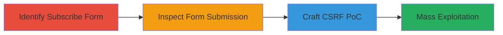

# CSRF Exploitation in MailChimp Subscribe Form for Unauthorized User Subscriptions

Multi-stage attack chain demonstrating the exploitation of a Cross-Site Request Forgery (CSRF) vulnerability in the MailChimp subscribe form hosted by Paragon Initiative Enterprises. The attack allows an adversary to subscribe arbitrary email addresses to the mailing list without user interaction, resulting in unwanted confirmation emails and potential spam campaigns.

## Chain Metrics Dashboard

| Metric | Value |
|--------|-------|
| Chain Status | Unverified |
| Total Steps | 4 |
| Execution Time | ~10 minutes |
| Skill Level | Intermediate |
| Complexity | Medium |
| Impact Level | Medium |

## Attack Flow Visualization

## Prerequisites & Requirements

### Required Tools

- [[tools/Burp-Suite]]

### Target Environment

- Web platform with MailChimp integration
- Access to the subscribe form endpoint (e.g., http://paragonie.us11.list-manage.com/subscribe/post)
- No authentication required for the form

### Initial Access Requirements

- Victim must visit attacker's malicious page (e.g., via phishing or drive-by compromise)
- Attacker needs a list of target emails for mass exploitation
- Network access to the MailChimp endpoint

## Detailed Attack Procedures

### Step 1: Identify the Subscribe Form
procedure: [[procedures/Inspect-MailChimp-Subscribe-Form]]

**Objective**: Locate and analyze the MailChimp subscribe form to understand its structure and parameters.

**Instructions**: Navigate to the target subscribe form URL, such as http://paragonie.us11.list-manage2.com/subscribe?u=260ff2c88e0a7e103f01ccd79&id=8ddb8569ca, and examine the form fields for email, name, organization, etc.

**Expected Output**: Identification of the form endpoint and required parameters like u, id, MERGE0 (email).

**Success Indicators**:
- Form URL and parameters documented
- No CSRF token observed in the form

### Step 2: Inspect Form Submission Request
procedure: [[procedures/Inspect-MailChimp-Subscribe-Form]]

**Objective**: Capture and analyze the POST request sent during form submission to replicate it in the attack.

**Instructions**: Submit the form manually using a browser or proxy tool to capture the request details, including hidden fields like u=260ff2c88e0a7e103f01ccd79, id=8ddb8569ca, MERGE0=email, EMAILTYPE=html, and submit=Subscribe to list.

**Expected Output**: Detailed POST request payload with all parameters.

**Success Indicators**:
- Request captured without errors
- All form fields replicated accurately

### Step 3: Craft CSRF Proof-of-Concept
procedure: [[procedures/Craft-CSRF-Proof-of-Concept]]

**Objective**: Create a malicious HTML page that automatically submits the forged POST request to subscribe a victim.

**Instructions**: Develop an HTML form with hidden inputs matching the captured request and use JavaScript to auto-submit it when the page loads. For example, set MERGE0 to the victim's email (e.g., victim@gmail.com).

**Expected Output**: A functional HTML PoC that triggers a subscription when loaded in the victim's browser.

**Success Indicators**:
- PoC page loads and submits without user input
- Victim receives subscription confirmation email

### Step 4: Mass Exploitation with Burp Intruder
procedure: [[procedures/Mass-Exploit-CSRF-with-Burp-Intruder]]

**Objective**: Automate the attack to subscribe multiple victims using a payload list.

**Instructions**: Load the captured POST request into Burp Intruder, position the MERGE0 parameter for payloads, and supply an email list to send multiple requests.

**Expected Output**: Batch subscriptions completed, with confirmation emails sent to all targets.

**Success Indicators**:
- Multiple requests sent successfully
- No rate limiting or errors encountered

## Attack Chain Summary

### Key Achievements

1. Identified CSRF vulnerability in the MailChimp form lacking protection.
2. Created a PoC for single-victim subscription.
3. Enabled mass exploitation for spam campaigns.
4. Demonstrated impact through unwanted email subscriptions.

## Technique & Tactic Coverage

### MITRE ATT&CK Techniques

- [[Exploit Public-Facing Application]]

### MITRE ATT&CK Tactics

- [[Initial Access]]

---

*Last updated: 2023-10-01T00:00:00Z*
