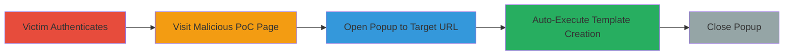

---
tags:
  - csrf
  - web
  - mavenlink
  - project-templates
type: attack_chain
tools: []
tactics:
  - '[[Initial Access]]'
verified: false
platforms:
  - Web
submitted: true
complexity: low
created_at: '2024-10-01T00:00:00Z'
procedures:
  - '[[procedures/Exploit-Mavenlink-CSRF-via-Popup-Window]]'
step_count: 5
techniques:
  - '[[Drive-by Compromise]]'
  - '[[Exploit Public-Facing Application]]'
updated_at: '2025-12-14T17:27:42.489Z'
description: >-
  A multi-stage attack chain exploiting a CSRF vulnerability in Mavenlink's
  project templates feature to force authenticated users to create unwanted
  project templates via a malicious webpage popup.
skill_level: intermediate
impact_level: medium
id: 983b3d57-0198-4175-bcb3-fd18dca8f585
validated: true
mitre_tactics:
  - '[[Initial Access]]'
mitre_techniques:
  - '[[Drive-by Compromise]]'
  - '[[Exploit Public-Facing Application]]'
---
# CSRF Exploitation in Mavenlink Project Templates for Unauthorized Creation

Multi-stage attack chain demonstrating a complete CSRF workflow in Mavenlink, where a malicious page tricks an authenticated user into creating unauthorized project templates via an unprotected URL hash fragment.

## Chain Metrics Dashboard

| Metric | Value |
|--------|-------|
| Chain Status | Unverified |
| Total Steps | 5 |
| Execution Time | ~1 minute |
| Skill Level | Intermediate |
| Complexity | Low |
| Impact Level | Medium |

## Attack Flow Visualization



## Prerequisites & Requirements

### Required Tools

- Web browser (e.g., Chrome, Firefox)
- Local web server to host PoC (optional, can use file://)

### Target Environment

- Mavenlink web application
- Authenticated user session
- No specific ports; web-based over HTTPS

### Initial Access Requirements

- Victim must be logged into Mavenlink
- Attacker hosts or links to malicious HTML page
- No prior access to victim account needed beyond social engineering

## Detailed Attack Procedures

### Step 1: Victim Authenticates to Mavenlink

procedure: [[procedures/Exploit-Mavenlink-CSRF-via-Popup-Window]]

**Objective**: Establish an authenticated session in the victim's browser, which is required for the CSRF to succeed using the existing session cookies.

**Instructions**: The victim manually logs in to https://app.mavenlink.com using valid credentials. No attacker intervention here; this is a prerequisite.

**Expected Output**: Successful login, with session cookies set in the browser.

**Success Indicators**:
- User can access protected areas like project templates
- Browser developer tools show active session tokens

### Step 2: Victim Visits Attacker's CSRF PoC Page

procedure: [[procedures/Exploit-Mavenlink-CSRF-via-Popup-Window]]

**Objective**: Trick the victim into loading the malicious HTML page that initiates the CSRF attack.

**Instructions**: Host a simple HTML page on a server or share a link (e.g., via phishing email or social engineering). The page contains JavaScript to trigger the popup. Example PoC HTML:

```html
<!DOCTYPE html>
<html>
<head><title>CSRF PoC</title></head>
<body>
<script>
  var popup = window.open('https://app.mavenlink.com/project_templates#new', 'csrf', 'height=100,width=100');
  setTimeout(function() { if (popup) popup.close(); }, 30000);
</script>
<p>Click anywhere to proceed...</p>
</body>
</html>
```

Save as index.html and serve via a local server (e.g., python -m http.server) or open directly.

**Expected Output**: Page loads, and JavaScript executes automatically on load or click.

**Success Indicators**:
- Popup window opens briefly
- No user interaction required beyond visiting the page

### Step 3: JavaScript Opens Popup to Target URL

procedure: [[procedures/Exploit-Mavenlink-CSRF-via-Popup-Window]]

**Objective**: Use window.open() to load the vulnerable URL in a hidden popup, leveraging the victim's session.

**Instructions**: The PoC JavaScript calls `window.open('https://app.mavenlink.com/project_templates#new', 'csrf', 'height=100,width=100');`. This loads the Mavenlink page in a small, unobtrusive window.

**Expected Output**: A new browser window opens to the project_templates page with #new hash.

**Success Indicators**:
- Network tab shows request to https://app.mavenlink.com/project_templates
- Popup is small and may go unnoticed

### Step 4: Target Page Loads and Auto-Creates Template

procedure: [[procedures/Exploit-Mavenlink-CSRF-via-Popup-Window]]

**Objective**: Exploit the #new hash to trigger automatic JavaScript POST to /api/v1/project_templates, creating a template without CSRF checks.

**Instructions**: Upon loading, Mavenlink's client-side scripts detect the #new hash and execute a POST request to /api/v1/project_templates, including the authenticity token from the session. This creates a new template and redirects to the edit page (https://app.mavenlink.com/project_templates#edit/[template-id]). No further attacker code needed; it's the app's own JS.

**Expected Output**: Unauthorized project template created in the victim's account; redirect to edit page in popup.

**Success Indicators**:
- Victim's Mavenlink dashboard shows new template
- API response (200 OK) with template ID in network logs

### Step 5: Close Popup Window

procedure: [[procedures/Exploit-Mavenlink-CSRF-via-Popup-Window]]

**Objective**: Automatically close the popup to avoid detection and complete the stealthy attack.

**Instructions**: In the PoC, use `setTimeout(function() { if (popup) popup.close(); }, 30000);` to close after 30 seconds, allowing time for the request to complete.

**Expected Output**: Popup disappears; attack completes without leaving traces.

**Success Indicators**:
- No open windows post-attack
- Template persists in victim's account

## Attack Chain Summary

### Key Achievements

1. Forced creation of unauthorized project templates without user consent
2. Bypassed CSRF protections via hash fragment auto-execution
3. Stealthy delivery using hidden popup for low detection risk

## Technique & Tactic Coverage

### MITRE ATT&CK Techniques

- [[Drive-by Compromise]]
- [[Exploit Public-Facing Application]]

### MITRE ATT&CK Tactics

- [[Initial Access]]

---
*Last updated: 2024-10-01T00:00:00Z*
