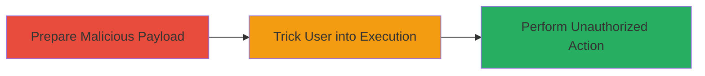

# CSRF Exploitation in Mixmax Allowing Unauthorized Actions

Multi-stage attack chain demonstrating a complete CSRF workflow in the Mixmax web application.

## Chain Metrics Dashboard

| Metric | Value |
|--------|-------|
| Chain Status | Unverified |
| Total Steps | 2 |
| Execution Time | ~5 minutes |
| Skill Level | Intermediate |
| Complexity | Medium |
| Impact Level | High |

## Attack Flow Visualization



## Prerequisites & Requirements

### Required Tools

- Browser developer tools for crafting payloads
- A web server to host malicious HTML (e.g., local Apache or Python server)

### Target Environment

- Web platform (Mixmax application)
- Authenticated user session in the victim's browser
- No specific ports or services beyond standard HTTPS (443)

### Initial Access Requirements

- Victim must be authenticated to Mixmax
- Attacker needs a way to deliver the malicious link (e.g., email, phishing site)
- Network access to the attacker's hosted payload

## Detailed Attack Procedures

### Step 1: Prepare Malicious Payload

procedure: [[procedures/Exploit-CSRF-Vulnerability-in-Mixmax]]

**Objective**: Craft a forged request that mimics a legitimate action in Mixmax without CSRF tokens.

**Instructions**: Create an HTML page with an auto-submitting form targeting a sensitive endpoint in Mixmax, such as one that changes user settings or performs actions like adding email templates.

Use a simple HTML file to simulate the request:

```html
<!DOCTYPE html>
<html>
<body>
<form action="https://app.mixmax.com/api/sensitive-action" method="POST" id="csrf-form">
    <input type="hidden" name="action" value="unauthorized-change" />
    <input type="hidden" name="value" value="attacker-controlled" />
</form>
<script>
document.getElementById('csrf-form').submit();
</script>
</body>
</html>
```

Host this on a server and send the URL to the victim.

**Expected Output**: The form submits automatically when the page loads, forging the request.

**Success Indicators**:
- Page loads and form submits without user interaction
- Network tab in browser shows POST to Mixmax endpoint

### Step 2: Execute and Verify Impact

procedure: [[procedures/Exploit-CSRF-Vulnerability-in-Mixmax]]

**Objective**: Induce the victim to load the payload, triggering the unauthorized action.

**Instructions**: Deliver the malicious URL via phishing email or social engineering. Once loaded in the victim's browser (while authenticated to Mixmax), the request executes on their behalf.

Monitor for changes in the victim's Mixmax account, such as altered settings or added actions.

**Expected Output**: Unauthorized action completes, e.g., user settings modified without direct input.

**Success Indicators**:
- Victim's account shows unexpected changes
- No CSRF token validation error in server logs (inferred from vulnerability)

## Attack Chain Summary

### Key Achievements

1. Successful forgery of requests bypassing CSRF protections
2. Execution of high-impact unauthorized actions on authenticated users
3. Demonstration of session hijacking-like behavior without stealing credentials

## Technique & Tactic Coverage

### MITRE ATT&CK Techniques

- [[Exploit Public-Facing Application]]

### MITRE ATT&CK Tactics

- [[Initial Access]]

---
*Last updated: 2023-10-01T12:00:00Z*
