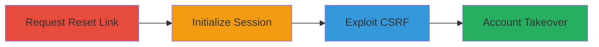

# CSRF Exploitation in OpenMage Password Reset for Account Takeover

Multi-stage attack chain demonstrating a complete CSRF-based account takeover workflow in OpenMage's password reset mechanism.

## Chain Metrics Dashboard

| Metric | Value |
|--------|-------|
| Chain Status | Unverified |
| Total Steps | 3 |
| Execution Time | ~5 minutes |
| Skill Level | Intermediate |
| Complexity | Medium |
| Impact Level | High |

## Attack Flow Visualization

## Prerequisites & Requirements

### Required Tools

- None (browser-based exploitation)

### Target Environment

- OpenMage e-commerce platform
- Web application running on PHP
- Accessible customer account forgot password endpoint

### Initial Access Requirements

- Victim's email address
- Ability to send phishing links or host malicious HTML
- No prior credentials needed, but victim must have an account

## Detailed Attack Procedures

### Step 1: Request Password Reset
procedure: [[procedures/Request-Password-Reset-Link]]

**Objective**: Initiate the password reset process to generate a reset link for the victim's account.

**Instructions**: Navigate to the forgot password page and submit the victim's email address to trigger the reset email.

**Expected Output**: An email containing the password reset link is sent to the victim.

**Success Indicators**:
- Reset email received by victim
- Reset link generated and accessible

### Step 2: Initialize Password Reset Session
procedure: [[procedures/Initialize-Password-Reset-Session]]

**Objective**: Load the reset link to establish a vulnerable session state without completing the reset.

**Instructions**: Have the victim open the reset link in their browser, which sets up the session for the reset form, then close the page.

**Expected Output**: Browser session initialized for password reset, leaving the form vulnerable to CSRF.

**Success Indicators**:
- Page loads the reset form
- Session cookies or state set for reset endpoint

### Step 3: Exploit CSRF to Change Password
procedure: [[procedures/Exploit-CSRF-to-Change-Password]]

**Objective**: Trick the victim into submitting a malicious form that changes their password via CSRF.

**Instructions**: Direct the victim to a malicious page with an auto-submitting HTML form targeting the reset endpoint with new password values.

**Expected Output**: Victim's password updated to attacker-controlled value, enabling account takeover.

**Success Indicators**:
- POST request succeeds without CSRF token
- Victim's account password changed
- Attacker logs in with new credentials

## Attack Chain Summary

### Key Achievements

1. Bypassed CSRF protection in password reset form
2. Achieved unauthorized password change
3. Enabled full account takeover without user interaction beyond link clicks

## Technique & Tactic Coverage

### MITRE ATT&CK Techniques

- [[Exploit Public-Facing Application]]

### MITRE ATT&CK Tactics

- [[Initial Access]]
- [[Credential Access]]

---
*Last updated: 2023-10-01T00:00:00Z*
