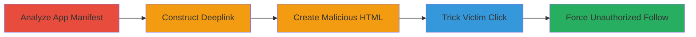

---
tags:
  - csrf
  - deeplink
  - android
  - mobile
  - periscope
type: attack_chain
tools: []
tactics:
  - '[[Initial Access]]'
verified: false
platforms:
  - Android
  - Mobile
submitted: true
complexity: medium
created_at: '2024-10-01'
procedures:
  - '[[procedures/Analyze-Periscope-Android-Manifest-for-Deeplinks]]'
  - '[[procedures/Construct-Malicious-Deeplink-for-Follow-Action]]'
  - '[[procedures/Create-HTML-Page-with-Embedded-Deeplink]]'
  - '[[procedures/Trick-Victim-into-Clicking-the-Link]]'
step_count: 4
techniques:
  - '[[T1566.002]]'
updated_at: '2025-12-14T17:27:57.895Z'
description: >-
  A multi-step attack exploiting CSRF in the Periscope Android app by abusing
  internal deeplinks to force unauthorized follows without user confirmation.
skill_level: intermediate
impact_level: low
id: 1d35a7f6-86fc-46aa-bb05-7df02e3b7811
validated: true
mitre_tactics:
  - '[[Initial Access]]'
mitre_techniques:
  - '[[T1566.002]]'
---
# CSRF Exploitation in Periscope Android App Follow Action via Deeplinks

Multi-stage attack chain demonstrating a complete attack workflow exploiting a CSRF vulnerability in the Periscope Android app's follow action through internal deeplinks.

## Chain Metrics Dashboard

| Metric | Value |
|--------|-------|
| Chain Status | Unverified |
| Total Steps | 4 |
| Execution Time | ~10 minutes |
| Skill Level | Intermediate |
| Complexity | Medium |
| Impact Level | Low |

## Attack Flow Visualization

## Prerequisites & Requirements

### Required Tools

- Android APK decompiler (e.g., APKTool, implied for manifest analysis)

### Target Environment

- Periscope Android app installed on victim's device
- Android browser (e.g., Chrome)
- Access to target user's ID from Periscope app or website

### Initial Access Requirements

- Victim must be logged into Periscope app
- Attacker hosts HTML page accessible via link (e.g., phishing email or site)
- No prior network access needed beyond tricking victim

## Detailed Attack Procedures

### Step 1: Analyze App Manifest
procedure: [[procedures/Analyze-Periscope-Android-Manifest-for-Deeplinks]]

**Objective**: Identify exposed deeplink schemes in the Periscope Android app to discover exploitable paths for the follow action.

**Instructions**: Decompile the Periscope APK to extract and examine the AndroidManifest.xml file, focusing on <data> tags with schemes like 'pscp' and hosts like 'user' to reveal paths such as pscp://user/<user-id>.

**Expected Output**: List of deeplink schemes and paths, including pscp://user/<user-id>/follow.

**Success Indicators**:
- Deeplink for follow action identified
- Confirmation that no confirmation prompt is required in app handling

### Step 2: Construct Deeplink
procedure: [[procedures/Construct-Malicious-Deeplink-for-Follow-Action]]

**Objective**: Build a malicious deeplink URL that directly triggers the follow action in the Periscope app without user consent.

**Instructions**: Format the deeplink using the target user's ID (obtained from Periscope's featured users or website) as pscp://user/<user-id>/follow.

**Expected Output**: Valid deeplink URL ready for embedding.

**Success Indicators**:
- Deeplink matches the scheme from manifest analysis
- URL is correctly formatted for the follow path

### Step 3: Create HTML Page
procedure: [[procedures/Create-HTML-Page-with-Embedded-Deeplink]]

**Objective**: Embed the malicious deeplink in an HTML page to disguise it as a clickable link that can be hosted and shared with the victim.

**Instructions**: Create a simple HTML file with an <a> tag linking to the deeplink, e.g., <a href="pscp://user/<user-id>/follow">CSRF DEMO</a>, and host it on a web server accessible via Android browser.

**Expected Output**: Hosted HTML page with the embedded malicious link.

**Success Indicators**:
- Link opens Periscope app when clicked from Android browser
- No errors in URL formatting

### Step 4: Trick Victim
procedure: [[procedures/Trick-Victim-into-Clicking-the-Link]]

**Objective**: Socially engineer the victim to click the malicious link from their Android browser, triggering the app to perform the unauthorized follow.

**Instructions**: Share the HTML page link via phishing email, social media, or messaging, enticing the victim to click it while their Periscope app is installed and logged in. Upon click, the browser hands off to the app, executing the follow without prompts.

**Expected Output**: Victim's account follows the target user automatically.

**Success Indicators**:
- Victim follows the target account
- No confirmation dialog appears in the app (unlike web version at www.pscp.tv/<user-id>/follow)

## Attack Chain Summary

### Key Achievements

1. Exposed deeplinks in Periscope Android app via manifest analysis
2. Constructed and embedded malicious deeplink in HTML for browser-to-app handover
3. Forced unauthorized follow action, bypassing web confirmation prompts
4. Demonstrated low-impact CSRF with easy reversibility (unfollow)

## Technique & Tactic Coverage

### MITRE ATT&CK Techniques

- [[T1566.002]]

### MITRE ATT&CK Tactics

- [[Initial Access]]

---
*Last updated: 2024-10-01*
