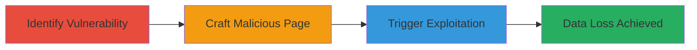

# CSRF Exploitation in Pet Deletion Endpoint Leading to Unauthorized Data Loss

Multi-stage attack chain demonstrating a complete attack workflow exploiting CSRF in the Mars platform's pet deletion functionality.

## Chain Metrics Dashboard

| Metric | Value |
|--------|-------|
| Chain Status | Unverified |
| Total Steps | 3 |
| Execution Time | ~5 minutes |
| Skill Level | Intermediate |
| Complexity | Medium |
| Impact Level | High |

## Attack Flow Visualization

## Prerequisites & Requirements

### Required Tools

- Basic web development tools (e.g., text editor for HTML/JS)

### Target Environment

- Web platform (Mars application)
- Authenticated user session
- Access to host a malicious webpage

### Initial Access Requirements

- No prior credentials needed beyond user authentication on target
- Ability to lure victim to malicious site (e.g., via phishing)

## Detailed Attack Procedures

### Step 1: Identify Vulnerability
procedure: [[procedures/Identify-CSRF-Vulnerability-in-Pet-Deletion-Endpoint]]

**Objective**: Analyze the pet deletion endpoint to confirm lack of CSRF protection.

**Instructions**: Inspect the endpoint handling pet deletion, focusing on the manipulable pet ID parameter. Verify absence of CSRF token validation by reviewing API responses or source code if available.

**Expected Output**: Confirmation that DELETE requests to /pets/{id} can be forged without tokens.

**Success Indicators**:
- Endpoint identified without CSRF safeguards
- Pet ID parameter confirmed as manipulable

### Step 2: Craft Malicious Webpage
procedure: [[procedures/Craft-Malicious-Webpage-for-CSRF-Exploitation]]

**Objective**: Create a webpage that automatically submits a forged DELETE request to the vulnerable endpoint.

**Instructions**: Develop an HTML page with a hidden form or JavaScript that targets the pet deletion endpoint. Use the victim's authenticated session to submit the request upon page load.

**Expected Output**: A functional HTML file ready for hosting.

**Success Indicators**:
- Page loads and triggers request without user input
- Request mimics legitimate DELETE action

### Step 3: Trigger Exploitation
procedure: [[procedures/Demonstrate-CSRF-Exploitation-via-User-Visit]]

**Objective**: Force an authenticated user to visit the malicious page, resulting in pet deletion.

**Instructions**: Host the malicious webpage and direct the victim to it (e.g., via link). The browser will execute the forged request using the active session.

**Expected Output**: Pet deleted from user's account without consent.

**Success Indicators**:
- Victim's pet removed
- No alerts or confirmations prompted

## Attack Chain Summary

### Key Achievements

1. Identified CSRF vulnerability in pet deletion endpoint
2. Crafted and deployed malicious webpage for exploitation
3. Demonstrated unauthorized data loss via user interaction

## Technique & Tactic Coverage

### MITRE ATT&CK Techniques

- [[Exploit Public-Facing Application]]
- [[JavaScript]]

### MITRE ATT&CK Tactics

- [[Initial Access]]
- [[Execution]]

---
*Last updated: 2023-10-01T12:00:00Z*
