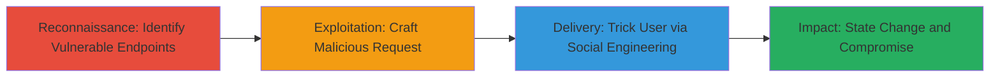

---
tags:
  - csrf
  - phabricator
  - web-vulnerability
type: attack_chain
tools: []
tactics:
  - '[[Initial Access]]'
  - '[[Execution]]'
verified: false
platforms:
  - Web
  - PHP
submitted: true
created_at: '2023-10-01T00:00:00Z'
procedures:
  - '[[procedures/Identify-Phabricator-CSRF-Vulnerable-Endpoints]]'
  - '[[procedures/Craft-and-Deliver-CSRF-Payload]]'
step_count: 3
techniques:
  - '[[Exploit Public-Facing Application]]'
  - '[[Drive-by Compromise]]'
updated_at: '2025-12-14T17:27:23.259Z'
description: >-
  A multi-stage attack leveraging CSRF vulnerabilities in Phabricator's
  dashboard panel rendering endpoints to force authenticated users into
  performing unwanted actions, potentially leading to data compromise or account
  hijack.
id: 6a5715b4-8596-4679-aa88-5f2393678f2a
validated: true
mitre_tactics:
  - '[[Initial Access]]'
  - '[[Execution]]'
mitre_techniques:
  - '[[Exploit Public-Facing Application]]'
  - '[[Drive-by Compromise]]'
---
# CSRF Exploitation in Phabricator Dashboard Panels for Unauthorized State Changes

Multi-stage attack chain demonstrating a complete CSRF workflow against Phabricator's unprotected dashboard panel endpoints.

## Chain Metrics Dashboard

| Metric | Value |
|--------|-------|
| Chain Status | Unverified |
| Total Steps | 3 |
| Execution Time | ~5 minutes |
| Skill Level | Intermediate |
| Complexity | Medium |
| Impact Level | High |

## Attack Flow Visualization



## Prerequisites & Requirements

### Required Tools

- Browser developer tools for crafting requests
- A web server to host the malicious page (e.g., local Apache or Python SimpleHTTPServer)

### Target Environment

- Phabricator application running on PHP
- Web platform with dashboard panels enabled
- Authenticated user session (target must be logged in)

### Initial Access Requirements

- Knowledge of target's Phabricator instance URL
- Ability to send links or embed content to the target user (e.g., via email or chat)
- No direct network access to the server required, as CSRF exploits the user's browser

## Detailed Attack Procedures

### Step 1: Reconnaissance - Identify Vulnerable Endpoints
procedure: [[procedures/Identify-Phabricator-CSRF-Vulnerable-Endpoints]]

**Objective**: Discover the specific dashboard panel rendering endpoints that lack CSRF protection to target for exploitation.

**Instructions**: Manually inspect the Phabricator dashboard or use browser tools to monitor network requests. Look for POST requests to paths like /dashboard/panel/render/[ID]/ that modify state without token validation.

**Expected Output**: List of vulnerable endpoints, such as /dashboard/panel/render/12/, /dashboard/panel/render/22/, /dashboard/panel/render/4/, /dashboard/panel/render/6/.

**Success Indicators**:
- Endpoints identified that perform actions (e.g., panel reconfiguration) without CSRF tokens
- Confirmation via request inspection that no unique per-user token is required

### Step 2: Exploitation - Craft Malicious Request
procedure: [[procedures/Craft-and-Deliver-CSRF-Payload]]

**Objective**: Create a forged request that mimics a legitimate state-changing action on the vulnerable endpoints.

**Instructions**: Use HTML form submission to automatically send a POST request from the victim's browser. Embed this in a malicious webpage. For example, target /dashboard/panel/render/12/ to alter a panel configuration:

```html
<form action="https://target-phabricator.com/dashboard/panel/render/12/" method="POST" id="csrf-form">
  <input type="hidden" name="action" value="reconfigure">
  <input type="hidden" name="new_setting" value="malicious_value">
</form>
<script>document.getElementById('csrf-form').submit();</script>
```

Host this on a controlled server and verify it triggers the action when loaded in an authenticated session.

**Expected Output**: The panel on the target's dashboard is modified without their knowledge.

**Success Indicators**:
- Request sent successfully from victim's browser
- Server responds with 200 OK and state change applied

### Step 3: Delivery - Social Engineering

**Objective**: Trick the authenticated user into loading the malicious page, executing the CSRF payload.

**Instructions**: Send the malicious URL via email, chat, or a phishing site disguised as a legitimate Phabricator update or link. Ensure the page auto-submits the form upon load.

**Expected Output**: Victim's browser executes the request, compromising data or hijacking account settings.

**Success Indicators**:
- Victim interacts with the link (e.g., clicks it while logged in)
- Post-exploitation verification of changed state on the target's account

## Attack Chain Summary

### Key Achievements

1. Identification of multiple unprotected CSRF endpoints in Phabricator dashboard
2. Successful forging of state-changing requests without token validation
3. Delivery via social engineering leading to potential data compromise or admin takeover

## Technique & Tactic Coverage

### MITRE ATT&CK Techniques

- [[Exploit Public-Facing Application]] Exploit Public-Facing Application
- [[Drive-by Compromise]] Drive-by Compromise

### MITRE ATT&CK Tactics

- [[Initial Access]] Initial Access
- [[Execution]] Execution

---
*Last updated: 2023-10-01T00:00:00Z*
