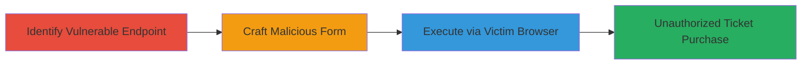

---
tags:
  - csrf
  - web-vulnerability
  - unauthorized-transaction
  - financial-loss
type: attack_chain
tools: []
tactics:
  - '[[Initial Access]]'
  - '[[Impact]]'
verified: false
platforms:
  - Web
submitted: true
complexity: medium
created_at: '2023-10-01T00:00:00Z'
procedures:
  - '[[procedures/Identify-CSRF-Vulnerable-API-Endpoint]]'
  - '[[procedures/Craft-Malicious-HTML-Form-for-CSRF-Attack]]'
  - '[[procedures/Execute-CSRF-Attack-via-Authenticated-Victim]]'
step_count: 3
techniques:
  - '[[Drive-by Compromise]]'
  - '[[Exploit Public-Facing Application]]'
updated_at: '2025-12-14T17:27:42.584Z'
description: >-
  A multi-stage attack chain exploiting a CSRF vulnerability in the Unikrn
  raffle ticket purchasing API, allowing unauthorized ticket purchases via
  malicious HTML forms.
skill_level: intermediate
impact_level: high
id: d02215b4-7a9d-4e5c-b0cf-df49c6fceaa1
validated: true
mitre_tactics:
  - '[[Initial Access]]'
  - '[[Impact]]'
mitre_techniques:
  - '[[Drive-by Compromise]]'
  - '[[Exploit Public-Facing Application]]'
---
# CSRF Exploitation in Raffle Ticket Purchasing Leading to Unauthorized Transactions

Multi-stage attack chain demonstrating a complete CSRF attack workflow on the Unikrn platform's raffle entry endpoint.

## Chain Metrics Dashboard

| Metric | Value |
|--------|-------|
| Chain Status | Unverified |
| Total Steps | 3 |
| Execution Time | ~5 minutes |
| Skill Level | Intermediate |
| Complexity | Medium |
| Impact Level | High |

## Attack Flow Visualization



## Prerequisites & Requirements

### Required Tools

- Web browser for testing
- Text editor for crafting HTML

### Target Environment

- Web platform
- Access to the target API endpoint: https://unikrn.com/apiv2/raffle/enter
- No specific ports or services required beyond standard HTTPS

### Initial Access Requirements

- No credentials needed for identification step
- Authenticated victim session for exploitation
- Ability to host or deliver malicious HTML page

## Detailed Attack Procedures

### Step 1: Identify Vulnerable Endpoint
procedure: [[procedures/Identify-CSRF-Vulnerable-API-Endpoint]]

**Objective**: Discover the API endpoint lacking CSRF protection and session_id validation.

**Instructions**: Use a web browser or API testing tool to send POST requests to https://unikrn.com/apiv2/raffle/enter. Test with parameters like raffle=4775 and tickets=1, omitting or setting session_id to empty. Observe that the request succeeds using only cookie-based authentication.

**Expected Output**: Successful raffle entry response without session_id validation error.

**Success Indicators**:
- Endpoint processes request despite missing or empty session_id
- No CSRF token required in response or request

### Step 2: Craft Malicious HTML Form
procedure: [[procedures/Craft-Malicious-HTML-Form-for-CSRF-Attack]]

**Objective**: Create a proof-of-concept HTML page that submits a forged POST request to the vulnerable endpoint.

**Instructions**: In a text editor, create an HTML file with an auto-submitting form targeting https://unikrn.com/apiv2/raffle/enter. Include hidden fields for raffle=4775, tickets=1, and an empty session_id. Use JavaScript to submit the form on page load.

Example HTML structure:

```html
<!DOCTYPE html>
<html>
<body>
<form id="csrf-form" action="https://unikrn.com/apiv2/raffle/enter" method="POST">
    <input type="hidden" name="raffle" value="4775">
    <input type="hidden" name="tickets" value="1">
    <input type="hidden" name="session_id" value="">
</form>
<script>document.getElementById('csrf-form').submit();</script>
</body>
</html>
```

Host this file on a server or local environment accessible via HTTP.

**Expected Output**: Form submits automatically when loaded, forging the request.

**Success Indicators**:
- HTML page loads and triggers POST without user interaction
- Form data matches vulnerable parameters

### Step 3: Execute via Authenticated Victim
procedure: [[procedures/Execute-CSRF-Attack-via-Authenticated-Victim]]

**Objective**: Trick an authenticated user into loading the malicious page, resulting in unauthorized raffle entry.

**Instructions**: Deliver the malicious HTML page to the victim, e.g., via phishing email, malicious link, or embedded iframe. When the victim (logged into Unikrn) loads the page, their browser will send the POST request with session cookies, bypassing session_id checks.

Monitor for success by checking the user's account for new raffle entries or balance deductions.

**Expected Output**: Raffle ticket purchase recorded in victim's account without their consent.

**Success Indicators**:
- Victim's balance decreases
- Raffle entry confirmed in account history
- No alerts or blocks on the transaction

## Attack Chain Summary

### Key Achievements

1. Identified CSRF vulnerability in API authentication
2. Crafted exploitable HTML payload for cross-site requests
3. Demonstrated unauthorized financial impact on victims

## Technique & Tactic Coverage

### MITRE ATT&CK Techniques

- [[Drive-by Compromise]]
- [[Exploit Public-Facing Application]]

### MITRE ATT&CK Tactics

- [[Initial Access]]
- [[Impact]]

---
*Last updated: 2023-10-01T00:00:00Z*
