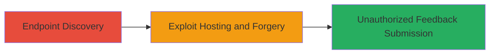

---
tags:
  - csrf
  - web-vulnerability
  - unauthorized-actions
type: attack_chain
tools: []
tactics:
  - '[[Initial Access]]'
verified: false
platforms:
  - Web
submitted: true
complexity: medium
created_at: '2024-01-01T00:00:00Z'
procedures:
  - '[[procedures/Identify-CSRF-Vulnerable-Endpoint-in-Web-Application]]'
  - '[[procedures/Craft-and-Host-CSRF-Exploit-on-Remote-Server]]'
step_count: 2
techniques:
  - '[[Exploit Public-Facing Application]]'
updated_at: '2025-12-14T17:27:35.999Z'
description: >-
  A two-step attack chain exploiting a CSRF vulnerability in the Rockstar Games
  Red Dead Online feedback submission endpoint to perform unauthorized actions
  on behalf of authenticated users.
skill_level: intermediate
impact_level: high
id: c52abed8-4684-4b6c-8f27-1714fe9b081d
validated: true
mitre_tactics:
  - '[[Initial Access]]'
mitre_techniques:
  - '[[Exploit Public-Facing Application]]'
---
# CSRF Exploitation in Red Dead Online Feedback Endpoint for Unauthorized Submissions

Multi-stage attack chain demonstrating a complete attack workflow exploiting a Cross-Site Request Forgery (CSRF) vulnerability in the feedback submission endpoint at https://www.rockstargames.com/reddeadonline/feedback/submit.json. The lack of CSRF protection allows attackers to forge requests from remote sites, tricking authenticated users into submitting unintended feedback. This was exploitable only in Chrome browsers prior to a recent update, enabling high-impact unauthorized actions on behalf of users.

## Chain Metrics Dashboard

| Metric | Value |
|--------|-------|
| Chain Status | Unverified |
| Total Steps | 2 |
| Execution Time | ~5 minutes |
| Skill Level | Intermediate |
| Complexity | Medium |
| Impact Level | High |

## Attack Flow Visualization

## Prerequisites & Requirements

### Required Tools

- Web browser for testing (e.g., Chrome prior to recent updates)
- Remote web server for hosting exploit

### Target Environment

- Web platform
- Target URL: https://www.rockstargames.com/reddeadonline/feedback/submit.json
- Authenticated user session required

### Initial Access Requirements

- User must be authenticated to the Rockstar Games site
- Attacker needs to host content on a controllable remote server
- No special credentials for discovery; exploitation relies on social engineering to lure users

## Detailed Attack Procedures

### Step 1: Endpoint Discovery
procedure: [[procedures/Identify-CSRF-Vulnerable-Endpoint-in-Web-Application]]

**Objective**: Identify the feedback submission endpoint lacking CSRF protection to enable forged requests.

**Instructions**: Manually test the endpoint https://www.rockstargames.com/reddeadonline/feedback/submit.json by inspecting network requests during legitimate feedback submission. Check for absence of CSRF tokens in forms or headers. Use browser developer tools to simulate requests without tokens from a different origin.

**Expected Output**: Confirmation that the endpoint processes POST requests without validating origin or tokens, allowing cross-site forgery.

**Success Indicators**:
- Requests succeed without CSRF token
- No origin or referrer checks enforced

### Step 2: Exploit Hosting and Forgery
procedure: [[procedures/Craft-and-Host-CSRF-Exploit-on-Remote-Server]]

**Objective**: Craft and host an exploit page that forges a feedback submission request on behalf of an authenticated user visiting the attacker's site.

**Instructions**: Create an HTML page with a hidden form or JavaScript that submits data to the vulnerable endpoint. Host this on a remote web server. Lure the victim (authenticated user) to visit the page, triggering the forged request in their browser.

**Expected Output**: Successful submission of unintended feedback from the victim's session, verifiable in the application's feedback logs.

**Success Indicators**:
- Forged request completes without user interaction
- Feedback appears submitted under victim's account
- Exploit only works in vulnerable Chrome versions

## Attack Chain Summary

### Key Achievements

1. Identified CSRF vulnerability in a production web endpoint despite typical ineligibility for bounties.
2. Demonstrated practical exploitation via remote hosting, leading to unauthorized actions.
3. Highlighted browser-specific impact, now mitigated by Chrome updates.

## Technique & Tactic Coverage

### MITRE ATT&CK Techniques

- [[Exploit Public-Facing Application]]

### MITRE ATT&CK Tactics

- [[Initial Access]]

---
*Last updated: 2024-01-01T00:00:00Z*
