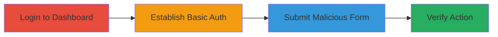

# CSRF Exploitation in Shopify API Endpoints via HTTP Basic Authentication

Multi-stage attack chain demonstrating a complete CSRF workflow against Shopify's API when using HTTP Basic Authentication, enabling an attacker to perform unauthorized actions like creating products or webhooks on the victim's behalf.

## Chain Metrics Dashboard

| Metric | Value |
|--------|-------|
| Chain Status | Unverified |
| Total Steps | 4 |
| Execution Time | ~5 minutes |
| Skill Level | Intermediate |
| Complexity | Medium |
| Impact Level | High |

## Attack Flow Visualization

## Prerequisites & Requirements

### Required Tools

- Web browser (e.g., Chrome or Firefox)
- HTML editor or simple text file for form creation

### Target Environment

- Shopify merchant account with admin access
- Web platform with API endpoints under /admin/
- No specific ports; standard HTTPS (443)

### Initial Access Requirements

- Victim must have saved Basic Auth credentials in browser
- Attacker needs to lure victim to malicious page (e.g., via phishing)
- Network access to victim's Shopify store

## Detailed Attack Procedures

### Step 1: Login to Shopify Merchant Dashboard
procedure: [[procedures/Login-to-Shopify-Merchant-Dashboard]]

**Objective**: Gain authenticated access to the Shopify admin dashboard to set up the environment for credential storage.

**Instructions**: Navigate to the Shopify merchant dashboard at https://[shop].myshopify.com/admin and enter valid credentials to log in. This establishes a session but is preparatory for Basic Auth setup.

**Expected Output**: Successful login to the admin interface.

**Success Indicators**:
- Dashboard loads with admin features accessible
- No authentication prompts on subsequent pages

### Step 2: Create Private Application and Establish Basic Auth
procedure: [[procedures/Create-Private-Application-and-Establish-Basic-Auth]]

**Objective**: Generate API credentials and prompt the browser to store Basic Auth details for automatic inclusion in API requests.

**Instructions**: In the dashboard, navigate to Apps > Develop apps > Create an app. Generate API key and password. Open the provided example URL (e.g., https://[shop].myshopify.com/admin/api/2023-10/products.json) in a new tab, which triggers a credential prompt. Enter the API key as username and password as password to store them in the browser.

**Expected Output**: Credentials stored; subsequent requests to the same domain include the Authorization header automatically.

**Success Indicators**:
- No further credential prompts for API endpoints
- Browser developer tools show Authorization: Basic header in network requests

### Step 3: Submit Malicious CSRF Form to API Endpoint
procedure: [[procedures/Submit-Malicious-CSRF-Form-to-API-Endpoint]]

**Objective**: Trick the victim's browser into sending an authenticated request to the API without user interaction, exploiting the lack of CSRF tokens.

**Instructions**: Create an HTML file with a form targeting an API endpoint, e.g., <form action="https://[shop].myshopify.com/admin/products.json" method="POST"><input type="hidden" name="product[title]" value="CSRF Test Product"><input type="hidden" name="product[vendor]" value="Attacker"><input type="submit" value="Click Me"></form>. Host this on an attacker-controlled site and lure the victim to it. The browser will auto-authenticate and submit, creating the product. For other methods (PUT/DELETE), add _method=PUT parameter.

**Expected Output**: API request succeeds with 200 OK and JSON response confirming action (e.g., product created).

**Success Indicators**:
- Network tab shows POST to /admin/products.json with Authorization header
- No authenticity token required or validated

### Step 4: Verify CSRF Action Execution
procedure: [[procedures/Verify-CSRF-Action-Execution]]

**Objective**: Confirm the unauthorized action was performed by checking the affected resource in the admin dashboard.

**Instructions**: After form submission, navigate back to the Shopify admin dashboard and visit the relevant section, e.g., Products page at https://[shop].myshopify.com/admin/products. Look for the newly created item from the CSRF payload.

**Expected Output**: The malicious product or change appears in the list.

**Success Indicators**:
- Unauthorized product/webhook/order appears
- Victim unaware of the action due to background execution

## Attack Chain Summary

### Key Achievements

1. Bypassed CSRF protections in API endpoints via Basic Auth auto-inclusion
2. Performed arbitrary authenticated actions like product creation or theme edits
3. Demonstrated potential for data exfiltration via webhooks or stored XSS

## Technique & Tactic Coverage

### MITRE ATT&CK Techniques

- [[Exploit Public-Facing Application]]

### MITRE ATT&CK Tactics

- [[Initial Access]]
- [[Execution]]

---
*Last updated: 2023-10-01T00:00:00Z*
