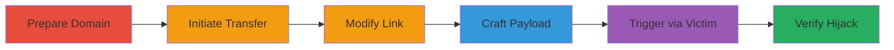

# CSRF Exploitation in Shopify Domain Transfer to Hijack Victim Store

Multi-stage attack chain demonstrating a complete CSRF-based domain hijacking workflow in Shopify.

## Chain Metrics Dashboard

| Metric | Value |
|--------|-------|
| Chain Status | Unverified |
| Total Steps | 6 |
| Execution Time | ~15 minutes |
| Skill Level | Intermediate |
| Complexity | Medium |
| Impact Level | High |

## Attack Flow Visualization

## Prerequisites & Requirements

### Required Tools

- Web browser for manual actions
- Text editor for HTML crafting

### Target Environment

- Shopify platform (myshopify.com stores)
- Attacker must have a Shopify account to purchase and transfer domains
- Victim must have an active Shopify store and be logged in

### Initial Access Requirements

- Attacker Shopify credentials
- Victim's store subdomain (e.g., victimstore.myshopify.com)
- No direct network access needed; relies on social engineering to deliver HTML

## Detailed Attack Procedures

### Step 1: Purchase and Prepare Domain
procedure: [[procedures/Purchase-and-Prepare-Domain-for-Transfer]]

**Objective**: Acquire a domain via Shopify and configure it with malicious DNS records to prepare for transfer.

**Instructions**: Log into your Shopify admin, purchase a domain, and set up DNS including MX, A, NS records, email forwarders, and custom subdomains to enable post-transfer control.

**Expected Output**: Domain ready with configured records visible in Shopify admin.

**Success Indicators**:
- Domain purchased successfully
- DNS records applied without errors

### Step 2: Initiate Transfer
procedure: [[procedures/Initiate-Domain-Transfer-to-Receive-Link]]

**Objective**: Start the inter-store transfer process to obtain the transfer link and code via email.

**Instructions**: In Shopify admin, request transfer of the prepared domain to another store (e.g., your own), which sends an email containing the transfer link like `https://www.shopify.com/login?redirect=settings/domains/initiate_inter_shop_domain_transfer?transfer_code=6fa6d18a-d2d1-4114-b11e-236b20f81398`.

**Expected Output**: Email received with the transfer link and unique code.

**Success Indicators**:
- Email arrives promptly
- Link contains valid transfer_code parameter

### Step 3: Modify Link
procedure: [[procedures/Modify-Transfer-Link-to-Target-Victim]]

**Objective**: Alter the transfer link to redirect to the victim's store subdomain instead of the attacker's.

**Instructions**: Edit the redirect URL in the link to point to the victim's store, e.g., change to `https://victimstore.myshopify.com/admin/settings/domains/initiate_inter_shop_domain_transfer?transfer_code=6fa6d18a-d2d1-4114-b11e-236b20f81398`.

**Expected Output**: Modified URL ready for embedding.

**Success Indicators**:
- URL now targets victim's myshopify.com subdomain
- Transfer code remains intact

### Step 4: Craft Payload
procedure: [[procedures/Craft-Malicious-HTML-for-CSRF-Payload]]

**Objective**: Create an HTML file that embeds the modified URL in an img tag to trigger the CSRF request automatically.

**Instructions**: Write HTML with `` and save as `csrf.html`.

**Expected Output**: HTML file that loads and triggers the img src request on open.

**Success Indicators**:
- HTML file saves without syntax errors
- Img tag src matches modified URL

### Step 5: Trigger Interaction
procedure: [[procedures/Trick-Victim-into-Opening-HTML-While-Logged-In]]

**Objective**: Socially engineer the victim to open the HTML file while authenticated in their Shopify store, executing the CSRF.

**Instructions**: Deliver `csrf.html` to the victim (e.g., via email or download link). Victim opens it in a browser logged into their store (test in incognito with no prior sessions).

**Expected Output**: Automatic request to the transfer endpoint, completing the domain transfer silently.

**Success Indicators**:
- Victim opens file without suspicion
- No user prompts during request

### Step 6: Verify Transfer
procedure: [[procedures/Verify-Successful-Domain-Transfer]]

**Objective**: Confirm the domain has transferred to the victim's store with all configurations intact.

**Instructions**: Check victim's Shopify admin for the new domain, DNS records, and test by editing HTML to target your own store and observing the redirect (e.g., from h1-5142.com to your store).

**Expected Output**: Domain listed in victim's store settings with copied MX, A, NS records, email forwarders, and subdomains.

**Success Indicators**:
- Domain appears in victim's admin
- DNS configurations match attacker's setup
- Potential for further escalation (e.g., store info theft)

## Attack Chain Summary

### Key Achievements

1. Successful domain purchase and malicious configuration
2. CSRF-triggered transfer without victim consent
3. Hijack of DNS and email infrastructure for escalation

## Technique & Tactic Coverage

### MITRE ATT&CK Techniques

- [[Exploit Public-Facing Application]] Exploit Public-Facing Application
- [[Drive-by Compromise]] Drive-by Compromise

### MITRE ATT&CK Tactics

- [[Initial Access]] Initial Access
- [[Impact]] Impact

---
*Last updated: 2023-10-01T12:00:00Z*
