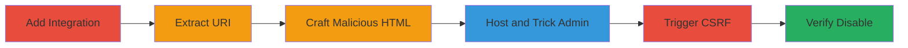

# CSRF Exploitation in Slack GitHub Integration to Disable Channel Authentication

Multi-stage attack chain demonstrating a complete CSRF workflow against Slack's GitHub integration, where an attacker tricks a channel admin into visiting a malicious page that forges a request to switch the integration to unauthenticated mode, effectively disabling authenticated GitHub notifications for the channel.

## Chain Metrics Dashboard

| Metric | Value |
|--------|-------|
| Chain Status | Unverified |
| Total Steps | 6 |
| Execution Time | ~5 minutes |
| Skill Level | Intermediate |
| Complexity | Medium |
| Impact Level | High |

## Attack Flow Visualization

## Prerequisites & Requirements

### Required Tools

- Web browser for testing
- Simple HTTP server (e.g., Python's built-in server)

### Target Environment

- Slack workspace with channel admin privileges
- GitHub integration not pre-approved for the channel
- Web platform access

### Initial Access Requirements

- Attacker must be a non-admin member of the target Slack channel
- Ability to observe notifications
- Social engineering access to trick admin (e.g., via phishing link)

## Detailed Attack Procedures

### Step 1: Add GitHub Integration
procedure: [[procedures/Add-GitHub-Integration-to-Slack-Channel]]

**Objective**: Set up the GitHub integration in a shared channel to expose the vulnerable URI.

**Instructions**: As a channel admin, navigate to the channel settings in Slack and add the GitHub integration. This generates a notification visible to all channel members, including the attacker.

**Expected Output**: Notification sent to channel members with the integration URI.

**Success Indicators**:
- Integration added successfully
- Notification with clickable URI appears in channel

### Step 2: Extract Integration URI
procedure: [[procedures/Extract-Slack-Integration-URI-from-Notification]]

**Objective**: Obtain the publicly accessible URI from the notification for later exploitation.

**Instructions**: As a non-admin user, view the notification in the channel (e.g., "added an integration to this channel: github") and copy the URI from the clickable link, such as https://vecchiowerther.slack.com/services/B2L476P3P.

**Expected Output**: Valid integration URI copied.

**Success Indicators**:
- URI accessible without authentication
- Link leads to integration confirmation page

### Step 3: Craft Malicious HTML
procedure: [[procedures/Craft-Malicious-HTML-for-CSRF-Attack]]

**Objective**: Create a forged request hidden in an image tag to exploit the CSRF vulnerability.

**Instructions**: Write a simple HTML file with an  tag sourcing the integration URI appended with ?no_auth_mode=1, e.g., <html></html>. Save as csrf.html.

**Expected Output**: HTML file ready for hosting.

**Success Indicators**:
- HTML file parses without errors
- Image src URI is correctly formed

### Step 4: Host and Trick Admin
procedure: [[procedures/Host-Malicious-Page-and-Trick-Admin]]

**Objective**: Deploy the malicious page and lure the admin to visit it, triggering the browser's automatic GET request.

**Instructions**: Host the HTML file on a public site (e.g., GitHub Pages at http://asanso.github.io/csrf.html) or local server. Send a phishing link to the admin via email or another channel, disguised as a legitimate resource.

**Expected Output**: Admin visits the page, browser fetches the img src.

**Success Indicators**:
- Page accessible via link
- Admin confirms visit (e.g., via social engineering)

### Step 5: Trigger CSRF Switch
procedure: [[procedures/Trigger-CSRF-to-Switch-Integration-Mode]]

**Objective**: Forge the request to switch the integration to unauthenticated mode via the admin's browser.

**Instructions**: Upon admin visit, the browser automatically sends a GET request to the URI with ?no_auth_mode=1, exploiting the lack of CSRF protection on the endpoint.

**Expected Output**: Slack processes the request, switching the mode.

**Success Indicators**:
- No visible error in browser
- Admin receives confirmation in Slack

### Step 6: Verify Degradation
procedure: [[procedures/Verify-Integration-Degradation]]

**Objective**: Confirm the integration is disabled, disrupting GitHub notifications.

**Instructions**: Check the channel integration settings or test a GitHub event; notifications should fail due to unauthenticated mode.

**Expected Output**: Integration shows as unauthenticated or disabled.

**Success Indicators**:
- GitHub functionality lost
- Admin notices disruption

## Attack Chain Summary

### Key Achievements

1. Exposed vulnerable URI via Slack notifications
2. Forged CSRF request to modify integration settings
3. Disabled authenticated access, impacting channel operations

## Technique & Tactic Coverage

### MITRE ATT&CK Techniques

- [[Exploit Public-Facing Application]] Exploit Public-Facing Application
- [[Drive-by Compromise]] Drive-by Compromise

### MITRE ATT&CK Tactics

- [[Initial Access]] Initial Access
- [[Execution]] Execution

---
*Last updated: 2023-10-01T00:00:00Z*
