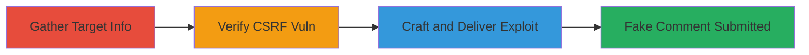

# CSRF Exploitation in Slack Help Requests to Submit Fake Comments

Multi-stage attack chain demonstrating a complete attack workflow for exploiting CSRF in Slack's help request system to impersonate users by submitting fake comments.

## Chain Metrics Dashboard

| Metric | Value |
|--------|-------|
| Chain Status | Unverified |
| Total Steps | 3 |
| Execution Time | ~5 minutes |
| Skill Level | Intermediate |
| Complexity | Medium |
| Impact Level | High |

## Attack Flow Visualization



## Prerequisites & Requirements

### Required Tools

- [[tools/Tamper-Data]]

### Target Environment

- Web platform (Slack application)
- Required services/ports: HTTPS on port 443
- Network access requirements: Internet access to Slack domain

### Initial Access Requirements

- Victim must be authenticated in Slack (active session)
- Attacker must know victim's Slack username and specific help request ID
- No prior access to victim's account needed, but social engineering for delivery

## Detailed Attack Procedures

### Step 1: Gather Target Information
procedure: [[procedures/Gather-Target-Information-for-Slack-CSRF]]

**Objective**: Identify the victim's username and the specific help request ID to target the CSRF exploit.

**Instructions**: Review Slack help request URLs or use social engineering to obtain the request number (e.g., from shared links). Confirm the victim's username via Slack directory or prior interactions.

**Expected Output**: Target details like username "victim@example.com" and request ID "237956".

**Success Indicators**:
- Valid request ID obtained (e.g., https://slack.com/help/requests/237956)
- Victim's username confirmed

### Step 2: Verify CSRF Vulnerability
procedure: [[procedures/Verify-CSRF-Vulnerability-with-Tamper-Data]]

**Objective**: Confirm the absence of anti-CSRF tokens in the help request comment form submission.

**Instructions**: Install and launch [[tools/Tamper-Data]] in Firefox. Navigate to the target help request page (e.g., https://slack.com/help/requests/237956). Fill the reply form with test text and intercept the submission using Tamper Data to inspect the HTTP POST request for missing CSRF tokens.

**Expected Output**: HTTP request to /help/requests/{id}/reply without any CSRF token parameters (e.g., no _token or similar field).

**Success Indicators**:
- Form submission intercepted successfully
- No anti-CSRF token present in request headers or body

### Step 3: Craft and Deliver Exploit
procedure: [[procedures/Craft-and-Deliver-Slack-CSRF-Exploit]]

**Objective**: Create a forged request to submit a fake comment as the victim and deliver it via a malicious page.

**Instructions**: Build an HTML page with an auto-submitting form targeting the vulnerable endpoint. Host it on a server or send via phishing email. When the victim loads the page (while authenticated in Slack), the form submits automatically.

Example malicious HTML:

```html
<html>
<body>
<form id="csrf-form" action="https://slack.com/help/requests/237956/reply" method="post">
  <input type="hidden" name="username" value="victim-username">
  <input type="hidden" name="comment" value="This is a fake comment from attacker!">
</form>
<script>document.getElementById('csrf-form').submit();</script>
</body>
</html>
```

Deliver by sending a link to the victim (e.g., "Click here for urgent update: http://attacker-site.com/exploit.html").

**Expected Output**: Fake comment appears in the help request thread under the victim's account.

**Success Indicators**:
- Victim loads the page and form submits
- Unauthorized comment posted in Slack help request

## Attack Chain Summary

### Key Achievements

1. Confirmed CSRF vulnerability in Slack's comment form
2. Impersonated victim to submit spam or malicious comments
3. Demonstrated potential for account abuse without direct access

## Technique & Tactic Coverage

### MITRE ATT&CK Techniques

- [[Exploit Public-Facing Application]]

### MITRE ATT&CK Tactics

- [[Execution]]

---
*Last updated: 2024-09-01T00:00:00Z*
