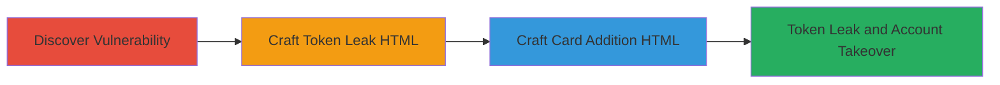

# CSRF Exploitation in Starbucks Webapp Leading to Access Token Leak and Account Takeover

Multi-stage attack chain demonstrating a CSRF vulnerability in Starbucks' web application, allowing token leakage and unauthorized account modifications via user interaction in non-Chrome browsers.

## Chain Metrics Dashboard

| Metric | Value |
|--------|-------|
| Chain Status | Unverified |
| Total Steps | 3 |
| Execution Time | ~5 minutes |
| Skill Level | Intermediate |
| Complexity | Medium |
| Impact Level | High |

## Attack Flow Visualization

## Prerequisites & Requirements

### Required Tools

- None (manual HTML crafting and browser testing)

### Target Environment

- Web platform
- Starbucks webapp.starbucks.co.jp and login.starbucks.co.jp services
- Authenticated user session

### Initial Access Requirements

- User must be authenticated to Starbucks webapp
- Target browser must not enforce SameSite cookies strictly (e.g., non-Chrome)
- Ability to trick user into opening crafted HTML file

## Detailed Attack Procedures

### Step 1: Discover CSRF Vulnerability
procedure: [[procedures/Discover-CSRF-Vulnerability-in-Starbucks-Webapp]]

**Objective**: Identify the lack of CSRF protections in the Starbucks webapp, enabling cross-site requests with automatic cookie inclusion.

**Instructions**: Manually test the application's authentication and request handling by inspecting network traffic during login and actions. Use browser developer tools to simulate cross-site requests and confirm cookies are sent without SameSite enforcement in non-Chrome browsers.

**Expected Output**: Confirmation of vulnerable endpoints that process requests without CSRF tokens.

**Success Indicators**:
- Requests succeed cross-site without authentication challenges
- Cookies are included in cross-origin requests

### Step 2: Craft HTML for Token Leakage
procedure: [[procedures/Craft-HTML-for-CSRF-Access-Token-Leakage]]

**Objective**: Create a malicious HTML file that triggers a CSRF request to leak the access token when opened by an authenticated user.

**Instructions**: Develop an HTML file with an auto-submitting form or script targeting the vulnerable endpoint (e.g., authentication API). Host or deliver the file to the victim, ensuring it's opened in a non-Chrome browser. The form should POST to the target URL and capture the response containing the token, exfiltrating it to an attacker-controlled server.

**Expected Output**: Access token leaked to attacker's endpoint.

**Success Indicators**:
- Network request shows token in response
- Token received on attacker's server

### Step 3: Craft HTML for Adding Malicious Card
procedure: [[procedures/Craft-HTML-for-Adding-Malicious-Starbucks-Card]]

**Objective**: Exploit CSRF to add a controlled Starbucks card to the victim's account, enabling takeover upon login.

**Instructions**: Create another HTML file with a form that submits a POST request to login.starbucks.co.jp to add a Starbucks card under attacker control. Deliver to the victim for interaction in a vulnerable browser. Upon user login, the added card allows unauthorized access.

**Expected Output**: Malicious card added to account.

**Success Indicators**:
- Account shows new card
- Attacker can access account via the card

## Attack Chain Summary

### Key Achievements

1. Identified CSRF in Starbucks webapp due to missing protections and SameSite cookies.
2. Leaked access tokens via crafted HTML in non-Chrome browsers.
3. Enabled potential account takeover by adding malicious cards.

## Technique & Tactic Coverage

### MITRE ATT&CK Techniques

- [[Exploit Public-Facing Application]]

### MITRE ATT&CK Tactics

- [[Initial Access]]

---
*Last updated: 2023-10-01T00:00:00Z*
