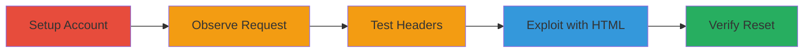

# CSRF Exploitation in Streamlabs API to Reset Donation Settings

Multi-stage attack chain demonstrating a complete CSRF workflow against the Streamlabs API endpoint for donation settings.

## Chain Metrics Dashboard

| Metric | Value |
|--------|-------|
| Chain Status | Unverified |
| Total Steps | 5 |
| Execution Time | ~10 minutes |
| Skill Level | Intermediate |
| Complexity | Medium |
| Impact Level | Medium |

## Attack Flow Visualization

## Prerequisites & Requirements

### Required Tools

- Web browser with developer tools (e.g., Chrome DevTools for intercepting requests)
- Text editor for creating HTML POC

### Target Environment

- Streamlabs web platform
- Required services: PayPal integration for donation settings
- Network access: Internet access to Streamlabs dashboard

### Initial Access Requirements

- Valid Streamlabs account credentials
- Victim must be authenticated in the browser
- Attacker needs to host or deliver malicious HTML (e.g., via phishing site)

## Detailed Attack Procedures

### Step 1: Set Up Streamlabs Account
procedure: [[procedures/Set-Up-Streamlabs-Account-for-Testing]]

**Objective**: Prepare a test environment by configuring a Streamlabs account with donation settings to enable the vulnerable endpoint.

**Instructions**: Log in to the Streamlabs dashboard, navigate to settings, connect a PayPal email, and publish the editor to activate the donation settings API.

**Expected Output**: Account ready with donation settings configured, avoiding redirect loops.

**Success Indicators**:
- Dashboard accessible without errors
- PayPal email connected successfully
- 'Save & Publish' completes without issues

### Step 2: Observe Legitimate Request
procedure: [[procedures/Observe-Legitimate-Donation-Settings-Request]]

**Objective**: Intercept and analyze a valid POST request to the donation settings endpoint to understand the required payload and headers.

**Instructions**: Use browser developer tools to monitor network traffic while updating donation settings, capturing the POST request details including JSON body and CSRF headers.

**Expected Output**: Captured request with headers like X-CSRF and X-XSRF, and body such as {"username":{"value":"shirley","autofill":false},"amount":{"value":null,"currency":"USD","autofill":true},"clips":{"isVisibleToPublic":true}}.

**Success Indicators**:
- Request intercepted successfully
- 200 OK response on legitimate update

### Step 3: Test Header Removal
procedure: [[procedures/Test-Removal-of-CSRF-Headers]]

**Objective**: Confirm the CSRF vulnerability by sending the request without required headers to check if the server still processes it.

**Instructions**: Replay the captured POST request using developer tools or a proxy, omitting X-CSRF and X-XSRF headers, and observe the server response.

**Expected Output**: 200 OK response despite missing headers, indicating no validation.

**Success Indicators**:
- Request succeeds without CSRF tokens
- Settings update occurs as expected

### Step 4: Create HTML POC
procedure: [[procedures/Create-HTML-POC-for-CSRF-Exploitation]]

**Objective**: Craft a malicious HTML form that auto-submits to the endpoint without CSRF headers, forcing the victim's settings to null.

**Instructions**: Write an HTML file with a form targeting POST /api/v6/viewer-portal/viewer-settings/donation_settings, using text/plain enctype, hidden input with JSON payload, and JavaScript to auto-submit on load.

**Expected Output**: Form submission results in {"settings":[]} response, resetting donation settings.

**Success Indicators**:
- HTML loads and submits automatically
- Victim's settings updated to empty/null

### Step 5: Verify Exploitation
procedure: [[procedures/Verify-Exploitation-of-Donation-Settings]]

**Objective**: Confirm the attack success by querying the endpoint to check if donation settings are reset.

**Instructions**: Send a GET request to /api/v6/viewer-portal/viewer-settings/donation_settings and inspect the response for empty settings.

**Expected Output**: Response shows updated empty settings array.

**Success Indicators**:
- GET request returns {"settings":[]}
- Donation functionality disrupted (e.g., no username or amount configured)

## Attack Chain Summary

### Key Achievements

1. Confirmed CSRF vulnerability in Streamlabs API by bypassing header validation.
2. Demonstrated exploitation via simple HTML form to reset user donation settings.
3. Highlighted impact on disrupting donation reception for authenticated victims.

## Technique & Tactic Coverage

### MITRE ATT&CK Techniques

- [[Drive-by Compromise]] Drive-by Compromise
- [[Exploit Public-Facing Application]] Exploit Public-Facing Application

### MITRE ATT&CK Tactics

- [[Initial Access]] Initial Access

---
*Last updated: 2023-10-01T00:00:00Z*
