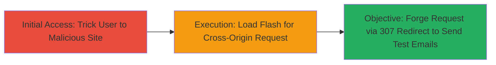

# CSRF Exploitation in Stripo Email Testing Using Flash and 307 Redirect

Multi-stage attack chain demonstrating a complete CSRF workflow against Stripo Inc's email testing feature, where the absence of XSRF token validation allows forged requests to send test emails without user consent.

## Chain Metrics Dashboard

| Metric | Value |
|--------|-------|
| Chain Status | Unverified |
| Total Steps | 2 |
| Execution Time | ~5 minutes |
| Skill Level | Intermediate |
| Complexity | Medium |
| Impact Level | High |

## Attack Flow Visualization

## Prerequisites & Requirements

### Required Tools

- Adobe Flash Player (legacy, for client-side execution)
- Web server to host malicious page (e.g., Apache or nginx)

### Target Environment

- Web platform
- Authenticated session to Stripo Inc's application
- No specific ports or services beyond standard HTTPS (443)

### Initial Access Requirements

- Victim must be authenticated to Stripo
- Network access to attacker's malicious site
- No prior access needed beyond social engineering to visit the site

## Detailed Attack Procedures

### Step 1: Initial Access
procedure: [[procedures/Craft-Malicious-Flash-for-CSRF]]

**Objective**: Create and host a malicious webpage that loads a Flash file to initiate cross-origin requests, bypassing same-origin policy restrictions.

**Instructions**: Develop a SWF (Flash) file that embeds a cross-domain policy allowing requests to the target's domain. Host it on a controlled server. Embed the Flash in an HTML page with a link or auto-load to trick the user into visiting.

**Expected Output**: Malicious webpage loads Flash, ready to execute on victim visit.

**Success Indicators**:
- Flash file loads without errors in victim's browser
- Cross-domain policy allows requests to Stripo's endpoint

### Step 2: Execution
procedure: [[procedures/Trigger-CSRF-via-307-Redirect]]

**Objective**: Use the Flash file to send a forged POST request to the email testing endpoint via a 307 redirect, exploiting the lack of token validation to perform unauthorized actions.

**Instructions**: Configure the Flash to navigate to a 307 redirect URL that points to Stripo's '/send-test-emails' endpoint with forged parameters (e.g., recipient emails, content). The 307 preserves the POST method, allowing the request to proceed without the XSRF token.

**Expected Output**: Test emails sent from the victim's authenticated session to attacker-specified recipients.

**Success Indicators**:
- Server responds with success (e.g., 200 OK) for the forged request
- Emails delivered, confirming unauthorized action

## Attack Chain Summary

### Key Achievements

1. Bypassed CSRF protections using legacy Flash for cross-origin POST
2. Utilized 307 redirect to maintain request integrity without tokens
3. Enabled unauthorized email sending, potentially for spam or phishing abuse

## Technique & Tactic Coverage

### MITRE ATT&CK Techniques

- [[Drive-by Compromise]] Drive-by Compromise
- [[Exploit Public-Facing Application]] Exploit Public-Facing Application
- [[T1203.001]] Exploitation for Client Execution: Flash

### MITRE ATT&CK Tactics

- [[Initial Access]] Initial Access
- [[Execution]] Execution

---
*Last updated: 2023-10-01T00:00:00Z*
