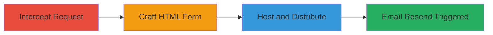

# CSRF Exploitation in Stripo Resend Confirmation Email to Force Unwanted Email Resends

Multi-stage attack chain demonstrating a complete CSRF workflow against Stripo's unverified account resend feature.

## Chain Metrics Dashboard

| Metric | Value |
|--------|-------|
| Chain Status | Unverified |
| Total Steps | 3 |
| Execution Time | ~5 minutes |
| Skill Level | Intermediate |
| Complexity | Medium |
| Impact Level | Medium |

## Attack Flow Visualization

## Prerequisites & Requirements

### Required Tools

- Browser developer tools or proxy like Burp Suite for interception

### Target Environment

- Web platform
- Stripo email service (https://my.stripo.email)
- Access to an unverified Stripo account

### Initial Access Requirements

- Valid session in victim's browser (authenticated unverified account)
- Ability to host a simple HTML page
- Victim must visit the attacker's hosted page while logged into Stripo

## Detailed Attack Procedures

### Step 1: Intercept Resend Email Request
procedure: [[procedures/Intercept-Resend-Email-Request-in-Stripo]]

**Objective**: Capture the vulnerable POST request to understand the endpoint and lack of protections.

**Instructions**: Log into an unverified Stripo account, navigate to the resend confirmation section, and use browser dev tools or a proxy to intercept the request when clicking 'Resend it'.

**Expected Output**: POST request to https://my.stripo.email/cabinet/stripeapi/v1/resendEmailConfirmation with empty body {}.

**Success Indicators**:
- Request intercepted without CSRF token requirement
- Endpoint accepts plain POST without content-type enforcement

### Step 2: Craft CSRF HTML Form
procedure: [[procedures/Craft-CSRF-HTML-Form-for-Stripo-Endpoint]]

**Objective**: Create an auto-submitting form that mimics the intercepted request to trigger the resend.

**Instructions**: Write an HTML file with a form that auto-submits on load to the vulnerable endpoint.

**Expected Output**: HTML page that, when loaded, sends the POST request from the victim's session.

**Success Indicators**:
- Form submits without user interaction
- No additional data or tokens required

### Step 3: Host and Distribute Malicious Page
procedure: [[procedures/Host-and-Distribute-Malicious-CSRF-Page]]

**Objective**: Deliver the payload to victims to exploit their authenticated sessions.

**Instructions**: Upload the HTML file to a hosting service and send the URL to potential victims via email or other means.

**Expected Output**: Victim visits the page, triggering an unwanted confirmation email to their inbox.

**Success Indicators**:
- Victim receives resend email without manual action
- Attack works without knowledge of victim's email

## Attack Chain Summary

### Key Achievements

1. Bypassed CSRF protections via simple HTML form
2. Forced email resends without user interaction or email knowledge
3. Exploited same-origin policy gaps in the endpoint

## Technique & Tactic Coverage

### MITRE ATT&CK Techniques

- [[Exploit Public-Facing Application]] Exploit Public-Facing Application
- [[Drive-by Compromise]] Drive-by Compromise

### MITRE ATT&CK Tactics

- [[Initial Access]] Initial Access

---
*Last updated: 2023-10-01T12:00:00Z*
