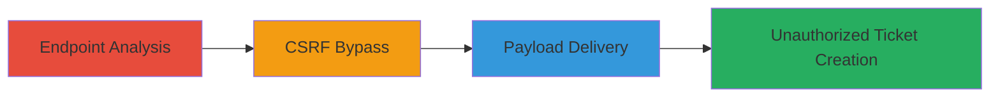

---
tags:
  - csrf
  - web
  - bypass
  - ticket-creation
  - tiktok
type: attack_chain
tools: []
tactics:
  - '[[Initial Access]]'
verified: false
platforms:
  - Web
submitted: true
complexity: medium
created_at: '2023-10-01T00:00:00Z'
procedures:
  - '[[procedures/Analyze-TikTok-Shop-Ticket-Creation-Endpoint]]'
  - '[[procedures/Bypass-CSRF-Protection-by-Modifying-Request-Format]]'
  - '[[procedures/Craft-Malicious-HTML-Form-for-CSRF-Attack]]'
step_count: 3
techniques:
  - '[[Exploit Public-Facing Application]]'
updated_at: '2025-12-14T17:28:36.413Z'
description: >-
  A multi-step attack exploiting a CSRF vulnerability in the TikTok Shop ticket
  creation endpoint to create arbitrary tickets without user consent by
  bypassing token validation through request format changes and delivering a
  forged HTML form.
skill_level: intermediate
impact_level: high
id: c07a84f1-164e-4b2b-8f09-59c26cb117ff
validated: true
mitre_tactics:
  - '[[Initial Access]]'
mitre_techniques:
  - '[[Exploit Public-Facing Application]]'
---
# CSRF Exploitation in TikTok Shop Ticket Creation for Unauthorized Ticket Generation

Multi-stage attack chain demonstrating exploitation of a CSRF vulnerability in the TikTok Shop ticket creation endpoint, allowing attackers to forge requests and create unauthorized tickets on behalf of authenticated users.

## Chain Metrics Dashboard

| Metric | Value |
|--------|-------|
| Chain Status | Unverified |
| Total Steps | 3 |
| Execution Time | ~5 minutes |
| Skill Level | Intermediate |
| Complexity | Medium |
| Impact Level | High |

## Attack Flow Visualization

## Prerequisites & Requirements

### Required Tools

- Web browser with developer tools (e.g., Chrome DevTools)
- Text editor for crafting HTML

### Target Environment

- Web platform
- TikTok Shop service
- Authenticated user session (victim must be logged in)

### Initial Access Requirements

- Victim must visit the attacker's malicious page while authenticated to TikTok Shop
- No direct credentials needed; exploits cross-site request forgery
- Network access to the TikTok Shop domain

## Detailed Attack Procedures

### Step 1: Endpoint Analysis
procedure: [[procedures/Analyze-TikTok-Shop-Ticket-Creation-Endpoint]]

**Objective**: Identify the ticket creation endpoint and understand its normal request format, including CSRF token and content type requirements.

**Instructions**: Use browser developer tools to inspect network traffic during legitimate ticket creation. Navigate to the TikTok Shop ticket submission page, fill out a sample form, and submit it while monitoring the Network tab in DevTools. Observe the POST request to the endpoint (e.g., https://vulnerableEndpoint), noting the inclusion of a CSRF token in the headers and the Content-Type set to application/json.

**Expected Output**: Details of the legitimate request, such as headers (CsrfToken: value) and body (JSON payload with fields like category_id, title, componentContents).

**Success Indicators**:
- Endpoint URL confirmed
- Request format documented, including token and JSON structure

### Step 2: CSRF Bypass
procedure: [[procedures/Bypass-CSRF-Protection-by-Modifying-Request-Format]]

**Objective**: Test modifications to the request to bypass CSRF validation by removing the token and altering the content type.

**Instructions**: In the browser's DevTools or using a proxy like Burp Suite, intercept and modify the legitimate POST request. Remove the CsrfToken header entirely and change the Content-Type from application/json to application/x-www-form-urlencoded. Resubmit the request with form-encoded data (e.g., category_id=1&title=Test&componentContents=%7B%22data%22%3A%22value%22%7D). Test variations to confirm acceptance without the token.

**Expected Output**: Server accepts the modified request and creates a ticket without requiring the CSRF token.

**Success Indicators**:
- Request succeeds without token
- Ticket is created, confirming bypass

### Step 3: Payload Delivery
procedure: [[procedures/Craft-Malicious-HTML-Form-for-CSRF-Attack]]

**Objective**: Create and deliver a malicious HTML page that auto-submits a forged request to the endpoint on behalf of the victim.

**Instructions**: Craft an HTML file with a form containing hidden inputs for the required fields (e.g., <input type="hidden" name="category_id" value="1">, <input type="hidden" name="title" value="Malicious Ticket">, <input type="hidden" name="componentContents" value="JSON-encoded payload simulating file upload">). Set the form method to POST and action to https://vulnerableEndpoint. Add JavaScript to auto-submit the form on page load (e.g., document.forms[0].submit();). Host the HTML on an attacker-controlled site and trick the victim into visiting it while logged into TikTok Shop.

**Expected Output**: Upon victim visit, the form submits automatically, creating an unauthorized ticket in their account.

**Success Indicators**:
- Victim's account shows new unauthorized ticket
- No user interaction required beyond page visit

## Attack Chain Summary

### Key Achievements

1. Bypassed CSRF protection via request format manipulation
2. Enabled cross-site forgery without authentication tokens
3. Demonstrated impact through arbitrary ticket creation, potentially leading to spam or unauthorized actions

## Technique & Tactic Coverage

### MITRE ATT&CK Techniques

- [[Exploit Public-Facing Application]]

### MITRE ATT&CK Tactics

- [[Initial Access]]

---
*Last updated: 2023-10-01T00:00:00Z*
