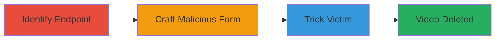

# CSRF Exploitation in TikTok Video Deletion for Unauthorized Video Removal

Multi-stage attack chain demonstrating a complete CSRF workflow to delete public videos on TikTok by forging requests from authenticated users.

## Chain Metrics Dashboard

| Metric | Value |
|--------|-------|
| Chain Status | Unverified |
| Total Steps | 3 |
| Execution Time | ~5 minutes |
| Skill Level | Intermediate |
| Complexity | Medium |
| Impact Level | High |

## Attack Flow Visualization



## Prerequisites & Requirements

### Required Tools

- None specific (uses browser and basic HTML crafting)

### Target Environment

- TikTok web application
- Authenticated user session
- Public videos accessible

### Initial Access Requirements

- Attacker needs a way to deliver a malicious link (e.g., email, social engineering)
- Victim must be authenticated on TikTok
- No prior access to victim's account needed

## Detailed Attack Procedures

### Step 1: Identify Video Deletion Endpoint
procedure: [[procedures/Identify-TikTok-Video-Deletion-Endpoint]]

**Objective**: Discover the endpoint used for deleting videos to craft the forged request.

**Instructions**: Use browser developer tools or proxy like Burp Suite to inspect network requests while attempting to delete a video manually on TikTok. Look for POST requests to endpoints handling video management.

**Expected Output**: Identification of the deletion URL, such as a POST to `/video/delete` with parameters like `video_id`.

**Success Indicators**:
- Endpoint URL and required parameters captured
- Request format (e.g., form data) understood

### Step 2: Craft CSRF Malicious Form
procedure: [[procedures/Craft-CSRF-Malicious-Form]]

**Objective**: Create an HTML page that automatically submits a forged deletion request using the victim's session.

**Instructions**: Write an HTML file with a hidden form targeting the deletion endpoint. Include the target video ID in the form data. Host this on a server or use a data URI for delivery.

Example HTML snippet:

```html
<form action="https://www.tiktok.com/video/delete" method="POST" id="csrf-form">
    <input type="hidden" name="video_id" value="TARGET_VIDEO_ID">
</form>
<script>document.getElementById('csrf-form').submit();</script>
```

Replace `TARGET_VIDEO_ID` with the ID of the public video to delete.

**Expected Output**: Malicious HTML page ready for delivery.

**Success Indicators**:
- Form submits correctly when tested in an authenticated browser
- No CSRF token required in the request

### Step 3: Trick Victim into Submission
procedure: [[procedures/Trick-Victim-into-Submission]]

**Objective**: Socially engineer the victim to load the malicious page while authenticated on TikTok, triggering the deletion.

**Instructions**: Send the malicious link via email, chat, or phishing site, disguised as something innocuous like "Check this funny video." When the victim clicks and loads the page, the form auto-submits, deleting the video.

**Expected Output**: Victim's video deleted from TikTok without further interaction.

**Success Indicators**:
- Video removed from public view
- No alerts or confirmations triggered on victim's side

## Attack Chain Summary

### Key Achievements

1. Forged authenticated request to delete arbitrary public videos
2. Bypassed lack of CSRF protection in video management
3. Demonstrated high impact on user-generated content without account compromise

## Technique & Tactic Coverage

### MITRE ATT&CK Techniques

- [[Drive-by Compromise]]
- [[Exploit Public-Facing Application]]

### MITRE ATT&CK Tactics

- [[Initial Access]]

---
*Last updated: 2023-10-01T00:00:00Z*
