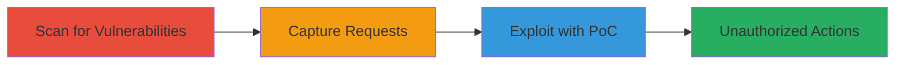

# CSRF Exploitation in Uzbey Website Forms for Unauthorized User Actions

Multi-stage attack chain demonstrating a complete CSRF exploitation workflow on the Uzbey website, identified via vulnerability scanning and leading to forced unauthorized actions on authenticated users.

## Chain Metrics Dashboard

| Metric | Value |
|--------|-------|
| Chain Status | Unverified |
| Total Steps | 3 |
| Execution Time | ~15 minutes |
| Skill Level | Intermediate |
| Complexity | Medium |
| Impact Level | High |

## Attack Flow Visualization

## Prerequisites & Requirements

### Required Tools

- [[tools/Acunetix]]

### Target Environment

- Web platform (Apache server, likely Drupal-based forms)
- Required services/ports: HTTP/HTTPS on port 80/443
- Network access requirements: Internet access to target site (e.g., staging.uzbey.com)

### Initial Access Requirements

- No prior credentials needed for scanning
- Network position: External attacker
- Prior access needed: None, but victim must be authenticated for exploitation

## Detailed Attack Procedures

### Step 1: Scan for CSRF Vulnerabilities
procedure: [[procedures/Scan-for-CSRF-Vulnerabilities-Using-Acunetix]]

**Objective**: Identify HTML forms lacking CSRF protection on the target website to uncover exploitable endpoints.

**Instructions**: Launch Acunetix to scan the website, focusing on form analysis. Configure the scan with Acunetix-Aspect headers to detect unprotected POST requests.

**Expected Output**: Report listing vulnerable forms, such as /user/register without CSRF tokens.

**Success Indicators**:
- Multiple endpoints identified without anti-CSRF measures
- Confirmation of POST methods with inputs like name, pass, form_build_id

### Step 2: Capture and Analyze Vulnerable Form Requests
procedure: [[procedures/Capture-and-Analyze-Vulnerable-Form-Requests]]

**Objective**: Intercept and examine the structure of vulnerable requests to understand the exact parameters and headers for replication in exploitation.

**Instructions**: Use Acunetix's interception features to capture a sample POST request to a vulnerable endpoint, verifying the absence of CSRF token validation.

**Expected Output**: Detailed request log showing headers (e.g., Acunetix-Aspect) and form data without security tokens.

**Success Indicators**:
- Request captured to https://staging.uzbey.com/user/register
- No CSRF token present in inputs or headers

### Step 3: Demonstrate CSRF Exploitation with PoC
procedure: [[procedures/Demonstrate-CSRF-Exploitation-with-PoC]]

**Objective**: Create and deploy a proof-of-concept to simulate forcing a victim to submit forged requests, leading to actions like unauthorized account registration.

**Instructions**: Build a malicious HTML page on an attacker-controlled site that auto-submits a form mimicking the vulnerable endpoint's structure.

**Expected Output**: Victim's browser executes the forged POST, potentially creating an account or altering data if authenticated.

**Success Indicators**:
- PoC form submits successfully to target
- Unintended action performed (e.g., new user registered)

## Attack Chain Summary

### Key Achievements

1. Discovered multiple CSRF-vulnerable forms via automated scanning
2. Analyzed request details to confirm exploitability
3. Demonstrated practical exploitation through a client-side PoC, enabling unauthorized actions on authenticated users

## Technique & Tactic Coverage

### MITRE ATT&CK Techniques

- [[Exploit Public-Facing Application]]

### MITRE ATT&CK Tactics

- [[Initial Access]]

---
*Last updated: 2023-10-01T12:00:00Z*
