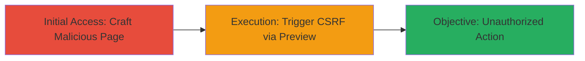

# CSRF Exploitation in VK.com Application Widgets via Insufficient Hash Checks

Multi-stage attack chain demonstrating a complete attack workflow exploiting Cross-Site Request Forgery (CSRF) in VK.com's application widgets, where insufficient hash checks in the preview box allow attackers to perform unauthorized actions on behalf of authenticated users.

## Chain Metrics Dashboard

| Metric | Value |
|--------|-------|
| Chain Status | Unverified |
| Total Steps | 2 |
| Execution Time | ~5 minutes |
| Skill Level | Intermediate |
| Complexity | Medium |
| Impact Level | High |

## Attack Flow Visualization

## Prerequisites & Requirements

### Required Tools

- Browser developer tools for crafting HTML
- No specialized tools required beyond a web browser

### Target Environment

- Target Platform: Web (VK.com application widgets)
- Required services/ports: HTTPS on port 443
- Network access requirements: Public internet access to VK.com

### Initial Access Requirements

- Credential requirements: Victim must be authenticated to VK.com
- Network position: Attacker hosts a malicious page accessible to victim
- Prior access needed: None, but social engineering to lure victim

## Detailed Attack Procedures

### Step 1: Craft Malicious CSRF Page
procedure: [[procedures/Craft-Malicious-CSRF-Page-for-VK-Widgets]]

**Objective**: Create an HTML page that forges a CSRF request to VK.com's widget preview endpoint, bypassing hash checks to initiate unauthorized actions.

**Instructions**: Develop a simple HTML form that submits a POST request to the vulnerable widget preview endpoint without proper CSRF token validation. Use browser dev tools to inspect and replicate the request structure from VK.com widgets.

**Expected Output**: A hosted HTML page that, when loaded by an authenticated user, automatically submits the forged request.

**Success Indicators**:
- HTML page loads without errors
- Form submission mimics legitimate widget preview request

### Step 2: Trigger CSRF via Preview Box
procedure: [[procedures/Trigger-CSRF-via-Preview-Box]]

**Objective**: Lure the victim to interact with the malicious page, triggering the CSRF attack to execute unauthorized actions in the VK.com widget preview box.

**Instructions**: Host the malicious page on an attacker-controlled domain and use social engineering (e.g., phishing link) to direct the victim to it while they are logged into VK.com. The page auto-submits the form to the preview box endpoint, exploiting the lack of hash verification.

**Expected Output**: Unauthorized action performed on victim's VK.com account, such as modifying widget settings or data.

**Success Indicators**:
- Victim's browser executes the forged request
- Server-side action completes without client-side errors (verifiable via network logs)

## Attack Chain Summary

### Key Achievements

1. Bypassed CSRF protections in VK.com widgets via insufficient hash checks
2. Enabled unauthorized execution of actions on authenticated users' behalf
3. Demonstrated potential for account manipulation without direct access

## Technique & Tactic Coverage

### MITRE ATT&CK Techniques

- [[Drive-by Compromise]]
- [[Steal Web Session Cookie]]

### MITRE ATT&CK Tactics

- [[Initial Access]]

---
*Last updated: 2023-10-01T00:00:00Z*
