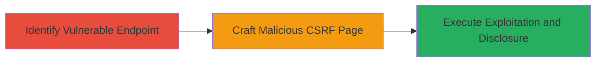

---
tags:
  - csrf
  - web
  - disclosure
  - audio
  - vk.com
type: attack_chain
tools: []
tactics:
  - '[[Initial Access]]'
  - '[[Collection]]'
verified: false
platforms:
  - Web
submitted: true
complexity: medium
created_at: '2023-10-01T00:00:00Z'
procedures:
  - '[[procedures/Identify-Vulnerable-CSRF-Endpoint-in-VK-Audio]]'
  - '[[procedures/Craft-Malicious-CSRF-Page-for-VK-Audio-Exploitation]]'
  - '[[procedures/Execute-CSRF-to-Add-Listeners-and-Disclose-Audio-Status]]'
step_count: 3
techniques:
  - '[[Exploit Public-Facing Application]]'
  - '[[Drive-by Compromise]]'
updated_at: '2025-12-14T17:27:29.599Z'
description: >-
  A multi-stage CSRF attack on VK.com's audio feature that bypasses protection
  to add unauthorized listeners and reveal private group audio broadcasts,
  including user IDs.
skill_level: intermediate
impact_level: high
id: da7f7b65-9e76-418b-a73f-fe1c198d8693
validated: true
mitre_tactics:
  - '[[Initial Access]]'
  - '[[Collection]]'
mitre_techniques:
  - '[[Exploit Public-Facing Application]]'
  - '[[Drive-by Compromise]]'
---
# CSRF-Exploitation-in-VK.com-Audio-to-Disclose-Private-Group-Content-and-User-IDs

Multi-stage attack chain demonstrating a complete CSRF workflow on VK.com's audio feature, exploiting the lack of CSRF protection to add users to listener lists and disclose private audio status from groups.

## Chain Metrics Dashboard

| Metric | Value |
|--------|-------|
| Chain Status | Unverified |
| Total Steps | 3 |
| Execution Time | ~5 minutes |
| Skill Level | Intermediate |
| Complexity | Medium |
| Impact Level | High |

## Attack Flow Visualization

## Prerequisites & Requirements

### Required Tools

- Web browser for testing
- Text editor for crafting HTML

### Target Environment

- VK.com web platform
- PHP-based audio streaming service
- No specific ports; web access required

### Initial Access Requirements

- Victim must be authenticated to VK.com
- Attacker needs to host a malicious page (e.g., on a web server)
- No prior credentials needed for attacker

## Detailed Attack Procedures

### Step 1: Identify Vulnerable Endpoint
procedure: [[procedures/Identify-Vulnerable-CSRF-Endpoint-in-VK-Audio]]

**Objective**: Locate the CSRF-vulnerable endpoint in VK.com's audio system that lacks proper token validation.

**Instructions**: Analyze VK.com's network traffic while interacting with the audio feature to identify endpoints like /al_audio.php?act=a_get_audio_status. Test by sending requests without the 'hash' parameter to confirm it processes unauthorized requests.

**Expected Output**: Confirmation that the endpoint responds without CSRF token, allowing cross-origin requests.

**Success Indicators**:
- Endpoint accepts requests sans 'hash'
- Response includes audio status data

### Step 2: Craft Malicious CSRF Page
procedure: [[procedures/Craft-Malicious-CSRF-Page-for-VK-Audio-Exploitation]]

**Objective**: Create a phishing page that tricks authenticated users into submitting forged requests to the vulnerable endpoint.

**Instructions**: Develop an HTML page with a hidden form or auto-submitting script targeting /al_audio.php?act=a_get_audio_status. Include parameters to add the victim's user ID to a listener list and fetch private audio details. Host the page on an attacker-controlled domain.

**Expected Output**: A functional malicious HTML file that, when loaded, sends the forged request to VK.com.

**Success Indicators**:
- Page loads without errors
- Form submission triggers request to VK endpoint

### Step 3: Execute Exploitation and Disclosure
procedure: [[procedures/Execute-CSRF-to-Add-Listeners-and-Disclose-Audio-Status]]

**Objective**: Lure victims to the malicious page to exploit their session, adding them to listeners and revealing private group audio.

**Instructions**: Distribute the malicious page link via social engineering (e.g., email or chat). When the victim visits while logged into VK.com, the CSRF triggers, adding their ID to the listener list and returning the current private song broadcast.

**Expected Output**: Victim's browser receives and potentially logs the disclosed audio status and user IDs.

**Success Indicators**:
- Victim added to listener list
- Private audio track details disclosed

## Attack Chain Summary

### Key Achievements

1. Bypassed CSRF protection on VK.com audio endpoint
2. Unauthorized addition of users to private listener lists
3. Disclosure of sensitive private group audio content and user IDs

## Technique & Tactic Coverage

### MITRE ATT&CK Techniques

- [[Exploit Public-Facing Application]] Exploit Public-Facing Application
- [[Drive-by Compromise]] Drive-by Compromise

### MITRE ATT&CK Tactics

- [[Initial Access]] Initial Access
- [[Collection]] Collection

---
*Last updated: 2023-10-01T00:00:00Z*
