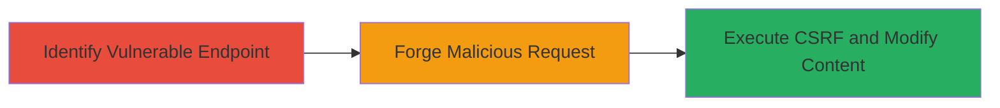

---
tags:
  - csrf
  - web
  - social-media
  - unauthorized-modification
type: attack_chain
tools: []
tactics:
  - '[[Initial Access]]'
verified: false
platforms:
  - Web
submitted: true
complexity: low
created_at: '2023-10-01T00:00:00Z'
procedures:
  - '[[procedures/Identify-CSRF-Vulnerable-Edit-Endpoint-in-VK-com-Group-Posts]]'
  - '[[procedures/Exploit-CSRF-to-Modify-VK-com-Group-Post-Carousel-Cards]]'
step_count: 2
techniques:
  - '[[Exploit Public-Facing Application]]'
updated_at: '2025-12-14T17:27:35.400Z'
description: >-
  A multi-stage attack leveraging missing CSRF protection in VK.com's group post
  editing to allow unauthorized changes to advertising carousel cards via forged
  requests.
skill_level: intermediate
impact_level: medium
id: 94020b02-1d27-4426-bfb4-2119dc89d775
validated: true
mitre_tactics:
  - '[[Initial Access]]'
mitre_techniques:
  - '[[Exploit Public-Facing Application]]'
---
# CSRF Exploitation in VK.com Group Post Carousel Editing for Unauthorized Modification

Multi-stage attack chain demonstrating a complete attack workflow exploiting the absence of CSRF tokens in VK.com's group post editing feature.

## Chain Metrics Dashboard

| Metric | Value |
|--------|-------|
| Chain Status | Unverified |
| Total Steps | 2 |
| Execution Time | ~5 minutes |
| Skill Level | Intermediate |
| Complexity | Low |
| Impact Level | Medium |

## Attack Flow Visualization

## Prerequisites & Requirements

### Required Tools

- Browser developer tools (e.g., Chrome DevTools)
- HTML editor for crafting POC page

### Target Environment

- VK.com web platform
- Authenticated user with group admin privileges
- Access to a group post with advertising carousel cards

### Initial Access Requirements

- Valid VK.com account with group membership and editing rights
- Victim must be authenticated and visit attacker's malicious site
- No special network access beyond internet connectivity

## Detailed Attack Procedures

### Step 1: Identify the Vulnerable Endpoint
procedure: [[procedures/Identify-CSRF-Vulnerable-Edit-Endpoint-in-VK-com-Group-Posts]]

**Objective**: Locate the edit request for advertising carousel cards in group posts and confirm the absence of CSRF protection.

**Instructions**: Log in to VK.com as a group administrator. Create or navigate to an existing group post containing advertising carousel cards. Attempt to edit the carousel by modifying card details (e.g., text or images). Open browser developer tools (F12), switch to the Network tab, and submit the edit. Inspect the POST request to the edit endpoint (typically under /al/groups.php or similar API path). Verify that the request parameters include carousel data but lack a CSRF hash or token in headers or form fields.

**Expected Output**: Network request details showing POST to edit endpoint without CSRF token, e.g., parameters like act=edit_carousel, group_id, post_id, and card modifications.

**Success Indicators**:
- Edit request identified without CSRF protection
- Request can be replayed cross-origin without authentication challenges

### Step 2: Exploit CSRF to Modify Group Post Carousel Cards
procedure: [[procedures/Exploit-CSRF-to-Modify-VK-com-Group-Post-Carousel-Cards]]

**Objective**: Craft and deliver a forged request to trick an authenticated user into unknowingly editing the carousel cards.

**Instructions**: Based on the identified endpoint, create a malicious HTML page hosted on an attacker-controlled site. Use an auto-submitting form targeting the VK.com edit endpoint with forged parameters (e.g., hidden inputs for group_id, post_id, and malicious card content like altered images or text). Ensure the form uses method=POST and action= the vulnerable URL. Lure the victim (authenticated VK.com group admin) to visit the malicious page via phishing or social engineering. Upon page load, the form submits automatically, modifying the carousel without user consent.

**Expected Output**: Successful POST response from VK.com indicating edit applied (e.g., 200 OK with updated post data). Verify by checking the group post for unauthorized changes.

**Success Indicators**:
- Carousel cards modified as per forged data
- No user interaction required beyond visiting the malicious site
- Changes persist in the group post

## Attack Chain Summary

### Key Achievements

1. Identified CSRF vulnerability in group post editing lacking token protection.
2. Demonstrated exploitation via proof-of-concept allowing unauthorized content modification.
3. Highlighted potential for phishing or misinformation by altering advertising carousels.

## Technique & Tactic Coverage

### MITRE ATT&CK Techniques

- [[Exploit Public-Facing Application]]

### MITRE ATT&CK Tactics

- [[Initial Access]]

---
*Last updated: 2023-10-01T00:00:00Z*
