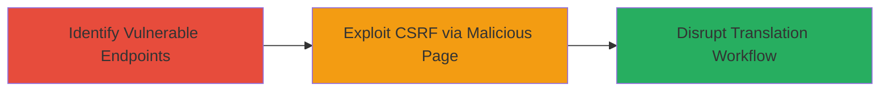

# CSRF Exploitation in Weblate Translation Lock and Unlock Functionality

Multi-stage attack chain demonstrating a complete attack workflow exploiting CSRF in Weblate to force unauthorized locking or unlocking of translation components, disrupting collaborative projects.

## Chain Metrics Dashboard

| Metric | Value |
|--------|-------|
| Chain Status | Unverified |
| Total Steps | 2 |
| Execution Time | ~5 minutes |
| Skill Level | Intermediate |
| Complexity | Medium |
| Impact Level | Medium |

## Attack Flow Visualization

## Prerequisites & Requirements

### Required Tools

- Browser developer tools for inspecting requests
- A web server to host the malicious page (e.g., local HTTP server)

### Target Environment

- Weblate instance (web application)
- Authenticated user session on the target Weblate
- No specific ports required beyond standard HTTP/HTTPS (80/443)

### Initial Access Requirements

- Victim must be an authenticated user with access to translation components
- Attacker needs to trick victim into visiting a malicious page (e.g., via phishing link)
- No prior credentials needed for attacker, but victim's session cookies are leveraged

## Detailed Attack Procedures

### Step 1: Identify Vulnerable Endpoints
procedure: [[procedures/Identify-Vulnerable-CSRF-Endpoints-in-Weblate]]

**Objective**: Analyze Weblate's translation management endpoints to identify those susceptible to CSRF attacks due to using GET requests without token protection.

**Instructions**: Use browser developer tools to inspect network traffic while interacting with translation components. Navigate to a translation project (e.g., /aptoide-uploader/strings/ka/) and attempt to lock or unlock it, observing the HTTP requests sent to /lock/ and /unlock/ paths.

**Expected Output**: Confirmation that requests are GET methods to URLs like GET /lock/aptoide-uploader/strings/ka/ without CSRF tokens in headers or forms.

**Success Indicators**:
- Endpoints identified as state-changing via GET
- No CSRF token observed in requests

### Step 2: Exploit CSRF to Lock or Unlock Translations
procedure: [[procedures/Exploit-CSRF-to-Lock-or-Unlock-Weblate-Translations]]

**Objective**: Craft and deliver a malicious webpage that triggers the vulnerable endpoints using the victim's authenticated session, forcing unauthorized actions.

**Instructions**: Create an HTML page with img or script tags that load the vulnerable URLs (e.g., ). Host this page on an attacker-controlled server and send a link to the victim via email or social engineering. When the victim visits, the browser automatically sends the GET request with session cookies.

**Expected Output**: The translation component is locked or unlocked without victim consent, visible in the Weblate interface upon login.

**Success Indicators**:
- Unauthorized lock/unlock action performed
- Workflow disruption confirmed (e.g., other translators lose access)

## Attack Chain Summary

### Key Achievements

1. Identified CSRF-vulnerable endpoints in Weblate's translation management.
2. Demonstrated cross-site exploitation to force state changes.
3. Highlighted potential for disrupting collaborative translation projects.

## Technique & Tactic Coverage

### MITRE ATT&CK Techniques

- [[Exploit Public-Facing Application]]

### MITRE ATT&CK Tactics

- [[Initial Access]]

---
*Last updated: 2023-10-01T00:00:00Z*
