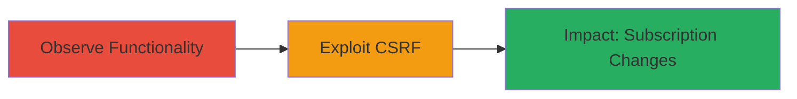

# CSRF Exploitation in Weblate Watch/Unwatch Projects for Unintended Subscription Changes

Multi-stage attack chain demonstrating a complete CSRF workflow against Weblate's project management features.

## Chain Metrics Dashboard

| Metric | Value |
|--------|-------|
| Chain Status | Unverified |
| Total Steps | 2 |
| Execution Time | ~5 minutes |
| Skill Level | Intermediate |
| Complexity | Low |
| Impact Level | Medium |

## Attack Flow Visualization



## Prerequisites & Requirements

### Required Tools

- Browser developer tools for inspection
- Optional: [[tools/curl]] for testing

### Target Environment

- Weblate instance (e.g., https://hosted.weblate.org/)
- Web platform with Django backend
- Authenticated user session required

### Initial Access Requirements

- Attacker needs to know target project slugs (e.g., 'androbd')
- Victim must be authenticated to Weblate
- No special privileges; relies on session cookies

## Detailed Attack Procedures

### Step 1: Observe Watch/Unwatch Functionality
procedure: [[procedures/Observe-Weblate-Watch-Unwatch-Functionality]]

**Objective**: Identify the watch/unwatch endpoints and confirm lack of CSRF protection by inspecting network requests.

**Instructions**: Navigate to a project page in Weblate, such as https://hosted.weblate.org/projects/androbd/, and interact with the Watch/Unwatch button in the top-right corner. Use browser developer tools to monitor the network tab and observe the POST request sent, noting the presence of a CSRF token in the payload.

**Expected Output**: Confirmation of POST endpoint like /accounts/watch/androbd/ with CSRF token in legitimate requests.

**Success Indicators**:
- Network request captured showing POST to watch/unwatch endpoint
- Token observed but not enforced on direct access

### Step 2: Exploit CSRF to Force Subscription Changes
procedure: [[procedures/Exploit-Weblate-CSRF-to-Force-Subscription-Changes]]

**Objective**: Craft and deliver malicious links or forms that trigger watch/unwatch actions without CSRF validation, forcing unintended changes to the victim's project subscriptions.

**Instructions**: Test the vulnerability by directly accessing the endpoint URL in the browser, such as https://hosted.weblate.org/accounts/watch/androbd/, while authenticated. Confirm the action succeeds without a CSRF token. For exploitation, embed a malicious link (e.g., <a href="https://hosted.weblate.org/accounts/unwatch/androbd/">Click here</a>) or form on a third-party site:

```html
<form action="https://hosted.weblate.org/accounts/watch/androbd/" method="POST" style="display:none;">
  <input type="submit" value="Watch Project">
</form>
<script>document.forms[0].submit();</script>
```

Host this on an attacker-controlled site and trick the victim into visiting it while logged into Weblate.

**Expected Output**: Victim's subscription status changes (e.g., project added/removed from watch list) without their intent.

**Success Indicators**:
- Action performs successfully via direct URL or cross-site request
- Victim's notification preferences disrupted

## Attack Chain Summary

### Key Achievements

1. Identified CSRF bypass in Weblate's Django-based endpoints
2. Demonstrated exploitation via simple URL access or embedded forms
3. Highlighted impact on user experience through unwanted subscription changes

## Technique & Tactic Coverage

### MITRE ATT&CK Techniques

- [[Exploit Public-Facing Application]] Exploit Public-Facing Application
- [[User Execution]] User Execution

### MITRE ATT&CK Tactics

- [[Initial Access]] Initial Access
- [[Execution]] Execution

---
*Last updated: 2023-10-01T00:00:00Z*
