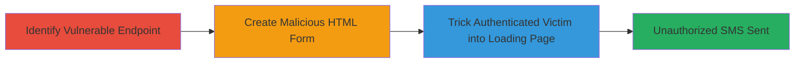

---
id: ac-uuid-12345
name: CSRF Exploitation in Zomato Phone Invitation Feature for Unauthorized SMS Sending
type: attack_chain
description: A multi-stage CSRF attack targeting Zomato's phone number invitation endpoint to force authenticated users to send unwanted SMS invitations, enabling spam or phishing.
verified: false
submitted: false
step_count: 3
created_at: 2023-10-01T00:00:00Z
updated_at: 2023-10-01T00:00:00Z
procedures: [[procedures/Exploit-CSRF-in-Zomato-SMS-Invitation]]
techniques: [[Drive-by Compromise]], [[Exploit Public-Facing Application]]
tactics: [[Initial Access]]
tags: csrf, web, sms, spam, phishing
platforms: Web
tools: []
---

# CSRF Exploitation in Zomato Phone Invitation Feature for Unauthorized SMS Sending

Multi-stage attack chain demonstrating a complete attack workflow exploiting a CSRF vulnerability in Zomato's phone invitation feature.

## Chain Metrics Dashboard

| Metric | Value |
|--------|-------|
| Chain Status | Unverified |
| Total Steps | 3 |
| Execution Time | ~5 minutes |
| Skill Level | Intermediate |
| Complexity | Medium |
| Impact Level | High |

## Attack Flow Visualization



## Prerequisites & Requirements

### Required Tools

- None (uses basic HTML and browser)

### Target Environment

- Web platform
- Zomato website with authenticated session
- SMS invitation feature enabled

### Initial Access Requirements

- Victim must be authenticated to Zomato
- Attacker needs to host or send a malicious HTML page
- No special credentials required beyond social engineering

## Detailed Attack Procedures

### Step 1: Identify Vulnerable Endpoint
procedure: [[procedures/Exploit-CSRF-in-Zomato-SMS-Invitation]]

**Objective**: Locate the CSRF-vulnerable endpoint for phone invitations on Zomato.

**Instructions**: Inspect the invitation form on Zomato's website to identify the POST endpoint https://www.zomato.com/php/restaurantSmsHandler, which accepts 'type' and 'mobile_no' parameters without CSRF token validation. Note the presence of rate limiting but absence of anti-CSRF measures.

**Expected Output**: Confirmation of endpoint details and lack of CSRF protection.

**Success Indicators**:
- Endpoint identified: https://www.zomato.com/php/restaurantSmsHandler
- No CSRF token required in legitimate requests

### Step 2: Create Malicious HTML Form
procedure: [[procedures/Exploit-CSRF-in-Zomato-SMS-Invitation]]

**Objective**: Craft a hidden form that auto-submits to the vulnerable endpoint with attacker-controlled parameters.

**Instructions**: Create an HTML page with a form targeting the endpoint, setting 'type' to 'zomato-app-details' and 'mobile_no' to the desired phone number. Use JavaScript to auto-submit the form upon page load. Execute the payload creation as follows (save as .html file):

Use [[commands/zomato-csrf-sms-form]] to generate the form:

```html
<html><body><form action="https://www.zomato.com/php/restaurantSmsHandler" method="POST"><input type="hidden" name="type" value="zomato-app-details" /><input type="hidden" name="mobile_no" value="xxxxxxxxxxxxxx" /><input type="submit" value="Submit request" id="submit"></form><script>document.getElementById('submit').click();</script></body></html>
```

**Expected Output**: Malicious HTML file ready for hosting or delivery.

**Success Indicators**:
- Form auto-submits to correct endpoint
- Parameters correctly set for SMS invitation

### Step 3: Trick Victim into Loading the Malicious Page
procedure: [[procedures/Exploit-CSRF-in-Zomato-SMS-Invitation]]

**Objective**: Socially engineer the authenticated victim to visit the malicious page, triggering the CSRF request.

**Instructions**: Host the HTML page on an attacker-controlled server or send it via email/phishing link. Ensure the victim is logged into Zomato. When loaded, the browser sends the POST request using the victim's cookies, forging the invitation.

**Expected Output**: SMS sent to the target phone number from the victim's account.

**Success Indicators**:
- Victim's browser submits the request
- Confirmation via rate limiting logs or SMS delivery (if observable)

## Attack Chain Summary

### Key Achievements

1. Identified CSRF-vulnerable endpoint in Zomato's SMS handler
2. Created and delivered a drive-by CSRF payload
3. Forced unauthorized SMS invitations, enabling spam/phishing

## Technique & Tactic Coverage

### MITRE ATT&CK Techniques

- [[Drive-by Compromise]] Drive-by Compromise
- [[Exploit Public-Facing Application]] Exploit Public-Facing Application

### MITRE ATT&CK Tactics

- [[Initial Access]] Initial Access

---
*Last updated: 2023-10-01T00:00:00Z*
