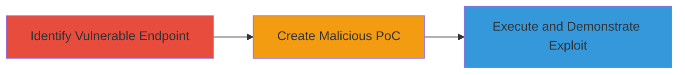

---
tags:
  - csrf
  - web
  - logout
  - session-disruption
type: attack_chain
tools:
  - '[[tools/Google-Chrome]]'
  - '[[tools/Internet-Explorer]]'
tactics:
  - '[[Impact]]'
verified: false
platforms:
  - Web
submitted: true
complexity: medium
created_at: '2023-10-01T00:00:00Z'
procedures:
  - '[[procedures/Identify-CSRF-Vulnerable-Logout-Endpoint]]'
  - '[[procedures/Create-CSRF-Proof-of-Concept-HTML]]'
  - '[[procedures/Demonstrate-CSRF-Logout-Exploit]]'
step_count: 3
techniques:
  - '[[Exploit Public-Facing Application]]'
updated_at: '2025-12-14T17:27:03.048Z'
description: >-
  A multi-step attack chain exploiting a CSRF vulnerability in WakaTime's logout
  functionality to force unauthorized session termination via a malicious
  webpage.
skill_level: intermediate
impact_level: medium
id: 3a370d55-5ebe-4c67-b838-e27ebc5ae541
validated: true
mitre_tactics:
  - '[[Impact]]'
mitre_techniques:
  - '[[Exploit Public-Facing Application]]'
---
# CSRF Exploitation of WakaTime Logout Endpoint

Multi-stage attack chain demonstrating a complete CSRF workflow against WakaTime's logout functionality, allowing an attacker to force a logged-in user to logout without consent by embedding a malicious request in a webpage.

## Chain Metrics Dashboard

| Metric | Value |
|--------|-------|
| Chain Status | Unverified |
| Total Steps | 3 |
| Execution Time | ~5 minutes |
| Skill Level | Intermediate |
| Complexity | Medium |
| Impact Level | Medium |

## Attack Flow Visualization

## Prerequisites & Requirements

### Required Tools

- [[tools/Google-Chrome]]
- [[tools/Internet-Explorer]]

### Target Environment

- Web platform
- Access to WakaTime service at https://wakatime.com
- No specific ports or services beyond standard HTTPS (443)

### Initial Access Requirements

- No credentials required for attacker
- Victim must be authenticated to WakaTime
- Attacker needs to host or deliver a malicious HTML page to the victim (e.g., via phishing or malicious site)

## Detailed Attack Procedures

### Step 1: Identify Vulnerable Logout Endpoint
procedure: [[procedures/Identify-CSRF-Vulnerable-Logout-Endpoint]]

**Objective**: Locate and confirm the logout mechanism's susceptibility to CSRF by analyzing the endpoint's method and lack of protections.

**Instructions**: Examine the WakaTime logout process by inspecting network requests during a manual logout. Use browser developer tools to observe that the logout is triggered via a GET request to https://wakatime.com with the 'login' parameter, without any CSRF token validation.

**Expected Output**: Confirmation of GET-based logout endpoint lacking anti-CSRF measures.

**Success Indicators**:
- Endpoint identified as https://wakatime.com?login (or similar parameter)
- No CSRF token observed in requests

### Step 2: Create Malicious PoC
procedure: [[procedures/Create-CSRF-Proof-of-Concept-HTML]]

**Objective**: Develop a proof-of-concept HTML file that embeds a cross-origin request to trigger the vulnerable logout.

**Instructions**: Create an HTML file named csrf_poc.html with an auto-submitting form or img tag that sends a GET request to the logout endpoint. For example, use a form element targeting https://wakatime.com with the 'login' parameter set to initiate logout.

**Expected Output**: A functional HTML file that, when loaded, sends the forged request.

**Success Indicators**:
- HTML file loads without errors
- Request to logout endpoint is forged successfully in network logs

### Step 3: Execute and Demonstrate Exploit
procedure: [[procedures/Demonstrate-CSRF-Logout-Exploit]]

**Objective**: Test the PoC in browsers to verify it forces an authenticated user's session to logout without interaction.

**Instructions**: With an authenticated WakaTime session open, load the csrf_poc.html file in a test browser. Observe the session termination, confirming the CSRF exploit works cross-origin.

**Expected Output**: Unauthorized logout of the victim's session upon loading the page.

**Success Indicators**:
- User is logged out after page load
- Works in multiple browsers like Chrome and IE

## Attack Chain Summary

### Key Achievements

1. Identified CSRF vulnerability in logout endpoint
2. Crafted exploitable PoC for session disruption
3. Demonstrated cross-browser impact on authenticated sessions

## Technique & Tactic Coverage

### MITRE ATT&CK Techniques

- [[Exploit Public-Facing Application]]

### MITRE ATT&CK Tactics

- [[Impact]]

---
*Last updated: 2023-10-01T00:00:00Z*
