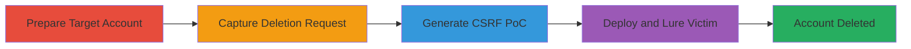

# CSRF Exploitation on Account Deletion Endpoint for Unauthorized Account Removal

Multi-stage attack chain demonstrating a complete CSRF-based account deletion workflow in a web application.

## Chain Metrics Dashboard

| Metric | Value |
|--------|-------|
| Chain Status | Unverified |
| Total Steps | 4 |
| Execution Time | ~15 minutes |
| Skill Level | Intermediate |
| Complexity | Medium |
| Impact Level | High |

## Attack Flow Visualization

## Prerequisites & Requirements

### Required Tools

- [[tools/Burp-Suite]]

### Target Environment

- Web application (e.g., U.S. Department of Defense portal)
- Required services/ports: HTTPS on port 443
- Network access requirements: Ability to create accounts and access the profile page

### Initial Access Requirements

- Valid credentials for account creation (public registration assumed)
- Attacker's local setup with Burp Suite proxy
- Victim must be authenticated in the target application

## Detailed Attack Procedures

### Step 1: Prepare Target Account for Deletion
procedure: [[procedures/Prepare-Target-Account-for-Deletion]]

**Objective**: Set up a test account to identify and initiate the account deletion process, confirming the endpoint's behavior.

**Instructions**: Navigate to the account creation page on the target site (e.g., https://█████). Fill in the registration form with test details and submit to create an account. Log in with the new credentials, then access the user profile section. Locate and click the 'DELETE ACCOUNT' button, entering 'YES' in the confirmation field to trigger the deletion flow without completing it.

**Expected Output**: Profile page loads with visible delete option; confirmation prompt appears.

**Success Indicators**:
- Account successfully created and logged in
- Delete button and confirmation field visible

### Step 2: Capture Account Deletion Request with Burp Suite
procedure: [[procedures/Capture-Account-Deletion-Request-with-Burp-Suite]]

**Objective**: Intercept the POST request to the deletion endpoint to analyze its structure and confirm lack of CSRF protection.

**Instructions**: Configure Burp Suite as a proxy in your browser. With the proxy active, repeat the deletion initiation (click 'DELETE ACCOUNT' and confirm with 'YES'). Intercept the outgoing POST request to /users/deleteAccount in Burp Suite's Proxy > HTTP history or Repeater tab.

**Expected Output**: Captured POST request showing parameters like confirmation='YES' without CSRF token headers.

**Success Indicators**:
- Request intercepted successfully
- No CSRF token observed in request headers or body

### Step 3: Generate CSRF Proof-of-Concept with Burp Suite
procedure: [[procedures/Generate-CSRF-Proof-of-Concept-with-Burp-Suite]]

**Objective**: Create a malicious HTML page that forges the deletion request from an external site.

**Instructions**: In Burp Suite, right-click the captured /users/deleteAccount POST request in the Proxy or Repeater tab. Select 'Engagement tools' > 'Generate CSRF PoC'. Customize the generated HTML if needed (e.g., auto-submit form via JavaScript). Save the HTML code containing the form that posts to https://████/users/deleteAccount with the required parameters.

**Expected Output**: HTML file with <form> element targeting the deletion endpoint, ready for hosting.

**Success Indicators**:
- PoC HTML generated without errors
- Form submission mimics the original request

### Step 4: Deploy and Lure Victim to CSRF PoC
procedure: [[procedures/Deploy-and-Lure-Victim-to-CSRF-PoC]]

**Objective**: Host the PoC and trick the authenticated victim into executing the forged request, resulting in account deletion.

**Instructions**: Host the PoC HTML on a controllable server (e.g., local HTTP server or cloud hosting). Send the link to the victim via email, chat, or social engineering. When the victim (who must be logged into the target site) opens the page, the form auto-submits or prompts a click, sending the forged POST to delete their account.

**Expected Output**: Victim's account deleted; target site shows login prompt or error on access.

**Success Indicators**:
- Victim visits the page while authenticated
- Account deletion confirmed via login attempt or admin logs

## Attack Chain Summary

### Key Achievements

1. Identified CSRF vulnerability in account deletion endpoint
2. Generated and deployed functional PoC for remote exploitation
3. Demonstrated high-impact account removal without direct access

## Technique & Tactic Coverage

### MITRE ATT&CK Techniques

- [[Exploit Public-Facing Application]] Exploit Public-Facing Application
- [[Drive-by Compromise]] Drive-by Compromise

### MITRE ATT&CK Tactics

- [[Initial Access]] Initial Access
- [[Impact]] Impact

---
*Last updated: 2023-10-01T00:00:00Z*
